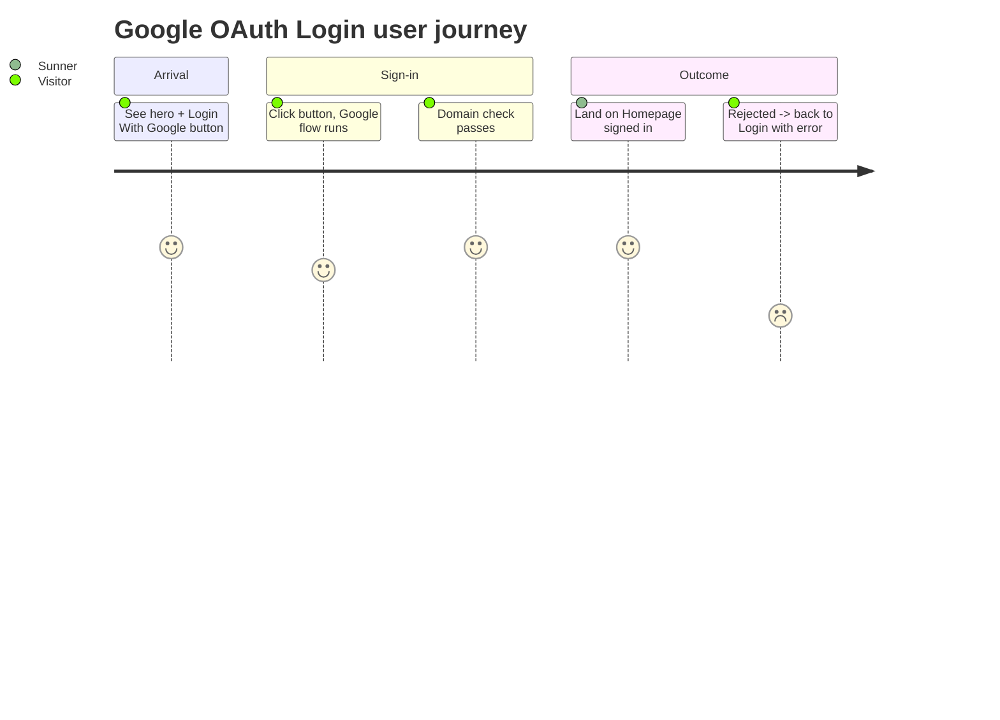

## Screen List

| Screen Name | SCR### | What User Sees | What User Can Do |
|-------------|--------|-----------------|-------------------|
| Login | SCR001_Login (draft) | Hero visual with the "ROOT FURTHER" headline, intro copy, and a single "LOGIN With Google" button; header (logo + language selector) and footer (copyright) render as part of F002_NavigationShell's shared shell, not owned here | Start Google sign-in — everything else on this screen (language switch, header/footer) is F002_NavigationShell's scope |

## User Journey

1. A visitor arrives at the Login screen and sees the hero intro and the "LOGIN With Google" button (TC b9805e65, 8415b629, 33a1dacf, 5fbe2a18, 42b82364, 6ae76d15 — layout, shared with F002_NavigationShell for header/footer/language).
2. The visitor selects "LOGIN With Google"; the button disables and shows a loading indicator while Google's own sign-in flow runs (TC 60bc5bbb, c18649fa, 37eae882).
3. On a successful, domain-matching sign-in, the visitor leaves the Login screen and arrives at the Homepage screen already signed in (TC e76aa170).
4. On a rejected or cancelled sign-in, the visitor stays on the Login screen and sees an error message instead.
5. A visitor who already has a session and opens the Login screen directly is sent straight to the Homepage screen instead (TC f62b0c97; TC 45278c06 item 3).
6. A visitor with no session who tries to open any other screen directly is sent to the Login screen first, then back to the screen they originally wanted once they sign in.

Note: language-selector interaction on this screen (dropdown open/hover, default VN, flag+chevron — TC 20d87e28, 5f1cbabd, 98e20775, 4426635b, cb42461d) is F002_NavigationShell's shared component; not re-described here.

