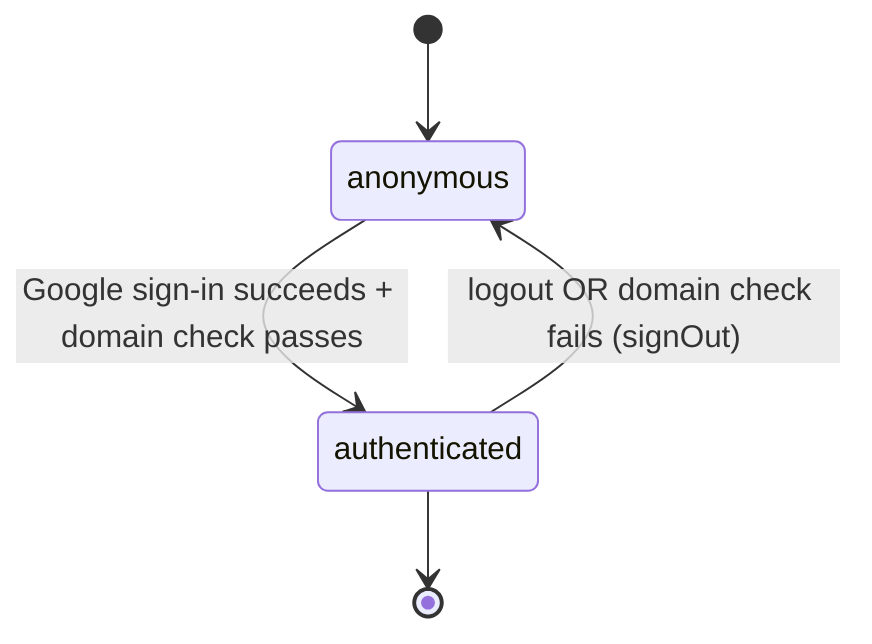

# F000_GoogleOauthLogin

**Priority**: P0
**Type**: mixed
**Generated**: 2026-08-28

## Overview

F001_GoogleOAuthLogin lets a Sunner sign in to the SAA 2025 site with their existing `@sun-asterisk.com` Google account, and keeps every later request on a guarded session. The Login screen (MoMorph `GzbNeVGJHz`) exposes a single "LOGIN With Google" CTA; clicking it starts Supabase's OAuth flow, which lands on a server route that exchanges the OAuth code for a session, rejects non-company domains, and provisions a `profile` row for first-time sign-ins. From then on, `proxy.ts` re-checks the session on every request outside the `/` and `/login` public allow-list, so private pages are only ever reached by a signed-in Sunner. Header/footer/language-selector/account-menu rendering on the Login screen is owned by F002_NavigationShell, not this feature.

## Polymorphic Behavior

N/A — no discriminator fields in Key Entities. `data-model.md` carries no `DISC-###` tags for `profile` (no data-model researcher pass has run in this greenfield round); `profile.role` (admin|member) is set to its default value on creation and does not branch this feature's own behavior — role-based UI variants belong to F002_NavigationShell.

## Cross-Cutting Logic
### Requirements

None — all FRs are local to a single User Story (see `## User Stories`).

### Business Rules

#### BR-001_DomainRestriction
**Linked FR:** FR-002
**Source:** _not yet implemented — draft spec, no code exists yet_
**Applies to:** OAuth callback route
**Rule:** Only Google accounts on the `@sun-asterisk.com` domain may complete sign-in. The check happens server-side, immediately after the OAuth code exchange — never client-side, and never relying on Google's `hd` query parameter alone (that parameter only pre-fills Google's account picker; it does not block other domains). A non-matching account is signed out immediately and returned to `/login` with an error.

**Pseudocode:**
```text
email = session.user.email
if domain_of(email) != "sun-asterisk.com":
    supabase.auth.signOut()
    redirect("/login?error=domain")
```

#### BR-002_PublicRouteAllowList
**Linked FR:** FR-003
**Source:** _not yet implemented — draft spec, no code exists yet_
**Applies to:** every request (route guard in `proxy.ts`)
**Rule:** Only `/`, `/login`, and the OAuth callback route are reachable without a session. Every other route requires a valid session, re-checked on every request — not just at first load.

#### BR-003_LoginRedirectDestination
**Linked FR:** FR-001, FR-004
**Source:** _not yet implemented — draft spec, no code exists yet_
**Applies to:** OAuth callback route; `proxy.ts`
**Rule:** A successful sign-in always lands on `/` (Homepage), never `/todo` — the path named in the raw Login spec's item 2.2.1 is leftover placeholder text per `clarifications.md`. The same destination applies when an already-authenticated visitor opens `/login` directly.

### Decision Logic

**Subtypes** (list — declare ≥1, may declare multiple): `render`, `interaction`, `flow`.

---

#### DEC-001_SessionRouteGuardFlow
**subtype:** flow
**Triggers in:** every route request (`proxy.ts`); SCR001_Login mount
**Involved entities:** session (validity via `getClaims()`), request route path
**user_visible_outcome:** decides whether a visitor sees the Login screen, is bounced to it, or is sent onward to the page they originally asked for
**Source:** _not yet implemented — draft spec; planned in `proxy.ts` per the research report sketch_

```pseudo
isAuthed = getClaims() succeeds
isPublic = path in ["/", "/login", "/auth/callback"]
if not isAuthed and not isPublic:
    redirect("/login?next=" + path)
if isAuthed and path == "/login":
    redirect("/")
```

---

### State Machines

**`kind` values:** `entity` — persisted (DB/cookie-backed session); `ui` — component-local only.

#### SM-001_SessionState
**kind:** entity
**Linked FR:** FR-001, FR-003
**Source:** _not yet implemented — draft spec, no code exists yet_
**States:** anonymous, authenticated



**Transition rules:**
- `anonymous → authenticated`: guard = OAuth code exchange succeeds AND email domain is `@sun-asterisk.com`; side effect = `profile` row provisioned on first sign-in (see `## DB Impact per Event`)
- `authenticated → anonymous`: guard = explicit logout (F002_NavigationShell) OR domain check fails; side effect = session cookie cleared

### Algorithms

None — this feature performs no computation beyond the domain-string comparison already captured as BR-001.

### External Integrations

TBD (draft) — skeletal per greenfield authoring rules.

#### INT-001_GoogleOAuthSignIn
**Type:** api-call (OAuth 2.0 / OIDC via Supabase Auth's `signInWithOAuth` / `exchangeCodeForSession`)
**Target:** Google Identity Platform, brokered by the local/hosted Supabase Auth (GoTrue) instance
**Trigger:** visitor clicks "LOGIN With Google"
**Failure handling:** TBD (draft) — planned: any error or cancellation redirects to `/login` with a generic error, no retry/backoff needed (single user-initiated action)
**Note:** real `GOOGLE_CLIENT_ID`/`GOOGLE_CLIENT_SECRET` values are an external prerequisite not yet present in this environment (`supabase/config.toml` reads them via `env(...)`) — see `## Unresolved Questions`.

### Verification

- **SC-001** — a signed-in Sunner's request to any route outside `/`, `/login` succeeds without a redirect (covers FR-003, DEC-001)
- **SC-002** — no session with a non-`@sun-asterisk.com` email is ever observable by `proxy.ts` (covers FR-002, BR-001)

---

**Client behavior:** see `behavior-logic.md` (TBD (draft) — not authored this round; no client-side debounce/optimistic-UI/polling/upload/realtime patterns expected on this screen), [`permissions.md`](../system/permissions.md), `screen-flow.md` (TBD (draft) — not authored this round).

## User Stories

### US001_GoogleSignIn (Priority: P0)

**What happens:** A Sunner on the Login screen selects "LOGIN With Google"; the button shows a disabled/loading state while Google's own sign-in flow completes, then Supabase exchanges the OAuth code for a session and the Sunner lands on `/` already signed in.
**Why this priority:** This is the only way into the product — every other in-scope screen requires a session, so sign-in is the P0 entry point.
**Independent Test:** Click "LOGIN With Google" on `/login`, complete a valid `@sun-asterisk.com` Google sign-in, and confirm the browser ends on `/` with a session cookie set.

**Acceptance Scenarios:**

1. **Given** an unauthenticated visitor on `/login`, **When** they click "LOGIN With Google" and complete sign-in with a valid `@sun-asterisk.com` account, **Then** they land on `/` with an active session (TC e76aa170).
2. **Given** the click just happened, **When** Google's flow is still in progress, **Then** the button is disabled and shows a loading indicator (TC 37eae882).
3. **Given** an unauthenticated visitor, **When** they open `/login` directly, **Then** the Login screen is displayed (TC 45278c06, item 1).

**Requirements fulfilled:**
- **FR-001** Clicking "LOGIN With Google" starts Supabase's `signInWithOAuth` flow and, on a successful domain-matching callback, redirects to `/`
  **Source:** _not yet implemented — draft spec; planned in `src/app/login/actions.ts` + `src/app/auth/callback/route.ts` per the research report_

**Rules enforced:** BR-003_LoginRedirectDestination

**Verification:**
- **SC-003** A successful sign-in always ends on `/`, never `/todo` (covers FR-001, BR-003)

---

### US002_DomainRejection (Priority: P0)

**What happens:** A Google account outside `@sun-asterisk.com` completes Google's own consent screen, but the server rejects it right after the OAuth code exchange, signs the briefly-created session back out, and returns the visitor to `/login` with an error.
**Why this priority:** SAA 2025 is an internal-only award programme; without this check any Google account could reach private company content (`clarifications.md` § Auth/authorization).
**Independent Test:** Complete Google sign-in with a non-`@sun-asterisk.com` account and confirm the visitor ends on `/login?error=domain` with no session cookie set.

**Acceptance Scenarios:**

1. **Given** a visitor signs in with a non-company Google account, **When** the OAuth callback runs, **Then** the session is signed out immediately and the visitor is returned to `/login` with the error message "Đăng nhập không thành công. Vui lòng thử lại." (per the raw Login spec item 2.2.1's error copy).
2. **Given** the same rejected visitor, **When** they check their browser state, **Then** no `sb-*` session cookie is present.

**Requirements fulfilled:**
- **FR-002** The OAuth callback checks the signed-in Google account's email domain and rejects/signs-out any non-`@sun-asterisk.com` account before a session is considered valid
  **Source:** _not yet implemented — draft spec; planned in `src/lib/auth/allowed-email.ts` + the callback route per the research report_

**Rules enforced:** BR-001_DomainRestriction

**Verification:**
- **SC-004** No session with a non-`@sun-asterisk.com` email is ever observable by `proxy.ts` (covers FR-002, BR-001)

---

### US003_PrivateRouteGuard (Priority: P0)

**What happens:** An unauthenticated visitor who requests any route other than `/` or `/login` is redirected to `/login`, and — once they sign in successfully — sent onward to the page they originally asked for.
**Why this priority:** Without this guard, the domain restriction on the Login screen alone would be meaningless — anyone could still reach a private page by URL.
**Independent Test:** As an unauthenticated visitor, request `/he-thong-giai` directly, confirm redirect to `/login`, then sign in and confirm the browser ends on `/he-thong-giai`.

**Acceptance Scenarios:**

1. **Given** no session, **When** a visitor requests a route outside `/` and `/login`, **Then** they are redirected to `/login` with the original path preserved (e.g. a `next` query param).
2. **Given** that same visitor signs in successfully, **When** the OAuth callback completes, **Then** they land on the originally requested page, not always `/`.

**Requirements fulfilled:**
- **FR-003** Every request outside the `/`, `/login` (and OAuth callback) public allow-list is re-checked for a valid session on every request, not only at first load
  **Source:** _not yet implemented — draft spec; planned in `proxy.ts` per the research report_

**Rules enforced:** BR-002_PublicRouteAllowList

**Verification:**
- **SC-005** No response body for a private route is ever served to a request without a valid session (covers FR-003, BR-002)

---

### US004_AuthenticatedLoginRedirect (Priority: P1)

**What happens:** A Sunner who already has a valid session and opens `/login` directly (e.g. a stale bookmark) never sees the login form — they are sent straight to `/`.
**Why this priority:** Prevents a confusing "sign in again" prompt for someone already signed in; lower urgency than the three P0 guards above since it is a convenience, not a security boundary.
**Independent Test:** Sign in, then navigate directly to `/login`, and confirm an immediate redirect to `/` with no login form rendered.

**Acceptance Scenarios:**

1. **Given** an authenticated Sunner, **When** they navigate to `/login`, **Then** they are redirected to `/` without seeing the Login screen (TC f62b0c97; TC 45278c06 item 3).

**Requirements fulfilled:**
- **FR-004** An authenticated visitor requesting `/login` is redirected to `/`
  **Source:** _not yet implemented — draft spec; planned in `proxy.ts` per the research report_

**Rules enforced:** BR-003_LoginRedirectDestination (see US001)

**Verification:**
- **SC-006** `/login` never renders its form to a request carrying a valid session (covers FR-004)

---

### Edge Cases

See edge-cases.md. Header/Footer/Language-selector test cases (TC b9805e65, 8415b629, 33a1dacf, 5fbe2a18, 42b82364, 6ae76d15, 20d87e28, 5f1cbabd, 98e20775, 4426635b, cb42461d) are layout/i18n concerns owned by F002_NavigationShell — not re-specified here.

## Key Entities

| Entity | Table | Key Columns | Purpose |
|--------|-------|-------------|---------|
| auth.users | `auth.users` (Supabase-managed) | id, email, raw_user_meta_data | Created/read by Supabase on every Google sign-in; this feature reads `email` for the domain check and `raw_user_meta_data` to seed the profile row |
| profile | `public.profile` | id, full_name, avatar_url, role | One row per Sunner, inserted once via a planned `auth.users` insert trigger; `role` defaults to `member` and is not branched on by this feature |
| auth.sessions | `auth.sessions` (Supabase-managed) | id, user_id, refreshed_at | Implicitly created on sign-in and re-validated by `proxy.ts` on every request (JWT expiry `3600`s, refresh-token rotation enabled per `supabase/config.toml`) |

## Artifact References

| Artifact | File | Codes Used | Reviewed |
|----------|------|------------|----------|
| Feature List | [feature-list.md](../feature-list.md) | F001 | [ ] |
| System Overview | TBD (draft) — not authored this round | — | [ ] |
| Architecture | [architecture.md](../system/architecture.md) | — | [ ] |
| Permissions | [permissions.md](../system/permissions.md) | — | [ ] |
| API Map / Route List | TBD (draft) — not generated yet | TBD (draft) | [ ] |
| Entities | TBD (draft) — not generated yet | TBD (draft) | [ ] |
| Screens (this feature) | [screens.md](./screens.md) | TBD (draft) | [ ] |
| Screen Spec (Login) | [screens/SCR001_Login/spec.md](./screens/SCR001_Login/spec.md) | SCR001_Login (draft) | [ ] |
| User Stories | (see `## User Stories` above) | US001, US002, US003, US004 | [x] |

**Rule:** Every code listed in Codes Used MUST exist in its source artifact. Orphan refs = reviewer critical.

## Assumptions

- `getClaims()` is assumed available on the pinned `@supabase/auth-js` version bundled by `supabase-js@2.112.4`; not yet confirmed by `npm run typecheck` (per the research report) — if absent, the route guard falls back to `getUser()`.
- The `profile` row is assumed provisioned by a Postgres trigger on `auth.users` insert (`security definer`), not by application code in the callback route — so the callback route itself is assumed to only perform an OAuth code exchange and a domain check, no direct table writes.
- The app's redirect origin is assumed to resolve to the exact string already present in `supabase/config.toml`'s `additional_redirect_urls` (`http://localhost:3000`); the file's second entry (`https://127.0.0.1:3000`) is assumed to be a scheme-mismatched leftover, not the value the app actually uses.
- Real Google OAuth client credentials (`GOOGLE_CLIENT_ID`/`GOOGLE_CLIENT_SECRET`) are assumed to be an external prerequisite obtained from Google Cloud Console before this feature can be exercised end-to-end locally or in any deployed environment.

## Source Code References

**Source:** `src/lib/auth/allowed-email.ts:24-37` — `isAllowedEmail()`, the domain-only allow-list predicate (covers BR-001_DomainRestriction, FR-002). Strict by design: exactly one `@`, non-empty local part, case-insensitive domain compare.
**Source:** `supabase/migrations/20260828000000_create_profile_table_and_trigger.sql:8-15` — `public.profile` table (`role` admin\|member, default `member`; see `## Key Entities`).
**Source:** `supabase/migrations/20260828000000_create_profile_table_and_trigger.sql:17-28` — RLS enabled, `profile_select_own` policy (`auth.uid() = id`), `select` granted to `authenticated` only.
**Source:** `supabase/migrations/20260828000000_create_profile_table_and_trigger.sql:34-52` — `handle_new_user()` security-definer trigger (`search_path` pinned to `public`) on `auth.users` insert, provisions the `profile` row (see `## DB Impact per Event`).

Not yet written: the OAuth callback route, the sign-in Server Action, and the `proxy.ts` route guard — see `## User Stories` and `## Source Walkthrough` for the planned files.

## Unresolved Questions

1. **`getClaims()` availability**: not confirmed against the installed `@supabase/auth-js` version — requires `npm run typecheck` against the sketched `proxy.ts` before implementation locks in this call over `getUser()`.
2. **Repo config bugs**: `supabase/config.toml:309`'s `skip_nonce_check = false` contradicts its own comment ("Required for local sign in with Google auth"), and `supabase/config.toml:149`'s `additional_redirect_urls` has a scheme mismatch (`https://127.0.0.1:3000` vs the dev server's `http://localhost:3000`). Both need a config fix before local Google sign-in can be exercised — not yet fixed as of this draft.
3. **MoMorph test-case coverage gap**: `docs/momorph/login/test-cases.csv` predates the domain-restriction decision and has no case for a rejected non-company account, nor for the unauthenticated-private-route-redirect flow; new test cases need authoring rather than being sourced from the existing CSV.
4. **Google OAuth client credentials**: `env(GOOGLE_CLIENT_ID)`/`env(GOOGLE_CLIENT_SECRET)` in `supabase/config.toml` have no real values yet — an external Google Cloud Console prerequisite, not something this spec can resolve.

### Resolved by orchestrator — 2026-08-28
- Session length → Supabase defaults only (JWT 1h, rotating refresh in proxy.ts); no app-level max age. (see plans/clarifications.md § Spec-stage gaps)
- Banner on /login after private-route redirect → none; identical Login screen. (see plans/clarifications.md § Spec-stage gaps)
- Account-switch path for signed-in user on /login → out of scope; always redirect to `/`. (see plans/clarifications.md § Spec-stage gaps)

## Source Walkthrough

Ordered reading list — no feature code exists yet, so this walks the 3 existing files this feature builds on, in the order an implementer should read them:

1. **File:** `supabase/config.toml:120-160` — why start here: the local OAuth provider config, the two known bugs (redirect-URL scheme mismatch, `skip_nonce_check`), and the `env(GOOGLE_CLIENT_ID)`/`env(GOOGLE_CLIENT_SECRET)` prerequisite all live here.
2. **File:** `src/lib/supabase/server.ts` — next: the existing server-side Supabase client factory this feature's Server Action and callback route must reuse (not rebuild).
3. **File:** `src/lib/supabase/client.ts` — last: the existing browser-side Supabase client factory, for reference/consistency with the server client's cookie contract.

### Call Hierarchy

```text
(planned) Login screen button click
  -> Server Action signInWithGoogle()          [not yet written]
  -> Supabase signInWithOAuth() -> Google consent
  -> /auth/callback route handler               [not yet written]
  -> exchangeCodeForSession() + domain check (BR-001)
  -> proxy.ts route guard on every later request [not yet written]
```

**Related files:** see `## Source Code References` above (Order column added there — F15 DRY, one table not two).

## DB Impact per Event

| Event/Endpoint | Table | Columns | Operation | Value Derivation | Source |
|-----------------|-------|---------|-----------|-------------------|--------|
| OAuth callback success (first sign-in) | `public.profile` | id, full_name, avatar_url, role | INSERT | `id` = new `auth.users.id`; `full_name`/`avatar_url` from Google's `raw_user_meta_data`; `role` defaults to `'member'` | `[INFERRED]` — planned via a `security definer` trigger on `auth.users` insert (see research report); migration file not yet written |
