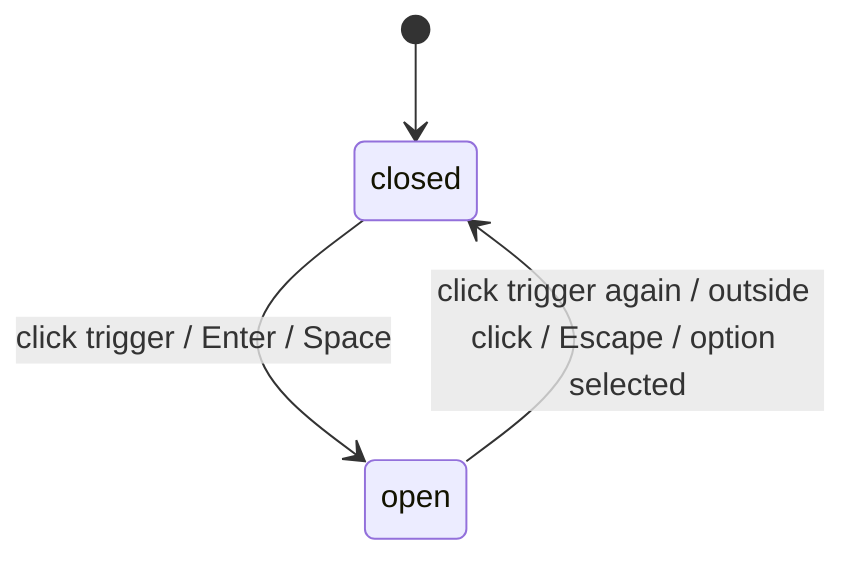
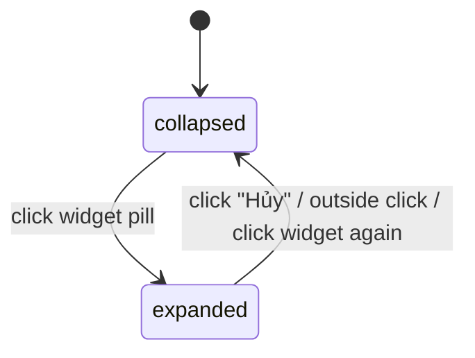

# F000_NavigationShell

## Overview

F002_NavigationShell (P0, type `ui`) is the persistent header, footer, language switcher, role-aware account menu, and floating action button reused across every in-scope screen — full shell on Homepage SAA and Hệ thống giải, logo+language only on Login (no session yet). It renders navigation, locale switching, and a role-gated account menu; it does not own the Login CTA (F001_GoogleOAuthLogin), the homepage hero/countdown/award grid (F003_HomepageOverview), the award-page body (F004_AwardSystemBrowse), or the deferred destinations (Kudos composer, Thể lệ panel, notification panel, Admin Dashboard) it merely renders affordances for.

## Polymorphic Behavior

### DISC-001 — profile.role

| Value | Render | Validation | Persistence |
|-------|--------|------------|-------------|
| `member` | Account menu shows Profile + Logout only (no Dashboard row) | none (read-only display) | no write from this feature |
| `admin` | Account menu shows Profile + Dashboard + Logout; Dashboard renders but does not navigate (route TBD per clarifications.md) | none (read-only display) | no write from this feature |

**Source:** `src/lib/profile/get-current-profile.ts` (Phase 07) — reads `role` off `public.profile`; see `## Source Code References` and `## Key Entities`.

(Session-presence gates the header's guest/authenticated variant but is not a `profile` column — it is documented under `SCR002_Header`'s `## UI States` instead of here, since it is not a discriminator on a Key Entity.)

## Cross-Cutting Logic
### Requirements

None — locale switch and logout each serve exactly one user story below and are placed there, per the placement rule (an FR appears under exactly one of a US or Cross-Cutting Logic).

### Business Rules

#### BR-001_LocalePersistence
**Linked FR:** FR-001
**Source:** TBD (draft)
**Applies to:** language switcher, every screen using the shell
**Rule:** The selected locale (`vi` default, `en` alternate) persists in the `NEXT_LOCALE` cookie (no URL prefix) and applies to every subsequent request until changed again.

**Pseudocode:**
```text
on select(locale):
  set_cookie(NEXT_LOCALE, locale, maxAge=1y, path=/)
  revalidate(currentPath)
  close dropdown
```

#### BR-002_LogoutClearsSession
**Linked FR:** FR-002
**Source:** TBD (draft)
**Applies to:** Logout menu item, member and admin account-menu variants
**Rule:** Logout signs the user out immediately (no confirmation dialog), clears the session, closes the dropdown, and redirects to Homepage SAA.

**Pseudocode:**
```text
on click(logout):
  signOut()
  close dropdown
  redirect("/")
```

#### BR-003_DropdownDismissal
**Linked FR:** N/A — presentational only
**Source:** TBD (draft)
**Applies to:** language dropdown, profile dropdown, profile-admin dropdown, FAB widget
**Rule:** Each open panel closes on outside click, `Esc`, or re-toggling its own trigger; `Enter`/`Space` opens a focused, closed trigger.

**Pseudocode:**
```text
on toggleClick / Enter / Space (while closed): open()
on toggleClick (while open) / outsideClick / Escape: close()
```

#### BR-004_DeferredAffordancesRenderOnly
**Linked FR:** N/A — no backing route/data this round
**Source:** TBD (draft)
**Applies to:** footer "Tiêu chuẩn chung" button, notification bell panel, FAB's "Thể lệ" destination, Admin Dashboard menu item
**Rule:** These elements render visibly (link, icon, badge, menu row) but perform no navigation or side effect this round — deferred per `clarifications.md`. (Round 2: the header/footer "Sun* Kudos" link and the FAB's "Viết KUDOS" destination were the round-1 members of this rule; both now navigate to real destinations — `/kudos` and F005's compose modal respectively — and are out of BR-004's scope as of Round 2. See `US004`/`US005` below and `docs/screens/SCR004_Fab/spec.md`.)

**Pseudocode:**
```text
on click(deferredTarget):
  preventDefault() // no-op this round
```

### Decision Logic

N/A — no user-facing decision logic beyond DISC-001 Polymorphic Behavior. Nav-link active/hover/selected styling is a single-predicate (current-route match) per link, and the account-menu variant is already covered by DISC-001; no branch here combines ≥2 predicates or drives a multi-step flow.

### State Machines

#### SM-001_DropdownMenuState
**kind:** ui
**Linked FR:** N/A
**Source:** TBD (draft)
**States:** closed, open



**Transition rules:**
- `closed → open`: guard = trigger focused or clicked; side effect = render panel
- `open → closed`: guard = any dismissal event above; side effect = hide panel

Applies identically to the language, profile, and profile-admin dropdowns — one shared interaction contract, one component.

#### SM-002_FabWidgetState
**kind:** ui
**Linked FR:** N/A
**Source:** TBD (draft)
**States:** collapsed, expanded



**Transition rules:**
- `collapsed → expanded`: guard = authenticated session present; side effect = show Thể lệ + Viết KUDOS + Hủy
- `expanded → collapsed`: guard = any dismissal event; side effect = hide the 3 buttons

### Algorithms

None.

### External Integrations

None — logout submits to `src/app/auth/sign-out/route.ts` (a Route Handler, not a Server Action; see that file's docblock for why), owned jointly with F001_GoogleOAuthLogin; F002 only renders the form and handles the resulting redirect.

### Verification

- **SC-001** Selecting a language updates the displayed locale and survives a full page reload (covers BR-001, FR-001)
- **SC-002** Logout clears the session and lands the user on Homepage SAA with no confirmation dialog (covers BR-002, FR-002)
- **SC-003** Every dropdown and the FAB close on outside click, `Esc`, and a repeat click of their own trigger (covers BR-003, SM-001, SM-002)
- **SC-004** Footer "Tiêu chuẩn chung" button, notification bell, FAB's "Thể lệ" destination, and the Admin Dashboard menu item are visible but clicking them performs no navigation (covers BR-004)

**Client behavior:** see behavior-logic.md, permissions.md, screen-flow.md

## User Stories

### US001_SwitchLanguage — Switch UI Language (Priority: P1)

**What happens:** Any visitor, on any screen that renders the shell, opens the header language dropdown and picks VN or EN; the interface re-renders in that language and the choice is remembered on the next visit.
**Why this priority:** Bilingual content is a stated requirement for every in-scope screen — without it, half the intended audience cannot read the site.
**Independent Test:** Load any in-scope page, switch to EN, reload the page, confirm EN persists.

**Acceptance Scenarios:**
1. **Given** the default VN locale, **When** the user selects EN from the language dropdown, **Then** all shell and page text switches to English and the dropdown closes.
2. **Given** EN was selected on a prior visit, **When** the user reloads any page, **Then** the site renders in EN without a flash of VN content.

**Requirements fulfilled:**
- **FR-001** Persist the selected locale — server action `setLocale(locale, pathname)` writing the `NEXT_LOCALE` cookie
  **Source:** TBD (draft)

**Rules enforced:** BR-001, BR-003 (dropdown dismissal)
**State transitions:** SM-001 (closed → open → closed)

**Verification:**
- **SC-001**

---

### US002_ViewRoleAwareAccountMenu — View Role-Aware Account Menu (Priority: P1)

**What happens:** An authenticated Sunner clicks the header avatar; a member sees Profile + Logout, an admin additionally sees a Dashboard row (destination deferred).
**Why this priority:** The account menu is the entry point to Logout and to the role distinction the product depends on.
**Independent Test:** Sign in as a member, open the menu, confirm 2 rows; sign in as an admin, confirm 3 rows.

**Acceptance Scenarios:**
1. **Given** an authenticated member, **When** they click the avatar, **Then** the menu shows exactly Profile and Logout.
2. **Given** an authenticated admin, **When** they click the avatar, **Then** the menu shows Profile, Dashboard, and Logout, with Dashboard rendering but not navigating.

**Requirements fulfilled:** none dedicated — reuses the `profile.role` value already loaded by F001_GoogleOAuthLogin's session guard.

**Rules enforced:** BR-003; role variant governed by DISC-001
**State transitions:** SM-001

**Verification:**
- **SC-003**

---

### US003_LogOut — Log Out (Priority: P1)

**What happens:** An authenticated user clicks Logout in the account menu; the session is cleared immediately with no confirmation dialog and they land on Homepage SAA.
**Why this priority:** Ending a session cleanly is a baseline security expectation for an authenticated app.
**Independent Test:** Sign in, click Logout, confirm the session cookie is gone and the URL is `/`.

**Acceptance Scenarios:**
1. **Given** an authenticated session, **When** the user clicks Logout, **Then** the session is cleared, the dropdown closes, and the browser is redirected to `/`.

**Requirements fulfilled:**
- **FR-002** Log out the current session — server action / route handler, no confirmation step
  **Source:** TBD (draft)

**Rules enforced:** BR-002
**State transitions:** SM-001

**Verification:**
- **SC-002**

---

### US004_NavigateViaHeaderFooterLinks — Navigate via Header/Footer (Priority: P1)

**What happens:** Any visitor clicks the logo or one of the 3 nav links (header or footer) to move to the corresponding page, or scrolls to top if already there; the active link is visually distinct.
**Why this priority:** This is the primary cross-screen navigation for the whole product.
**Independent Test:** From Hệ thống giải, click the header logo, confirm landing on `/` scrolled to top.

**Acceptance Scenarios:**
1. **Given** the user is on any page, **When** they click the logo, **Then** they land on Homepage SAA scrolled to top.
2. **Given** the user is already on the page a nav link points to, **When** they click that link again, **Then** the page scrolls to top rather than reloading.
3. **Given** the user clicks the footer's "Tiêu chuẩn chung" button, **When** the click fires, **Then** it renders normally but performs no navigation (destination deferred/unresolved this round).
4. **Given** the user clicks "Sun* Kudos" in the header or footer, **When** the click fires, **Then** they land on the Sun* Kudos Live board at `/kudos` (Round 2 — supersedes the round-1 BR-004 deferral; `e2e/navigation-shell.spec.ts` "06").

**Requirements fulfilled:** none — client-side link navigation and scroll, no backend call.

**Rules enforced:** BR-004 (Tiêu chuẩn chung subset only, as of Round 2)

**Verification:**
- **SC-004** (deferred-link subset)

---

### US005_OpenFabQuickActions — Open FAB Quick Actions (Priority: P2)

**What happens:** An authenticated user clicks the floating widget; it expands to show Thể lệ and Viết KUDOS options plus a Hủy (cancel) button. Since Round 2, Viết KUDOS opens F005_KudosCompose's compose modal (collapsing the widget first); Thể lệ remains deferred — still no destination this round.
**Why this priority:** Visible affordance matters for perceived completeness; Thể lệ's destination is still explicitly deferred, but Viết KUDOS now opens a real flow.
**Independent Test:** Click the widget, confirm 3 buttons appear; click Viết KUDOS, confirm the compose modal opens; click Hủy on the collapsed widget, confirm it collapses.

**Acceptance Scenarios:**
1. **Given** the widget is collapsed, **When** the user clicks it, **Then** it expands to show Thể lệ, Viết KUDOS, and Hủy.
2. **Given** the widget is expanded, **When** the user clicks Viết KUDOS, **Then** F005's compose modal opens and the widget collapses (`docs/screens/SCR004_Fab/spec.md`).
3. **Given** the widget is expanded, **When** the user clicks Thể lệ, **Then** nothing opens (deferred) and the widget only collapses via Hủy/outside-click/re-click.

**Requirements fulfilled:** none — opening F005's modal is that feature's own concern; F002 owns only the widget's dispatch/collapse mechanics (see `## Overview`).

**Rules enforced:** BR-003, BR-004 (Thể lệ subset only, as of Round 2)
**State transitions:** SM-002

**Verification:**
- **SC-003**, **SC-004** (Thể lệ subset)

---

### US006_SeeNotificationBadge — See Notification Badge (Priority: P2)

**What happens:** An authenticated user sees a notification bell in the header, with a red badge when unread notifications exist; clicking it opens no panel this round (deferred).
**Why this priority:** The badge is a passive, low-risk affordance; the panel behind it is out of scope this round.
**Independent Test:** With unread notifications seeded, confirm the badge renders; with none, confirm it does not.

**Acceptance Scenarios:**
1. **Given** unread notifications exist, **When** the header renders, **Then** the bell shows a red badge.
2. **Given** none exist, **When** the header renders, **Then** the bell shows no badge.

**Requirements fulfilled:** none — the unread-count source is TBD (draft); the badge renders only when a value is supplied.

**Rules enforced:** BR-004

**Verification:**
- **SC-004**

### Edge Cases

See edge-cases.md.

## Key Entities

| Entity | Table | Key Columns | Purpose |
|--------|-------|-------------|---------|
| Profile | `profile` | id, full_name, avatar_url, role | Read-only source for the avatar image, display name, and the DISC-001 role-gated account-menu variant |
| Auth session | `auth.users` (Supabase-managed) | id, email | Read-only — a valid session decides the guest vs. authenticated header variant (see `SCR002_Header` `## UI States`) |
| Notification (deferred) | TBD (draft) — no schema yet | TBD (draft) | Would back the unread-count badge; out of scope this round, badge currently has no confirmed data source |

## Artifact References

| Artifact | File | Codes Used | Reviewed |
|----------|------|------------|----------|
| Feature List | [feature-list.md](../feature-list.md) | F002_NavigationShell (provisional) | [x] |
| System Overview | TBD (draft) | TBD (draft) | [ ] |
| Architecture | TBD (draft) | TBD (draft) | [ ] |
| API Map | TBD (draft) | TBD (draft) | [ ] |
| Entities | TBD (draft) | TBD (draft) | [ ] |
| Screens | [screens.md](screens.md) | TBD (draft) | [ ] |
| Behavior Logic | TBD (draft) | TBD (draft) | [ ] |
| Permissions Matrix | TBD (draft) | TBD (draft) | [ ] |
| User Stories | TBD (draft) | US001–US006 (local to this spec) | [ ] |

## Assumptions

- `profile.role` holds exactly `admin` or `member` this round (per clarifications.md); no third role is provisioned.
- The notification bell's unread-count source and the account-menu's Dashboard-route destination are both undecided; this feature renders their affordances without implementing backing data or a route this round.
- Header, footer, and the FAB are one shared component set imported by every page's layout (Login gets header logo+language only, pre-auth), not duplicated per page.
- The footer's "Tiêu chuẩn chung" button has no confirmed destination; it renders as a visible, non-navigating affordance until a target is defined (see `## Gaps for Clarification` in the delivery report). The header/footer "Sun* Kudos" link carried the same assumption in round 1 — resolved in Round 2, it now links to `/kudos` (F006_KudosLiveBoard).

## Source Code References

**Source:** `src/components/layout/site-header.tsx:1-85` — header (nav links, guest/authed variant gating for bell + account menu, mobile drawer trigger).
**Source:** `src/components/layout/site-footer.tsx:1-53` — footer (logo, nav links; "Tiêu chuẩn chung" still a deferred affordance per BR-004; "Sun* Kudos" is a real `<Link href="/kudos">` as of Round 2, no longer BR-004).
**Source:** `src/components/layout/fab-widget.tsx:1-114` — FAB (SM-002_FabWidgetState collapsed/expanded; "Thể lệ" deferred per BR-004, "Viết KUDOS" opens F005's compose modal as of Round 2).
**Source:** `src/components/layout/language-dropdown.tsx:1-75` — language switcher (BR-001_LocalePersistence).
**Source:** `src/components/layout/account-menu.tsx:1-90` — role-aware account menu (DISC-001 member/admin variants, BR-002_LogoutClearsSession).
**Source:** `src/components/layout/notification-bell.tsx:1-28` — notification badge (US006, unread-count source still TBD).
**Source:** `src/components/layout/mobile-nav-drawer.tsx:1-84` — narrow-viewport nav (PROVISIONAL hamburger pattern per clarifications.md).
**Source:** `src/components/ui/dropdown.tsx:1-89` — shared dropdown primitive backing SM-001_DropdownMenuState across all three dropdowns.
**Source:** `src/app/(site)/layout.tsx` — mounts `SiteHeaderContainer`/`SiteFooter`/`FabWidgetContainer` once, shared across every `(site)` route (Homepage, Award System). The shell moved out of the root layout into this route group back in Group 3, so `/login`'s `(auth)` route group could mount its own `LoginHeader`/`LoginFooter` instead; `src/app/layout.tsx` (the root layout) has been html/body shell only since then. Phase 07 additionally swapped the two directly-mounted, guest-only components for `SiteHeaderContainer`/`FabWidgetContainer` (see § the container entries below).
**Source:** `src/lib/i18n/set-locale.ts:1-30` — BR-001_LocalePersistence: `setLocale()` Server Action, validates against the same locale allow-list as `request.ts` (falls back to `defaultLocale` rather than trusting the caller), sets the `NEXT_LOCALE` cookie (`httpOnly: false` — required for next-intl's client-side `useLocale()`), then `revalidatePath`.
**Source:** `src/i18n/request.ts:1-28` — BR-001_LocalePersistence: locale resolution (`NEXT_LOCALE` cookie, no URL prefix, `vi` default) plus the `isLocale()` allow-list guard `set-locale.ts` reuses.
**Source:** `src/app/auth/sign-out/route.ts` — BR-002_LogoutClearsSession: `POST` handler (Phase 07; also owned by F001_GoogleOAuthLogin), rejects a cross-origin `Origin` header (403 JSON), signs out of Supabase, explicitly deletes every `sb-*` cookie, and redirects `303 See Other` to `/` (303 so the browser follows with `GET /` instead of re-POSTing the form body). A Route Handler, not the originally-planned Server Action: the Server Action's `redirect()` is a soft, client-side navigation that races the response's `Set-Cookie` headers against the URL update — reproducibly lost 0/3 in an E2E check reading cookies right after `waitForURL`, passed 3/3 only with an artificial settle delay. `account-menu.tsx` submits a plain `<form method="post" action="/auth/sign-out">` here, which is a hard, full-page navigation instead — atomic for the browser (3/3 with no delay).
**Source:** `src/components/layout/site-header-container.tsx` — DISC-001: server container resolving `getCurrentProfile()` (`src/lib/profile/get-current-profile.ts`) and passing `variant`/`user`/`unreadCount={0}`/`onSelectLocale` into the presentational `SiteHeader`; mounted by `(site)/layout.tsx` in place of a directly-mounted `SiteHeader` (Phase 07).
**Source:** `src/components/layout/fab-widget-container.tsx` — SCR004_Fab hidden-for-guest state: renders `FabWidget` only when `getCurrentProfile()` resolves non-null, so the header and FAB never disagree about sign-in state (Phase 07).
**Source:** `src/lib/profile/get-current-profile.ts` — DISC-001: server-only `supabase.auth.getClaims()` + `select full_name, avatar_url, role from profile`; returns `null` on no session **and** on a failed profile-row read (degrades to the guest variant rather than throwing); never selects `email` (Phase 07).
**Source:** `src/lib/i18n/select-locale-action.ts` — BR-001_LocalePersistence: thin Server Action wrapper around `setLocale()`, the reference shape `onSelectLocale` needs since a Client Component may only be handed a Server Action reference, not an inline closure; recovers the current pathname from the `Referer` header (falls back to `/`) since the action itself has no route param (Phase 07).

All components imported from the `(site)` route group's layout, matching the Call Hierarchy above. See `## User Stories` for the behavior each component owns.

## Unresolved Questions

1. **Footer "Tiêu chuẩn chung" destination**: no spec row states what this button opens — same content as the FAB's Thể lệ panel, or something else entirely.
2. **Header responsive/mobile pattern**: no MoMorph spec row addresses a narrow-viewport layout for the header (hamburger, wrap, or icon-only); only desktop pixel dimensions are given.
3. **Scope of TC ID-30 through ID-35** (generic "Dropdown menu" open/close/keyboard tests): unclear whether they validate only the account dropdown or all three dropdowns identically. Assumed identical shared behavior (SM-001) pending confirmation.

### Resolved by orchestrator — 2026-08-28
- Footer "Tiêu chuẩn chung" destination → render only, no destination this round. (see plans/clarifications.md § Spec-stage gaps)
- Header below `md` → hamburger menu with existing tokens; PROVISIONAL (not in Figma). (see plans/clarifications.md § Spec-stage gaps)
- Admin vs member Profile item → render only, no navigation, both roles (/profile deferred). (see plans/clarifications.md § Spec-stage gaps)
- TC ID-30–35 target → all three dropdowns via one shared Dropdown primitive. (see plans/clarifications.md § Spec-stage gaps)

## Source Walkthrough

Recommended reading order: `get-current-profile.ts` (the `profile.role` lookup DISC-001 branches on), then `site-header-container.tsx`/`fab-widget-container.tsx` (the server containers `(site)/layout.tsx` mounts), then each dropdown component, then `select-locale-action.ts`/`set-locale.ts` and the sign-out route.

### Call Hierarchy

```text
(site)/layout.tsx -> SiteHeaderContainer -> getCurrentProfile() -> SiteHeader (LanguageDropdown, AccountMenu)
                                                                 -> selectLocaleAction / sign-out form POST
(site)/layout.tsx -> SiteFooter
(site)/layout.tsx -> FabWidgetContainer -> getCurrentProfile() -> FabWidget (collapsed/expanded)
```

**Related files:** see `## Source Code References` above — `site-header-container.tsx`, `fab-widget-container.tsx`, `get-current-profile.ts`, and `select-locale-action.ts` are Phase 07 additions; `setLocale`/sign-out were implemented in an earlier phase.

## DB Impact per Event

N/A — read-only feature. F002 reads `profile.role` (via F001's session) but writes nothing to a database table itself; the locale choice is a client cookie and logout is a Supabase-managed session invalidation, not a local table write.
