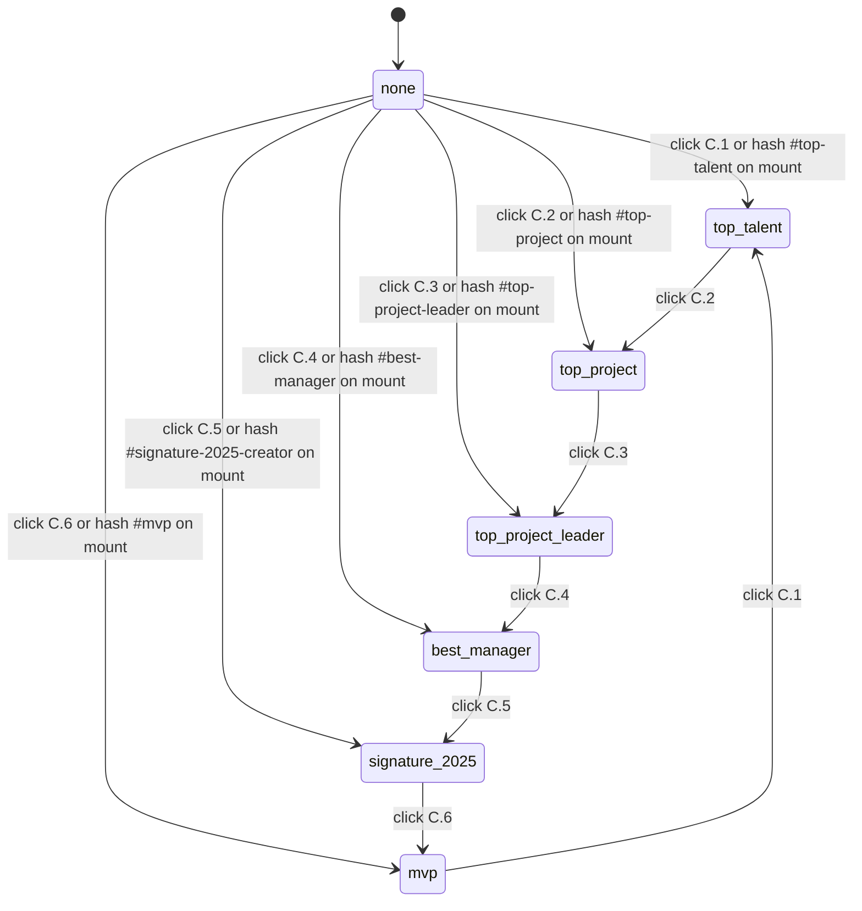

# F000_AwardSystemBrowse

## Overview

Award System Browsing is the presentational body of the `/he-thong-giai` page: a signed-in Sunner reads the SAA 2025 keyvisual hero and section title, picks one of six award categories from a left-hand scroll-spy menu (or arrives already scrolled to one via a Homepage deep-link hash), and reviews that category's image, description, headcount, and prize value. The page closes with a Sun* Kudos promo block whose "Chi tiết" button is a visible affordance only this round — its destination is deferred. Header, footer, language switch, account menu, and FAB are rendered by F002_NavigationShell and are out of scope here; the route itself is gated by F001_GoogleOAuthLogin's session guard (unauthenticated → redirect `/login`, TC ID-1).

## Polymorphic Behavior

N/A — no discriminator fields in Key Entities. The six award categories are static design content (see `## Key Entities`), not a DB-backed enum.

## Cross-Cutting Logic
### Requirements

None — all FRs for this feature sit under their owning User Story (see `## User Stories`), per the FR placement rule (a cross-cutting FR would only apply here if one FR spanned ≥2 USs equally, which none do).

### Business Rules

Scroll-spy left-nav behavior (menu `C`, items `C.1`–`C.6`) applies across both the click path and the hash-on-load path, so it is captured here rather than under a single User Story.

#### BR-001_ScrollSpyClickSetsActive
**Linked FR:** FR-002
**Source:** `src/components/awards/award-category-nav.tsx:90-93` — `handleSelect()`, sets `clickedSlug` and smooth-scrolls to the matching section.
**Applies to:** the 6 nav items `C.1`–`C.6` and their target sections `D.1`–`D.6`
**Rule:** Clicking a nav item smooth-scrolls the page to its matching award-card section and marks that item active (gold color + underline). Exactly one item is active at a time — activating a new one clears the previous item's active state (TC ID-9, TC ID-11).

**Pseudocode:**
```text
on click(navItem):
  scrollIntoView(sectionFor(navItem), behavior: "smooth")
  activeItem = navItem  # single source of truth, replaces prior value
```

#### BR-002_HashOnLoadScroll
**Linked FR:** FR-003
**Source:** `src/components/awards/award-category-nav.tsx:78-88` — `useSyncExternalStore` hash read + mount effect that scrolls to `hashSlug`; `src/components/awards/resolve-active-slug.ts:1-15` resolves the raw hash to a known slug.
**Applies to:** initial page load / mount of `/he-thong-giai`
**Rule:** If the URL loads with a hash matching one of the six known category anchors (e.g. `/he-thong-giai#top-talent`, used by Homepage deep-links per clarifications.md § Navigation), the page scrolls to that section and marks the matching nav item active on mount, without requiring a click.

**Pseudocode:**
```text
on mount:
  hash = readLocationHash()
  if hash in knownAnchors:
    scrollIntoView(sectionFor(hash), behavior: "auto")
    activeItem = navItemFor(hash)
```

#### BR-003_UnknownHashNoOp
**Linked FR:** FR-003
**Source:** `src/components/awards/resolve-active-slug.ts:7-15` — `resolveActiveSlug()` returns `null` for any hash not in the known slug list; the nav's mount effect no-ops on a `null`/falsy `hashSlug`.
**Applies to:** initial page load with an invalid/unknown hash, or a programmatic attempt to trigger a non-existent section id (TC ID-13)
**Rule:** An unknown section id — whether present on load or attempted via a manual/console call — produces no JavaScript error. The page stays exactly where it is (top, or current scroll position) and no active state changes.

**Pseudocode:**
```text
on mount or on programmatic scrollTo(id):
  if id not in knownAnchors:
    return  # no-op, no throw, no active-state change
```

**Note (not re-specified here):** unauthenticated access to `/he-thong-giai` redirects to `/login` — enforced by F001_GoogleOAuthLogin's proxy guard/middleware (TC ID-1). This feature does not own or re-implement that guard.

### Decision Logic

N/A — no user-facing decision logic beyond DISC-### Polymorphic Behavior; the scroll-spy branching above is captured as BR-001–BR-003 (single-condition click/hash handlers, not multi-predicate render/interaction/flow decisions).

### State Machines

#### SM-001_ActiveNavSection
**kind:** ui
**Linked FR:** FR-002, FR-003
**Source:** `src/components/awards/award-category-nav.tsx:78-83` — `activeSlug = clickedSlug ?? hashSlug`, the single source of truth both BR-001 and BR-002 write through.
**States:** none, top-talent, top-project, top-project-leader, best-manager, signature-2025-creator, mvp (7 states — "none" only before hydration/first interaction)



**Transition rules:**
- any state `→` any other category state: guard = user clicked that nav item; side effect = smooth scroll + gold/underline swap (BR-001).
- `none →` a category state on mount only: guard = valid hash present (BR-002).
- unknown hash: no transition occurs, state stays `none` (BR-003).

### Algorithms

None.

### External Integrations

None — the Sun* Kudos "Chi tiết" button targets an internal route (`/kudos`), not a third-party service; that route is deferred per clarifications.md, so no integration exists yet.

### Verification

- **SC-001** — clicking any of the 6 nav items scrolls to the matching section and marks exactly one item active (covers BR-001; TC ID-9, TC ID-11)
- **SC-002** — loading `/he-thong-giai#<valid-anchor>` scrolls to that section and activates the matching nav item on mount (covers BR-002)
- **SC-003** — an unknown/invalid section id produces no JavaScript error and no scroll/active-state change (covers BR-003; TC ID-13)

---

**Client behavior:** see `behavior-logic.md`, `permissions.md`, `screen-flow.md` (docs/system — not yet generated this round, greenfield draft; scroll-spy active-state and hash-restore logic is captured inline above as BR-001–BR-003 and SM-001 until those system docs exist).

## User Stories

### US001_ViewAwardCategories — View the SAA 2025 award categories (Priority: P1)

**What happens:** A signed-in Sunner opens `/he-thong-giai` and sees the keyvisual hero, the "Hệ thống giải thưởng SAA 2025" section title, and all six award info cards (Top Talent, Top Project, Top Project Leader, Best Manager, Signature 2025 - Creator, MVP), each showing a 336x336 image, title, description, headcount, and prize value.
**Why this priority:** This is the entire reason the page exists — without it there is nothing to navigate to or scroll toward.
**Independent Test:** Load the route as an authenticated user and confirm the hero, title, and all 6 cards render with the exact static content from the design (TC ID-3, TC ID-4, TC ID-6, TC ID-7).

**Acceptance Scenarios:**

1. **Given** a signed-in Sunner, **When** they open `/he-thong-giai`, **Then** the page renders successfully with hero → title → 6 cards → Kudos promo, top to bottom (TC ID-0, TC ID-3).
2. **Given** the page is open, **When** the Sunner scrolls through the content area, **Then** each of the 6 cards shows its fixed name, headcount, and prize value exactly as listed in `docs/data-model.md` § award_category (TC ID-6).
3. **Given** the page is open, **When** the Sunner looks at any award card's image, **Then** it renders at 336x336px (TC ID-7).

**Requirements fulfilled:**
- **FR-001** Render the keyvisual hero (background image, title "ROOT FURTHER", subtitle "Sun* Annual Award 2025") and the section title (subtitle "Sun* annual awards 2025" + heading "Hệ thống giải thưởng SAA 2025") from design content — no invented copy.
  **Endpoint:** N/A — static content rendered client-side, no network call.
  **Source:** TBD (draft) — not yet implemented
- **FR-004** Render the six award info cards (D.1–D.6) with image, title, description, quantity, and prize value sourced from `docs/data-model.md` § award_category (fixed rows) and, for description copy, from the Figma design text (only `D.1` Top Talent has description prose in `specs.csv`; the other 5 are read from Figma at implement time, never invented — see `## Unresolved Questions`).
  **Endpoint:** N/A — static content rendered client-side, no network call.
  **Source:** TBD (draft) — not yet implemented

**Verification:**
- **SC-004** all six cards render with the fixed name/quantity/prize values (covers FR-004; TC ID-6)

---

### US002_NavigateAwardCategories — Navigate categories via the scroll-spy left menu (Priority: P1)

**What happens:** The Sunner clicks one of the six left-menu items (`C.1`–`C.6`); the page smooth-scrolls to that category's card and highlights the clicked item in gold with an underline, clearing any previously active item. Hovering a menu item highlights it before click (TC ID-10 — visual-contract concern per clarifications.md § Responsive/visual states, not TDD).
**Why this priority:** The menu is the primary way to jump between the six categories on a long page; without it the page is a plain scroll with no orientation.
**Independent Test:** Click each of the 6 nav items in turn and confirm the page scrolls to the right section and exactly one item is active at a time (TC ID-9, TC ID-11), independent of US001's content.

**Acceptance Scenarios:**

1. **Given** the page is open, **When** the Sunner clicks "Top Talent" in the left menu, **Then** the page smooth-scrolls to the Top Talent card and "Top Talent" is shown gold + underlined (TC ID-9).
2. **Given** "Top Talent" is active, **When** the Sunner clicks "MVP", **Then** "MVP" becomes active and "Top Talent" loses its active state — only one item is ever active (TC ID-11).
3. **Given** a Homepage award card links to `/he-thong-giai#top-talent`, **When** the Sunner follows that link, **Then** the page opens already scrolled to the Top Talent section with that nav item active (BR-002).
4. **Given** an unknown/invalid section id is requested (e.g. via developer console), **When** the app processes it, **Then** no JavaScript error occurs and the page stays where it is (TC ID-13, BR-003).

**Requirements fulfilled:**
- **FR-002** Render the 6-item left navigation menu ("Top Talent", "Top Project", "Top Project Leader", "Best Manager", "Signature 2025 - Creator", "MVP") in this fixed order; clicking an item triggers BR-001.
  **Endpoint:** N/A — client-only smooth-scroll + local UI state, no network call.
  **Source:** TBD (draft) — not yet implemented
- **FR-003** Restore scroll position and active nav state from a URL hash on load; ignore unknown hashes without error.
  **Endpoint:** N/A — client-only, reads `location.hash` on mount, no network call.
  **Source:** TBD (draft) — not yet implemented

**Rules enforced:** BR-001, BR-002, BR-003 (see `## Cross-Cutting Logic`)

**State transitions:** SM-001 (see `## Cross-Cutting Logic`)

**Verification:**
- **SC-005** menu renders the 6 items in the exact fixed order (covers FR-002; TC ID-5)

---

### US003_ViewKudosPromo — View the Sun* Kudos promo block (Priority: P2)

**What happens:** At the bottom of the page the Sunner sees the Sun* Kudos promo block — label "Phong trào ghi nhận", title "Sun* Kudos", a summary paragraph, an illustration, and a "Chi tiết" button.
**Why this priority:** It is a secondary promotional block, not core to browsing the award categories, so it ranks below US001/US002.
**Independent Test:** Scroll to the bottom of the page and confirm the promo block's text and button render, independent of whether the button does anything (TC ID-8).

**Acceptance Scenarios:**

1. **Given** the Sunner scrolls to the end of the page, **When** the Kudos block comes into view, **Then** it shows the label, title, description, and "Chi tiết" button exactly as designed (TC ID-8).
2. **Given** the Kudos promo block is visible, **When** the Sunner clicks "Chi tiết", **Then** no navigation occurs this round — `/kudos` is deferred per clarifications.md § Navigation. The button is a visible affordance only. TC ID-12 (opens Kudos tab) and TC ID-14 (network-failure handling for that navigation) are both **deferred**, not implemented, until the Kudos page exists.

**Requirements fulfilled:**
- **FR-005** Render the Kudos promo block content and the "Chi tiết" button as a non-navigating affordance.
  **Endpoint:** N/A — no navigation wired this round (deferred).
  **Source:** TBD (draft) — not yet implemented

**Verification:**
- **SC-006** Kudos block renders label/title/description/button (covers FR-005; TC ID-8). No pass/fail check for TC ID-12/ID-14 — explicitly deferred.

---

### Edge Cases

See edge-cases.md.

## Key Entities

This feature performs **zero** database reads or writes. All six award categories are static design content fixed by Figma, not rows fetched from a table — `docs/data-model.md` § award_category states explicitly: "Static content, 6 rows, no DB implied." The single row below documents that content as design-fixed data, not a database entity; the usual 3-entity minimum does not apply to a feature with no DB surface at all.

| Entity | Table | Key Columns | Purpose |
|--------|-------|-------------|---------|
| AwardCategory | N/A — static design content, not a DB table (see `docs/data-model.md` § award_category, superseded-by-code note) | `name`, `slug` in code (`award-categories.ts`); title/description/quantityValue/quantityUnit/prizes in `messages/vi/awards.json` → `cardContent[slug]` | Renders the 6 fixed award info cards (D.1–D.6) and the scroll-spy nav labels (C.1–C.6) |

## Artifact References

| Artifact | File | Codes Used | Reviewed |
|----------|------|------------|----------|
| Feature List | [feature-list.md](../feature-list.md) | F004_AwardSystemBrowse | [ ] |
| Screens | [screens.md](screens.md) | SCR006_AwardSystem | [ ] |
| User Stories | N/A — allocated locally in this technical-spec.md (no separate user-stories.md in greenfield) | US001, US002, US003 | [ ] |
| System Overview | TBD (draft) | TBD (draft) | [ ] |
| Architecture | TBD (draft) | TBD (draft) | [ ] |
| API Map | TBD (draft) | TBD (draft) | [ ] |
| Entities | TBD (draft) | TBD (draft) | [ ] |
| Behavior Logic | TBD (draft) | TBD (draft) | [ ] |
| Permissions Matrix | TBD (draft) | TBD (draft) | [ ] |

## Assumptions

- Award category data (the 6 rows) is static design content hard-coded in the frontend, not fetched from a DB table — per `docs/data-model.md` § award_category and clarifications.md § Empty state ("six fixed entries from the design").
- Award descriptions beyond title/quantity/prize are missing from `specs.csv` for 5 of 6 cards (only Top Talent/`D.1` has body copy) — they must be read from Figma text nodes via MoMorph MCP at implement time, per clarifications.md § "Assumptions taken without asking."
- The six per-category hash anchors (e.g. `#top-talent`) are not explicitly named in `specs.csv`; slugs must be derived from the English award names at implement time and kept consistent with the Homepage feature's deep-links, per clarifications.md § Navigation.
- The Kudos "Chi tiết" button (`D2.1`) renders as a visible, non-navigating affordance this round — clarifications.md marks `/kudos` deferred, so TC ID-12/ID-14 are deferred, not implemented.
- Visual tokens (gold active color, 336x336 image size, spacing, breakpoints) come from MoMorph MCP `get_frame`/specs data and the project's Tailwind v4 `@theme` tokens in `globals.css` (CSS-first config, per the Tailwind v4 research) — never guessed or rounded.
- Unauthenticated access enforcement (redirect to `/login`, TC ID-1) is implemented by F001_GoogleOAuthLogin's proxy guard, not re-implemented here.

## Source Code References

**Source:** `src/app/(site)/he-thong-giai/page.tsx:1-45` — route composition (hero → section title → nav+cards two-column region → Kudos banner); guarded by F001_GoogleOAuthLogin's `proxy.ts` (not re-implemented here).
**Source:** `src/components/awards/award-hero.tsx:1-39` — FR-001, keyvisual hero; title/subtitle are baked into the non-exportable background photo (node `2167:5138`), rendered as the Cover node's own gradient fill with the copy re-exposed as `sr-only` text (accepted gap, see `## Unresolved Questions`).
**Source:** `src/components/awards/award-section-title.tsx:1-36` — FR-001, section title ("Sun* annual awards 2025" eyebrow + "Hệ thống giải thưởng SAA 2025" heading).
**Source:** `src/components/awards/award-category-nav.tsx:1-123` — FR-002/FR-003, BR-001/BR-002, SM-001: `useSyncExternalStore` hash read (empty on server and on the client's first render, so the real hash resync happens post-mount — same hydration-safety pattern as `src/lib/countdown/use-countdown.ts`); `clickedSlug` overrides the hash-derived slug as the single `activeSlug` source of truth; exactly one `aria-current="true"` at a time.
**Source:** `src/components/awards/resolve-active-slug.ts:1-15` — BR-002/BR-003, `resolveActiveSlug()`: pure hash-to-slug resolver, unit-tested independent of `window`/mounting.
**Source:** `src/components/awards/award-info-card.tsx:1-147` — FR-004, zigzag award cards (D.1–D.6): copy from `messages/vi/awards.json` → `cardContent[slug]` (each card's own `character` field, never the component instance's `itemName`); image/content side alternates by card-index parity; badges reused from `public/home/award-badge-{slug}.png` (accepted cross-screen asset reuse, see `## Unresolved Questions`).
**Source:** `src/components/awards/award-kudos-banner.tsx:1-55` — FR-005, inert "Chi tiết" CTA (`type="button" aria-disabled="true" tabIndex={-1}`) — `/kudos` deferred per clarifications.md.
**Source:** `src/lib/awards/award-categories.ts:1-21` — `AWARD_CATEGORIES`, the fixed `{ name, slug }` list this page maps over for both the nav and the six card sections; quantity/prize/description values live in `messages/vi/awards.json` instead (see `docs/data-model.md` § award_category).

`e2e/award-system.spec.ts` (5 specs) covers SC-001–SC-003 above using the `authenticatedPage` fixture (F001's real seeded-session fixture, since this route is private).

## Unresolved Questions

1. **Ghost spec rows `3.2` / `7.4`**: `specs.csv` rows "3.2" ("Danh sách nội dung giải thưởng") and "7.4" carry no `itemType`/description at all — unclear whether they are inert container labels the MoMorph extractor emitted, or placeholders for undesigned content. Treated as non-rendering, no-op rows until confirmed.
2. **Hash-anchor slugs**: no spec row names the six URL hash values Homepage deep-links will use (e.g. `#top-talent`); slugs must be derived from the English award names and agreed with the Homepage feature (F003) before both are built, since they must match exactly for the deep-link to work.
3. **Award body copy for 5 of 6 cards**: only the Top Talent card (`D.1`) has description prose in `specs.csv`; the other five have blank `description` cells — text must be pulled from Figma via MoMorph MCP `query_by_type(screenId, "TEXT")` at implement time, never invented.

### Resolved by orchestrator — 2026-08-28
- Section anchor slug rule → kebab-case English award name (#top-talent, #top-project, #top-project-leader, #best-manager, #signature-2025-creator, #mvp); shared with F003. (see plans/clarifications.md § Spec-stage gaps)
- specs.csv rows 3.2 / 7.4 → ignore as non-rendering ghost rows. (see plans/clarifications.md § Spec-stage gaps)
- Figma canvas vs. spec CSV conflicts (all screens) → spec CSV wins (status Done); applies here to the section-title eyebrow casing. (see plans/clarifications.md § Group 3 checkpoint)
- Award hero background photo (node `2167:5138`) has no exportable asset → render the Cover node's own gradient fill; designer to supply a PNG export later. (see plans/clarifications.md § Group 3 checkpoint)
- Award-page category badges (5 of 6 have no media URL on this screen) → reuse Homepage's `public/home/award-badge-*.png` exports; accepted cross-screen asset reuse. (see plans/clarifications.md § Group 3 checkpoint)
- `/he-thong-giai` nav active state on load without a hash → no default-active item; active only on click or a valid hash, unknown hash → none (existing RED test stands). (see plans/clarifications.md § Group 3 checkpoint)
- `AWARD_CATEGORIES` trimmed to `{ name, slug }` — its `quantity`/`prize` fields were wrong/paraphrased; per-card copy now lives in `messages/vi/awards.json` → `cardContent[slug]` (see `docs/data-model.md` § award_category). (see plans/clarifications.md § Group 3 checkpoint)

## Source Walkthrough

No source code exists yet (greenfield draft — no `**Source:**` citations are given below, per the draft citation rule). Planned build order once implementation starts:

1. **File:** TBD (draft) — `docs/data-model.md` § award_category — read first: defines the six fixed award rows this screen renders (no DB, static content).
2. **File:** TBD (draft) — the intended `/he-thong-giai` route entry (private route per F001's guard) — next: where hero, section title, nav, and cards mount.
3. **File:** TBD (draft) — the intended scroll-spy nav component — next: implements BR-001–BR-003 and SM-001.
4. **File:** TBD (draft) — the intended award-card + Kudos-promo components — last: renders the six D.1–D.6 cards and the D1/D2 promo block from static design content.

### Call Hierarchy

```text
TBD (draft) — planned: he-thong-giai route -> AwardSystemSection -> {AwardCategoryNav, AwardCard x6, KudosPromoBlock}
```

**Related files:** see `## Source Code References` above (Order column added there — F15 DRY, one table not two).

## DB Impact per Event

N/A — read-only feature, no DB writes; all award content is static design data (see `## Key Entities`).
