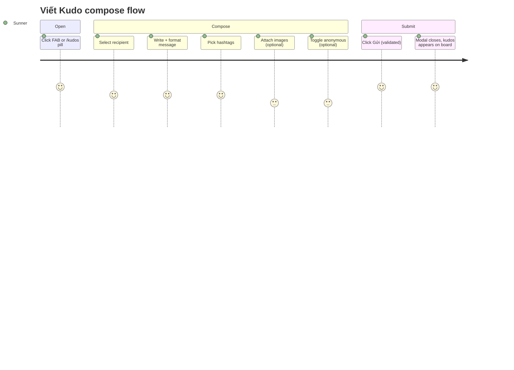

## Screen List

| Screen Name | MoMorph | What User Sees | What User Can Do |
|---|---|---|---|
| Viết Kudo modal | `ihQ26W78P2` | Title, recipient search, TipTap editor + toolbar, hashtag field, image upload grid, anonymous checkbox, Hủy/Gửi footer | Compose and send a kudos |
| Add link sub-dialog | `OyDLDuSGEa` | Text input (1–100), Link input (http/https, 5–2048), Hủy/Lưu footer | Insert a link into the editor's current selection |
| Hashtag picker dropdown | `p9zO-c4a4x` | Toggle-list of hashtags with a check-icon selected state | Pick/unpick up to 5 hashtags |

## User Journey

1. Sunner opens the modal from the FAB "Viết KUDOS" or the `/kudos` input pill
   (TC ID-3 — layout; `e2e/kudos-compose.spec.ts` "G1-01").
2. Modal renders field order: recipient, editor (with toolbar), hashtag, image, anonymous
   checkbox, footer (TC ID-3; `e2e/kudos-compose.spec.ts` "G1-02").
3. Sunner clicks the recipient search field, types, picks a Sunner from the autocomplete
   (TC ID-8/ID-25/ID-26); the pool is every `profile` row (RLS widened round 2), never the
   viewer's own name resolving to a valid pick — the server rejects self-selection on submit.
4. Sunner writes the message; toolbar buttons (B/I/S/list/link/quote) apply TipTap marks to
   the current selection (TC ID-27–ID-32; `e2e/kudos-compose.spec.ts` "G5-03"). Typing `@` opens
   a mention suggestion list sourced from `profile` (TC ID-12/ID-13; "G5-04").
5. Clicking the Link toolbar button opens the Add link sub-dialog; Lưu validates both fields
   and inserts the link mark, Hủy/Esc discards (addlink-box TC set; "G4-01"–"G4-04").
6. Sunner clicks "+ Hashtag", the picker dropdown opens; each click toggles a tag chip on the
   modal; at 5 selected, remaining rows disable (dropdown-list-hashtag A.1; TC ID-14–ID-17,
   ID-34–ID-36; "G3-01"/"G3-02").
7. Sunner optionally clicks "+ Image", picks up to 5 jpg/png/webp files ≤5MB each; the button
   hides at 5 (TC ID-18–ID-24, ID-37–ID-40, ID-54–ID-55; "G5-05").
8. Sunner optionally checks "Gửi ẩn danh"; a display-name text field appears and its value is
   discarded when unchecked (TC ID-41–ID-44; "G5-01"/"G5-02").
9. "Gửi" stays disabled until recipient + content + ≥1 hashtag are valid (TC ID-48/ID-49;
   "G2-01"/"G2-03"); clicking it validates, shows loading, submits, and closes the modal
   (`e2e/kudos-integration.spec.ts` item 2). "Hủy" discards and closes without saving
   (TC ID-45; "G2-02").

Note: the "+ Hashtag" picker and Add link sub-dialog are nested inside this modal, not
separate navigable routes — both close back to the parent modal without losing already-entered
fields.
