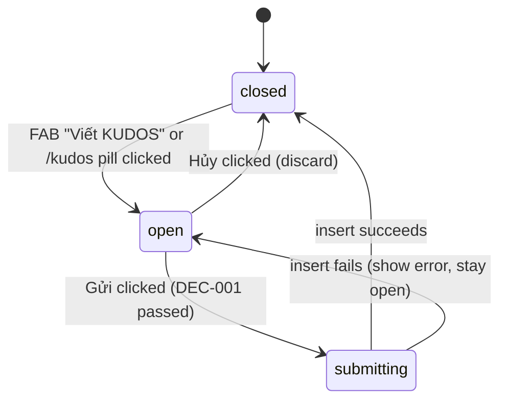
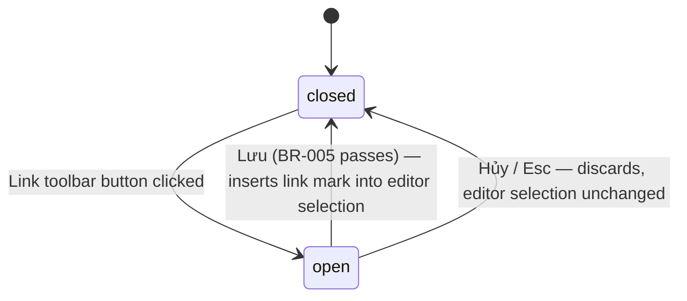

# F005_KudosCompose

**Priority**: P0 (feeds every F006 board surface)
**Type**: mixed
**Test policy**: `e2e-red-first`

## Overview

F005 is the "Viết Kudo" modal (MoMorph `ihQ26W78P2`): a signed-in Sunner picks a recipient,
writes a formatted message in a TipTap editor (with `@mention` autocomplete), tags 1–5
hashtags, optionally attaches up to 5 images and/or sends anonymously, and submits. The
editor's Link tool opens the Addlink Box sub-dialog (`OyDLDuSGEa`); the hashtag field opens the
hashtag picker dropdown (`p9zO-c4a4x`). On submit, the atomic `create_kudos` RPC writes
`kudos` + `kudos_hashtag` + `kudos_image` rows in one transaction (`../../data-model.md`).

## Notes on promotion from the Stage-1.5 draft

The spec drafts under `spec/F005_KudosCompose/` (2026-08-31) predate several clarifications
rulings and one code-level correction; this promoted version reconciles all of them:

- **Self-kudos is blocked**, not silently unenforced — a Group-3 checkpoint decision
  (2026-09-02) added the check after the draft was written (see BR-009 below).
- **TipTap link handling**: the draft's INT-001 named `@tiptap/extension-link` as a separate
  package. The shipped editor does not install it — `StarterKit`'s own bundled `link` extension
  is configured directly (`link: { openOnClick: false, autolink: false, ... }`); adding
  `@tiptap/extension-link` on top throws a duplicate-extension-name error at mount. Fixed below.
- **Recipient-required copy, upload-failure handling, and anonymous-name validation** — all
  three were open questions in the draft's edge-cases.md; all three are resolved in the shipped
  code (see `edge-cases.md`).

## Polymorphic Behavior

N/A — no discriminator fields in Key Entities. The modal's own behavior branches on UI state
(`isAnonymous`, hashtag/image counts), not on a `kind`/`type`-style entity discriminator.

## Cross-Cutting Logic

### Requirements

None — all FRs are local to a single User Story (see `## User Stories`).

### Business Rules

#### BR-001_RecipientRequired
**Linked FR:** FR-001 · **Source:** `viet-kudo` B.2, TC ID-7/ID-50
**Rule:** Submit is blocked and the recipient field shows a red border + error until a valid
existing Sunner (from `profile`, via the RLS widening in `../../data-model.md`) is selected.

#### BR-002_ContentRequired
**Linked FR:** FR-002 · **Source:** `viet-kudo` D, TC ID-11/ID-51
**Rule:** Submit is blocked until the editor has non-empty content (an empty TipTap doc, or
one with only whitespace, counts as empty).

#### BR-003_HashtagMinMax
**Linked FR:** FR-003 · **Source:** `viet-kudo` E/E.2, TC ID-14–ID-17/ID-34–ID-36/ID-52/ID-53
**Rule:** 1–5 hashtags required. 0 selected blocks submit with an error; a 6th pick is refused
client-side with "Tối đa 5 hashtag" (picker rows disable at 5, per `dropdown-list-hashtag` A.1).

#### BR-004_ImageMaxCountTypeSize
**Linked FR:** FR-004 · **Source:** `viet-kudo` F/F.5, TC ID-18–ID-24/ID-37–ID-40/ID-54/ID-55;
size/type per `clarifications.md`'s Round 2 logged assumption
**Rule:** Optional, up to 5 images. Accepted types jpg/png/webp, ≤5MB each, checked client-side
(`validate-image.ts`) before any upload starts. "+ Image" hides once 5 are attached; removing
one re-shows it.

#### BR-005_AddLinkValidation
**Linked FR:** FR-005 · **Source:** `addlink-box` B.2/C, full TC set
**Rule:** Text 1–100 chars, required, not whitespace-only. Link 5–2048 chars, required,
`http`/`https` only. Both validated live on every keystroke; Lưu stays disabled until both pass.

#### BR-006_SubmitEnablement
**Linked FR:** FR-006 · **Source:** `viet-kudo` H.2, TC ID-48/ID-49
**Rule:** "Gửi" is disabled until BR-001, BR-002, and BR-003 all pass simultaneously. Images
(BR-004) and anonymous (BR-007) are optional and never gate enablement.

#### BR-007_AnonymousTogglesDisplayName
**Linked FR:** FR-007 · **Source:** `viet-kudo` G, TC ID-41–ID-44
**Rule:** Checking "Gửi ẩn danh" reveals a display-name text field; unchecking hides it and
discards the value. The real `sender_id` is always the authenticated user
(`../../data-model.md` § `kudos`) — anonymity is a display concern only, never a data-integrity
one. Checking the box without a display name blocks submit server-side
(`missing-anonymous-display-name`).

#### BR-008_ContentStorageFormat
**Linked FR:** FR-002 · **Source:** `clarifications.md` § Round 2 (supersedes the 2026-08-28
placeholder — see `../../data-model.md` § Kudos Cluster)
**Rule:** Editor content is stored as `kudos.content jsonb` (TipTap document JSON), never
converted to an HTML string. Both write (`validate-content.ts`) and render
(`kudos-content-renderer.tsx`) independently allow-list mark and node types
(bold/italic/strike/link/blockquote/orderedList/mention/paragraph/text/doc/listItem) — no raw
`html` mark is ever accepted or rendered. A depth cap (20) and a total-node-count cap (2000) on
the write side reject a hostile, unboundedly-nested payload as a typed error instead of
exhausting the call stack.

#### BR-009_SelfKudosBlocked
**Linked FR:** FR-006 · **Source:** `plans/clarifications.md` § Group-3 checkpoint, 2026-09-02
**Rule:** A Sunner may not send a kudos to themselves. Enforced in `createKudos`
(`src/lib/kudos/write/create-kudos-action.ts`) — the sole enforcement point, since no RLS/DB
constraint backs it (`data-model.md` deliberately leaves `sender_id`/`receiver_id` unconstrained
at the schema level). Mirrored client-side in `ComposeDialogContainer` for an immediate error
before the network round trip.

### Decision Logic

**Subtypes:** `render`, `interaction`, `flow`.

---

#### DEC-001_SubmitEnablementFlow
**subtype:** flow
**Triggers in:** every field change while the modal is open
**Involved entities:** recipient, editor content, hashtag selection
**user_visible_outcome:** whether the "Gửi" button is enabled
**Source:** `kudos-compose-dialog.tsx`'s `canSubmit`

```pseudo
hasRecipient = recipientId != null
hasContent = editor.getText().trim().length > 0
hasHashtag = 1 <= selectedHashtags.length <= 5
submitEnabled = hasRecipient and hasContent and hasHashtag and not submitting
```

---

#### DEC-002_AnonymousFieldToggle
**subtype:** render
**Triggers in:** "Gửi ẩn danh" checkbox change
**Involved entities:** `isAnonymous` (UI state), `anonymousDisplayName` (UI state)
**user_visible_outcome:** the display-name field appears when checked, disappears (and its
value is discarded) when unchecked
**Source:** `anonymous-toggle.tsx`'s `onCheckedChange`

```pseudo
on checkbox toggle:
    isAnonymous = !isAnonymous
    if not isAnonymous:
        anonymousDisplayName = ""
```

---

#### DEC-003_HashtagPickerDisableAtMax
**subtype:** interaction
**Triggers in:** hashtag picker dropdown row click
**Involved entities:** `selectedHashtags` (UI state)
**user_visible_outcome:** a tag toggles on/off as a chip; the picker's remaining unselected
rows disable once 5 are already picked
**Source:** `dropdown-list-hashtag` A.1

```pseudo
on row click:
    if row.selected:
        selectedHashtags.remove(row.hashtagId)   # always allowed — unpicking never blocked
    else if selectedHashtags.length < 5:
        selectedHashtags.add(row.hashtagId)
    else:
        no_op   # row is already `disabled` at length == 5 — no click reaches this branch
```

---

#### DEC-004_SubmitFlow
**subtype:** flow
**Triggers in:** "Gửi" clicked with DEC-001 passing
**Involved entities:** `kudos`, `kudos_image`, `kudos_hashtag`, Supabase Storage `images` bucket
**user_visible_outcome:** a loading state, then either the modal closing (success) or an inline
error with the modal staying open (failure)
**Source:** `submit-kudos.ts`, `create-kudos-action.ts`

```pseudo
on submit:
    if receiverId == currentViewerId: show selfKudosError, abort   # BR-009, client fast path
    for each attached image (in order):
        upload to images bucket; on failure show uploadError naming the index, abort
    call createKudos(...)   # server re-derives sender_id, re-validates everything,
                             # rejects self-kudos again, then calls create_kudos (data-model.md)
    on success: close modal, revalidate /kudos
    on failure: show mapped error, keep modal open
```

---

### State Machines

**`kind` values:** `entity` (persisted) — `ui` (component-local only).

#### SM-001_ModalLifecycle
**kind:** ui · **Linked FR:** FR-006

**States:** closed, open, submitting



#### SM-002_AddLinkSubDialog
**kind:** ui

**States:** closed, open



### Algorithms

None — this feature performs no computation beyond the validation/allow-listing already
captured as BR-001 through BR-009.

### External Integrations

#### INT-001_TipTapEditor
**Type:** client library — `@tiptap/react` (`3.30.6`, pinned exact — TipTap v3 peers pin exact
versions) + `@tiptap/starter-kit` configured with `link` (StarterKit's own bundled extension,
not the separate `@tiptap/extension-link` package) + `@tiptap/extension-mention`
(`@tiptap/suggestion` peer)
**Trigger:** modal mount, `immediatelyRender: false` (avoids a Next.js SSR hydration mismatch)
**Note:** Mention's `items()` filters the same `profile` read used for recipient autocomplete —
one query shape (`getRecipients()`), two UI surfaces (DRY). StarterKit disables every node/mark
outside the `content-schema.ts` allow-list (heading, codeBlock, code, bulletList,
horizontalRule, underline, hardBreak).

#### INT-002_SupabaseStorageUpload
**Type:** client → Supabase Storage `images` bucket (browser client, `@supabase/ssr`)
**Trigger:** each accepted image, on Submit (not on file-pick, to avoid orphaned objects for a
kudos the user cancels)
**Failure handling:** stops at the first failed upload, names its index, never calls
`createKudos` for that draft (`submit-kudos.ts`).

#### INT-003_KudosInsert
**Type:** Server Action → `create_kudos` Postgres RPC (`security invoker`, one atomic
transaction — `../../data-model.md`)
**Trigger:** Gửi clicked with DEC-001 passing
**Trust boundary:** the Server Action re-derives `sender_id` from `getClaims()`, never the
client; re-validates the draft (`validate-draft.ts`), the content allow-list
(`validate-content.ts`), and every image's storage-path ownership prefix
(`verifyKudosImageStoragePath`) before calling the RPC.

### Verification

- **SC-001** — "Gửi" is never clickable while any of BR-001/002/003 fails (covers FR-006,
  DEC-001)
- **SC-002** — a 6th hashtag pick and a 6th image pick are both refused without a server round
  trip (covers BR-003, BR-004)
- **SC-003** — `kudos.sender_id` always equals the authenticated user's id regardless of
  `is_anonymous` (covers BR-007)
- **SC-004** — the Addlink sub-dialog never inserts a link mark unless both BR-005 checks pass
  (covers BR-005)
- **SC-005** — no `kudos` row can ever have `sender_id === receiver_id` that reaches this
  Server Action's success path (covers BR-009)

**Client behavior:** see `behavior-logic.md` (TBD — not authored this round; no client-side
debounce/optimistic-UI/polling/realtime pattern beyond the object-URL caching already described
in `## Source Code References` below), [`permissions.md`](../../system/permissions.md),
`screen-flow.md` (TBD — not authored this round).

## User Stories

### US001_SelectRecipient (P0)
**What happens:** Sunner types in the recipient field; an autocomplete filters `profile` rows
by name; selecting one populates the field with name + avatar.
**Independent Test:** Type "Nguyễn", see filtered suggestions, click one, field shows the
selected name (TC ID-8, ID-25, ID-26).
**Rules enforced:** BR-001_RecipientRequired

### US002_FormatMessage (P0)
**What happens:** Sunner selects text and clicks a toolbar button (B/I/S/list/quote); TipTap
applies the mark/node to the selection.
**Independent Test:** Select "Cảm ơn bạn", click Bold, confirm bold formatting applied
(TC ID-27–ID-30, ID-32; `e2e/kudos-compose.spec.ts` "G5-03").
**Rules enforced:** BR-002_ContentRequired, BR-008_ContentStorageFormat

### US003_MentionColleague (P0)
**What happens:** Typing `@` inside the editor opens a suggestion list from `profile`;
selecting one inserts a mention node.
**Independent Test:** Type "Cảm ơn @", confirm the mention suggestion list opens
(TC ID-12, ID-13; "G5-04").
**Rules enforced:** BR-008_ContentStorageFormat

### US004_InsertLink (P1)
**What happens:** Clicking the Link toolbar button opens the Addlink Box; valid Text + Link
inserts a link mark on save.
**Independent Test:** `KudosEditor`'s `onSave` handler (`kudos-editor.tsx`) inserts the link mark
into the editor via `editor.chain().focus().insertContent(...)`; no test exercises the full
valid-save path end to end this round (`e2e/kudos-compose.spec.ts`'s four Addlink tests all
cover a rejection or cancel path — TC `13c491cb`, the successful-save case, is untested; see
`docs/test-traceability.md`).
**Rules enforced:** BR-005_AddLinkValidation

### US005_PickHashtags (P0)
**What happens:** Sunner opens the hashtag picker, toggles 1–5 tags; chips render on the modal;
removing a chip un-toggles it in the picker.
**Independent Test:** Add 1 hashtag, confirm 1 chip, remove it via its "x", confirm 0 remain
(TC ID-34/ID-36; "G3-02").
**Rules enforced:** BR-003_HashtagMinMax

### US006_AttachImages (P1)
**What happens:** Sunner clicks "+ Image", picks files; valid images show as thumbnails with a
remove "x"; the button hides at 5.
**Independent Test:** Upload 5 valid PNGs, confirm all 5 thumbnails and a hidden "+ Image"
(TC ID-19, ID-38; "G5-05").
**Rules enforced:** BR-004_ImageMaxCountTypeSize

### US007_SendAnonymously (P1)
**What happens:** Checking "Gửi ẩn danh" reveals a display-name field; the recipient sees that
name instead of the sender's real name, while `sender_id` still records the real account.
**Independent Test:** Check the box, confirm the name field appears (TC ID-43; "G5-01"); uncheck,
confirm it hides and clears (TC ID-44; "G5-02").
**Rules enforced:** BR-007_AnonymousTogglesDisplayName

### US008_SubmitKudos (P0)
**What happens:** With all required fields valid, clicking "Gửi" validates, shows a loading
state, inserts the kudos + images + hashtags atomically, and closes the modal.
**Independent Test:** Fill recipient + content + 2 hashtags + 1 image, click Gửi, confirm the
modal closes and the new card appears in the feed with matching content/hashtags/time
(`e2e/kudos-integration.spec.ts` item 2, TC ID-46/ID-47).
**Rules enforced:** BR-006_SubmitEnablement, all upstream BRs

### US009_CancelDiscard (P1)
**What happens:** Clicking "Hủy" closes the modal without saving any entered data.
**Independent Test:** Enter recipient + content, click Hủy, confirm modal closes and no kudos
appears on the board (TC ID-45; "G2-02").

### US010_RejectSelfKudos (P0)
**What happens:** Selecting yourself as recipient and submitting is rejected, client- and
server-side, with the same typed error either way.
**Independent Test:** `createKudos` unit test "rejects sending a kudos to yourself (self-kudos
is BLOCKED per the Group-3 checkpoint decision)"; `ComposeDialogContainer` unit test "rejects a
self-kudos draft client-side without calling submitKudos".
**Rules enforced:** BR-009_SelfKudosBlocked

### Edge Cases

See `edge-cases.md` for the full scenario table (validation errors, upload failures, the three
copy gaps) and `## Unresolved Questions` below for what is still genuinely open.

## Key Entities

See `../../data-model.md` § Kudos Cluster for full column/RLS detail.

| Entity | Table | Purpose in this feature |
|---|---|---|
| kudos | `public.kudos` | The submitted message, written via `create_kudos` RPC |
| kudos_image | `public.kudos_image` | Up to 5 attached images, written via the same RPC |
| hashtag | `public.hashtag` | Read-only picker source (13 seeded rows) |
| kudos_hashtag | `public.kudos_hashtag` | 1–5 rows per submit, written via the same RPC |
| profile | `public.profile` | Read-only source for recipient autocomplete + `@mention` (RLS widened round 2 — every authenticated Sunner reads every row) |

## Artifact References

| Artifact | File | Codes Used | Reviewed |
|----------|------|------------|----------|
| Feature List | [feature-list.md](../../generated/feature-list.md) (code-derived, not regenerated this round — still lists 4 route-granularity features, not F005/F006) | F005 | [ ] |
| Architecture | [architecture.md](../../system-architecture.md) § Kudos domain (round 2) | — | [x] |
| Permissions | [permissions.md](../../system/permissions.md) | — | [x] |
| Data Model | [data-model.md](../../data-model.md) § Kudos Cluster | — | [x] |
| Screens (this feature) | [screens.md](./screens.md) | — | [x] |
| Screen Spec (Viết Kudo) | [screens/SCR007_KudosCompose/spec.md](../../screens/SCR007_KudosCompose/spec.md) | SCR007_KudosCompose | [x] |
| Test Traceability | [test-traceability.md](../../test-traceability.md) § Kudos Cluster (Round 2) | — | [x] |
| User Stories | (see `## User Stories` above) | US001–US010 | [x] |

**Rule:** Every code listed in Codes Used MUST exist in its source artifact. Orphan refs =
reviewer critical.

## Assumptions

- Image upload runs client → Supabase Storage directly (browser client, `@supabase/ssr`), not
  proxied through a Route Handler — consistent with this project having no custom API layer.
- The hashtag picker's 13 seeded tags fully replace any need for free-text tag creation —
  confirmed by `dropdown-list-hashtag`'s toggle `itemSubtype`, not a `text_form`.

## Source Code References

**Source:** `src/lib/kudos/content-schema.ts:1-55` — the shared node/mark/link-scheme
allow-list both the write and render layers import (covers BR-008).
**Source:** `src/lib/kudos/write/validate-content.ts:1-139` — `validateContent()`, the depth-
(20) and node-count- (2000) capped recursive validator run before every insert (BR-008).
**Source:** `src/lib/kudos/write/validate-draft.ts:1-82` — `validateDraft()` and
`isSelfKudos()`, the server-side mirror of DEC-001 plus BR-009 (covers BR-001–004, 007, 009).
**Source:** `src/lib/kudos/write/validate-image.ts:1-49` — client-side image type/size/count
checks before any upload starts (BR-004).
**Source:** `src/lib/kudos/write/storage-path.ts:1-57` — `buildKudosImageStoragePath()` /
`verifyKudosImageStoragePath()`, the upload path convention and its server-side ownership
verifier (INT-002, trust boundary).
**Source:** `src/lib/kudos/write/submit-kudos.ts:1-68` — `submitKudos()`, client orchestration:
uploads images in order, stops at the first failure, then calls `createKudos()`.
**Source:** `src/lib/kudos/write/create-kudos-action.ts:1-133` — `createKudos()` Server Action:
runtime input-shape guard, `getClaims()`-derived identity, BR-009 self-kudos rejection, draft +
image-path re-validation, then the `create_kudos` RPC call.
**Source:** `supabase/migrations/20260831000000_create_kudos_cluster.sql:281-325` —
`create_kudos()` Postgres function: one atomic transaction, 1–5 hashtag / ≤5 image guards,
`security invoker` (RLS still applies), an unhandled `raise exception` rolls back the whole
insert.
**Source:** `src/components/kudos/compose/kudos-compose-dialog.tsx:1-149` — `KudosComposeDialog`,
the modal's client-side state and `canSubmit` gate (DEC-001).
**Source:** `src/components/kudos/compose/kudos-editor.tsx:1-113` — the TipTap editor mount:
`StarterKit.configure({ heading:false, codeBlock:false, code:false, bulletList:false,
horizontalRule:false, underline:false, hardBreak:false, link:{...} })` + `Mention.configure(...)`
(INT-001; corrects the draft spec's separate-`@tiptap/extension-link` claim).
**Source:** `src/components/kudos/compose/addlink-dialog.tsx:1-142` — `AddlinkDialog`, live
Text/Link validation gating `Lưu` (BR-005).
**Source:** `src/components/kudos/compose/hashtag-picker.tsx:1-139` — `HashtagPicker`, the
5-tag ceiling and chip add/remove (BR-003, DEC-003).
**Source:** `src/components/kudos/compose/image-attachment-grid.tsx:1-162` —
`ImageAttachmentGrid`, thumbnail grid with per-file object-URL caching and cleanup (BR-004).
**Source:** `src/components/kudos/compose/anonymous-toggle.tsx:1-55` — `AnonymousToggle`,
discards the display name on uncheck (BR-007, DEC-002).
**Source:** `src/components/kudos/containers/compose-dialog-container.tsx:1-107` —
`ComposeDialogContainer`, the single client wrapper both entry points (FAB, `/kudos` pill)
mount; client-side self-kudos fast path, error-code-to-message mapping, post-submit
`router.refresh()` (BR-009, DEC-004).
**Source:** `messages/vi/compose.json`, `messages/en/compose.json` — all user-facing copy for
this feature; see `docs/test-traceability.md` § Copy gaps (round 2) for which keys are
`[VN]`-mirrored in the EN catalogue.

## Unresolved Questions

1. **Anonymous display-name field's own max length** — no spec row or code-level cap exists
   beyond "non-empty when checked" (`missing-anonymous-display-name`). Flagged for a product
   decision before a very long display name is exercised in practice.
2. **No notification hook** — see `business-context.md` § Unresolved Questions.
