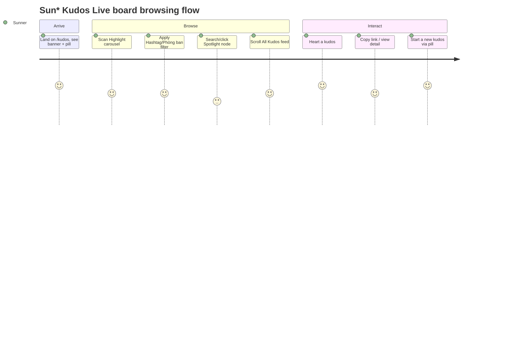

## Screen List

| Screen Name | Route | What User Sees | What User Can Do |
|---|---|---|---|
| Sun* Kudos Live board | `/kudos` | KV banner, input pill, Highlight carousel, filters, Spotlight word cloud, All Kudos feed, sidebar | Filter, heart, copy link, open detail/profile, start a new kudos |
| Kudos detail (minimal) | `/kudos/[id]` | One full card, no truncation, full-size images | Heart, copy link, open sender/receiver profile — all interactive |
| Profile stub | `/profile?id={uuid}` | Avatar + name + "Đang phát triển" | Nothing — placeholder |

## Layout Regions (`/kudos`)

| Region | MoMorph ref | Key Components |
|---|---|---|
| KV banner | A | Title "Hệ thống ghi nhận lời cảm ơn" + SAA 2025 KUDOS logo, readonly |
| Input pill | A.1 | Pill text field, placeholder "Hôm nay, bạn muốn gửi lời cảm ơn và ghi nhận đến ai?"; click opens F005's modal |
| Highlight header + filters | B.1 | "Sun* Annual Awards 2025" / "HIGHLIGHT KUDOS", Hashtag + Phòng ban dropdown buttons |
| Highlight carousel | B.2/B.3 | 5 cards, center-prominent, side cards faded, prev/next arrows disable at ends, pagination "n/5" |
| Spotlight header | B.6 | "Sun* Annual Awards 2025" / "SPOTLIGHT BOARD" |
| Spotlight board | B.7 | Word cloud canvas (one node per kudos, labeled by recipient), "N KUDOS" total (live `count(*)`), Pan/Zoom toggle, search bar (≤100 chars) |
| All Kudos header | C.1 | "Sun* Annual Awards 2025" / "ALL KUDOS" |
| All Kudos feed | C.2–C.7 | Infinite-scroll card list, page size 10; each card: sender/receiver info, time, content (≤5 lines), gallery, hashtags, heart, Copy Link |
| Sidebar | D | 5-line stats block + "Mở quà" (disabled, tooltip), two 10-item leaderboards |

**Sidebar stat-line count:** the design's own D-section prose says "6 dòng số liệu", but only 5
concrete `D.1.x` rows exist as real nodes under `2940:13488` (a 1px divider is the sixth
element, not a stat line). The board renders exactly 5 — `data-testid="sidebar-stat-line"`
asserted `toHaveCount(5)` — no invented 6th row. Logged as a design-copy gap, same class as
round 1's C2.4–C2.6 placeholder-copy precedent.

## User Journey

1. Sunner opens `/kudos`; unauthenticated visitors are redirected to `/login?next=/kudos` (F001
   BR-002_PublicRouteAllowList — no new guard code, the route just isn't in the public
   allow-list; `e2e/kudos-integration.spec.ts` item 1).
2. Sunner reads the KV banner (readonly) and clicks the input pill; F005's modal opens
   (TC `0578e8ef`, `b35d40c1`).
3. Sunner browses the Highlight carousel — prev/next arrows navigate, disabled at either end;
   pagination reads "n/5" (TC `86092c3a`, `81446f61`; `e2e/kudos-board.spec.ts`).
4. Sunner opens the Hashtag or Phòng ban dropdown, picks a value; both the Highlight carousel
   and the All Kudos feed re-filter via a shared `?hashtag=`/`?department=` URL query, Highlight
   resets to page 1 (TC `0e56cacb`, `159fed13`; `e2e/kudos-integration-heart-filters.spec.ts`
   item 8).
5. Sunner clicks a hashtag chip on any card; the Hashtag filter is set to that tag and both
   surfaces re-filter the same way (TC `d01729d4`; same test as above).
6. Sunner types in the Spotlight search bar (≤100 chars, empty-on-Enter both rejected with an
   inline error) or clicks a word-cloud node; clicking a node opens `/kudos/[id]`
   (TC `9e689933`, `33ca8f8a`).
7. Sunner scrolls the All Kudos feed; more cards load via infinite scroll, page size 10
   (TC `9dfda316`; `e2e/kudos-integration.spec.ts` item 3).
8. Sunner clicks a card's heart; count and color toggle; clicking again un-hearts
   (TC `7a7ec63e`). The sender's own kudos has its heart button disabled
   (TC `63645b03`; `e2e/kudos-board.spec.ts`).
9. Sunner clicks "Copy Link"; URL copied, toast "Link copied — ready to share!" shows
   (TC `0adfd7ce`, verbatim per `clarifications.md`; `e2e/kudos-integration.spec.ts` item 4).
10. Sunner clicks "Xem chi tiết" (Highlight cards only — feed cards have no such button, per
    spec C.4's real action bar) or a feed card's content (`role="link"`, spec C.2/C.3.5) or a
    Spotlight node; `/kudos/[id]` opens with the full, untruncated card and full-size gallery
    (TC `8c0d1781`, `31693bb7`; `e2e/kudos-detail.spec.ts` "Item 1",
    `e2e/kudos-integration.spec.ts` "4c").
11. `/profile?id={uuid}` exists and renders correctly when visited directly
    (`e2e/kudos-detail.spec.ts` "Item 4"/"Item 5"). Clicking a card's sender/receiver
    avatar/name also reaches it (TC `0952e2f0`, `2cd77a0c`; `e2e/kudos-integration.spec.ts`
    "4b") — a leaderboard entry's avatar/name is wired the same way but has no test clicking it
    yet.
12. Sunner sees the sidebar's 5 stats and both leaderboards; "Mở quà" is visibly disabled with
    a tooltip (per `clarifications.md` Round 2 — Secret Box modal itself is a later round).

## Notes

**Update (2026-09-02):** `/kudos/[id]`'s heart button and Copy Link are both wired.
`KudosDetailContainer` reads the signed-in Sunner's id via `getClaims()` and passes it as
`currentViewerId`; `KudosDetailView` derives `canHeart` from it (same
`sender.id !== currentViewerId` rule the board uses) and toggles through the shared
`useHeartToggle` hook (`src/components/kudos/containers/use-heart-toggle.ts`) — the same
in-flight-guard/optimistic-count logic the board's cards use, not a second implementation. Copy
Link shows the same verbatim toast text as the board ("Link copied — ready to share!").
`e2e/kudos-detail.spec.ts` "Item 2" clicks the heart button (asserts count 0→1→0) and Copy Link
(asserts the toast) end to end.
