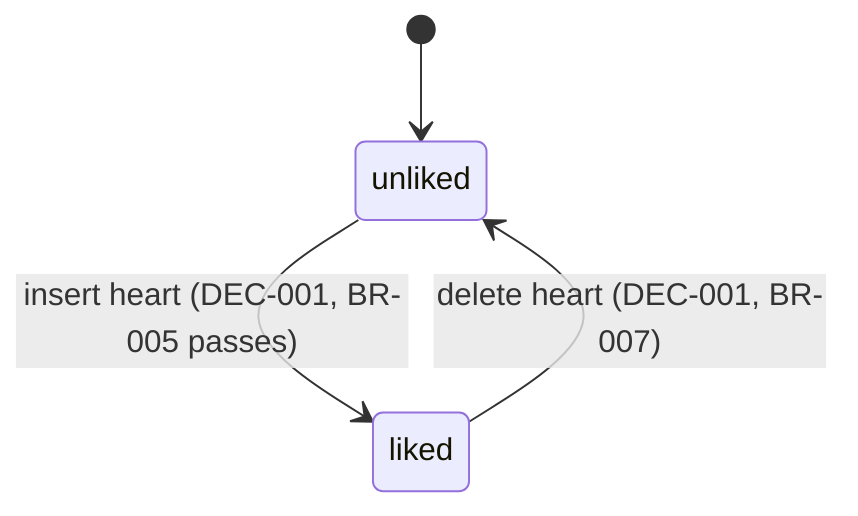
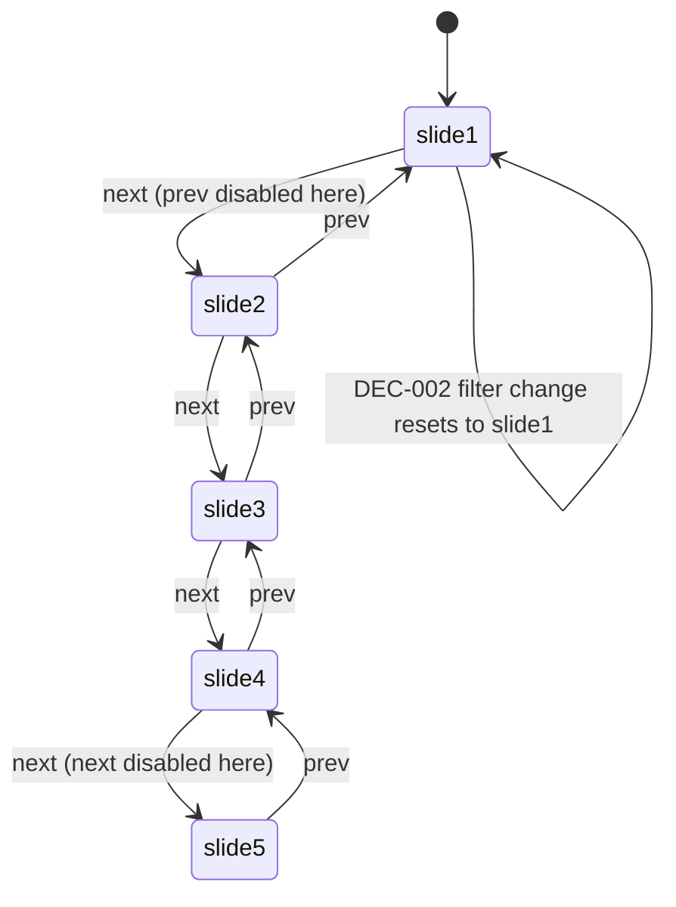

# F006_KudosLiveBoard

**Priority**: P0
**Type**: mixed
**Test policy**: `e2e-red-first`

## Overview

F006 is `/kudos` (MoMorph `MaZUn5xHXZ`): an auth-guarded route that reads everything F005
writes and surfaces it through five coordinated views — Highlight carousel (top 5 by hearts),
Hashtag/Phòng ban filters (apply to both Highlight and the feed), Spotlight word cloud (one
node per kudos, labeled by recipient), All Kudos infinite-scroll feed, and a stats/leaderboard
sidebar — plus a minimal detail page and a profile stub for the click targets those views
expose.

## Notes on promotion from the Stage-1.5 draft

The spec drafts under `spec/F006_KudosLiveBoard/` (2026-08-31) predate two clarifications
rulings; this promoted version reconciles both (also recorded in the round's own `plan.md` §
Notes):

- **Rank-promotion leaderboard is populated, not permanently empty.** The draft's own
  edge-cases.md called it: "render the leaderboard shell with the 'Chưa có dữ liệu' empty state
  permanently this round (no query, no fabricated rank logic)". `plans/clarifications.md`'s
  Round 2 session had already resolved the data source before implementation started ("Suy từ
  mốc hoa thị" — derive it from the 10th/20th/50th received-kudos milestone), and the shipped
  code implements exactly that (BR-013 below). Only the **gift**-recipient leaderboard stays
  legitimately empty (BR-011).
- **Sidebar stat count is 5, not 6.** US011 in the draft says "their own 6 stat lines"; the
  actual MoMorph frame under `2940:13488` has exactly 5 concrete `D.1.x` stat rows (the sixth
  "line" the design's own prose counts is a 1px divider, not a stat). Fixed in BR-014 below.
- **Avatar/name click-to-profile — fixed 2026-09-02, verified on disk.** The draft's US013 and
  its TC citation (`0952e2f0`) describe clicking a card's or leaderboard's avatar/name to open
  `/profile?id={uuid}`. This promotion's first pass found neither `CardAuthorBlock` nor
  `LeaderboardList` wired (a genuine implementation gap, not a promotion-time draft correction —
  the phase's own RED tests navigated by URL, never by clicking a rendered avatar, so nothing
  caught it). It shipped within the same round: `CardAuthorBlock` now wraps its block in a
  `next/link` `Link` to `/profile?id={author.id}`; `LeaderboardList` wraps each entry the same
  way. `e2e/kudos-integration.spec.ts` "4b" clicks a card's sender name and asserts the
  navigation — green. The leaderboard-entry click is implemented identically but has no test
  exercising it yet (`docs/test-traceability.md` TC `6b1e2359`).
- **Feed-card content → `/kudos/[id]` — fixed 2026-09-02, verified on disk.** Spec C.2/C.3.5
  (and TC `31693bb7`) expect clicking a feed card's content, not only the Highlight-only "Xem
  chi tiết" button, to open the detail page. This promotion's second pass found the content
  block had no `onClick`/`<Link>`; it shipped within the same round: the block (feed variant
  only) now carries `role="link"`, `tabIndex={0}`, and `onClick`/`onKeyDown` handlers that
  `router.push()` to `/kudos/${view.id}`, guarded against double-navigating on an embedded link
  mark inside the rendered content. `e2e/kudos-integration.spec.ts` "4c" clicks it — green.
- **Detail-page heart toggle and Copy Link — fixed 2026-09-02, verified on disk.**
  `KudosDetailContainer` now passes the signed-in Sunner's id (`getClaims()`) as
  `currentViewerId`; `KudosDetailView` derives `canHeart` from it and toggles through the new
  shared `useHeartToggle` hook (`src/components/kudos/containers/use-heart-toggle.ts`) — the
  same in-flight-guard/optimistic-count logic the board's own cards use, factored out rather
  than duplicated (BR-004–BR-007 apply identically). Copy Link shows the same verbatim toast.
  `e2e/kudos-detail.spec.ts` "Item 2" clicks both (heart 0→1→0, then the Copy Link toast) —
  green.

## Polymorphic Behavior

N/A — no discriminator fields in Key Entities.

## Cross-Cutting Logic

### Requirements

None — all FRs are local to a single User Story (see `## User Stories`).

### Business Rules

#### BR-001_AuthGuardedRoute
**Linked FR:** FR-001 · **Source:** F001 BR-002_PublicRouteAllowList; TC `71b3ef43`
**Rule:** `/kudos`, `/kudos/[id]`, and `/profile` are not in `PUBLIC_ROUTES`, so `proxy.ts`'s
existing guard already redirects an unauthenticated visitor to `/login?next=<path>` — no new
guard logic needed, only the routes themselves.

#### BR-002_HighlightTop5ByHearts
**Linked FR:** FR-002 · **Source:** `sun-kudos-live-board` B/B.2, TC `86092c3a`
**Rule:** Highlight carousel always shows exactly the 5 kudos with the most hearts (ties broken
by `created_at desc`, then `id desc` — unspecified by the spec, fixed for determinism),
re-computed whenever a filter changes.

#### BR-003_FilterAppliesToHighlightAndFeed
**Linked FR:** FR-003 · **Source:** `sun-kudos-live-board` B ("lọc cả phần Highlight Kudos và
All Kudos"), TC `0e56cacb`, `159fed13`, `d01729d4`
**Rule:** Selecting a Hashtag or Phòng ban value (via dropdown or a card's hashtag chip)
re-queries both Highlight and the All Kudos feed with the same filter, carried in the URL
(`?hashtag=`/`?department=`); Highlight's pagination resets to slide 1.

#### BR-004_HeartOnePerUserPerKudo
**Linked FR:** FR-004 · **Source:** `sun-kudos-live-board` C.4.1, TC `91e102ba`
**Rule:** Enforced by `heart`'s composite primary key `(kudos_id, user_id)`
(`../../data-model.md`) — a second insert for the same pair is a constraint violation, not an
app-level check alone.

#### BR-005_SenderCannotHeartOwnKudo
**Linked FR:** FR-005 · **Source:** `sun-kudos-live-board` C.4.1, TC `63645b03`
**Rule:** Heart button renders disabled when `kudos.sender_id === currentUser.id`; also
enforced at the database via the `heart_insert_not_self` RLS `with check` clause
(`../../data-model.md`) — belt and suspenders, verified by an E2E test that a direct anon-client
self-heart insert is rejected (SC-002).

#### BR-006_HeartGrantAmount
**Linked FR:** FR-004 · **Source:** `sun-kudos-live-board` C.4.1, TC `31936b72`;
`clarifications.md` Round 2
**Rule:** A heart grants the kudos's **sender** (not the receiver) 1 point normally, 2 points if
the current date in `Asia/Ho_Chi_Minh` is present in `special_days`. Decided server-side inside
`toggleHeart` (`heart-rules.ts`'s `computeGrantAmount`), before the `heart` row is written — the
client never supplies `granted_amount`. The Ho Chi Minh cast matters: Supabase's own
`current_date` is UTC, and a naive UTC compare is 7h out of phase around VN midnight (unit-tested
at both the 23:30 and 00:30 UTC boundaries).

#### BR-007_HeartRevokeReturnsGranted
**Linked FR:** FR-004 · **Source:** `clarifications.md` Round 2 ("Thu hồi tim phải trả đúng số
đã cộng")
**Rule:** Un-hearting deletes the `heart` row and subtracts exactly `granted_amount` (read back
from the row the delete actually removed, 1 or 2) from the sender's heart total — never a
hardcoded 1. The delete is a single atomic `delete().select("granted_amount")` round trip (a
Group-3 review fix over an earlier select-then-delete version), so a losing request in a
double-toggle race reports 0 rather than a phantom revoke it didn't perform.

#### BR-008_AsteriskBadgeThresholds
**Linked FR:** FR-006 · **Source:** `sun-kudos-live-board` B.3.2/B.3.6 (hover tooltip copy
given verbatim)
**Rule:** A Sunner's asterisk count on any card/leaderboard is a tier over their total received
kudos (`kudos.receiver_id = sunner`, not hearts) — 1★ at ≥10 received, 2★ at ≥20, 3★ at ≥50
(thresholds carried over from the 2026-08-28 session's "Still open" note, resolved by these spec
rows). Hover shows the matching tooltip sentence verbatim from the spec
(`kudos.asterisk.tier{1,2,3}`).

#### BR-009_ContentTruncation
**Linked FR:** FR-007 · **Source:** `sun-kudos-live-board` B.3/C.3.5
**Rule:** Highlight cards truncate content at 3 lines; All Kudos feed cards truncate at 5 lines;
either shows "…" when truncated. The detail page (`/kudos/[id]`) never truncates
(`truncate={false}`).

#### BR-010_SecretBoxCountersRealDefaultZero
**Linked FR:** FR-008 · **Source:** `clarifications.md` Round 2
**Rule:** The sidebar's Secret Box "opened" counter is a real per-Sunner count from
`secret_box_gift` (defaulting to 0 — the table seeds empty, no redemption flow exists yet); the
"unopened" counter has no data source at all this round and is a documented, fixed 0 (never a
fabricated non-zero value). "Mở quà" itself stays disabled with a tooltip.

#### BR-011_SidebarEmptyStates
**Linked FR:** FR-009 · **Source:** TC `d035e3b8`, `d662780b`
**Rule:** The gift-recipient leaderboard always shows "Chưa có dữ liệu" this round (no
`secret_box_gift` redemption flow exists to populate it — see BR-013 for its sibling, the
rank-promotion leaderboard, which is NOT always empty); the All Kudos feed with zero rows shows
"Hiện tại chưa có Kudos nào." — same empty-state string already used for Highlight per the
2026-08-28 session.

#### BR-012_SpotlightTotalFromDB
**Linked FR:** FR-010 · **Source:** `sun-kudos-live-board` B.7.1
**Rule:** The "N KUDOS" header is `count(*) from kudos` — never the design's placeholder
`388` literal (already flagged as a placeholder in the 2026-08-28 session).

#### BR-013_RankPromotionLeaderboard
**Linked FR:** FR-009 · **Source:** `clarifications.md` Round 2 ("Suy từ mốc hoa thị")
**Rule:** The rank-promotion leaderboard has no dedicated table. It is derived at read time: a
Sunner's 10th, 20th, and 50th received kudos each count as a "promotion event", timestamped by
that kudos's `created_at`. All Sunners' events are pooled, sorted `milestoneReachedAt desc`
(tie-broken by `userId asc` for determinism), and the 10 most recent are shown. See
`src/lib/kudos/derive/rank-promotion.ts`.

#### BR-014_SidebarStatCount
**Linked FR:** FR-011 · **Source:** MoMorph node `2940:13488`
**Rule:** The sidebar stats block renders exactly 5 label+value rows (kudos received, kudos
sent, hearts received, Secret Box opened, Secret Box unopened) — never a 6th invented row, even
though the design's own D-section prose counts "6 dòng số liệu" (the 6th element it's counting
is a 1px divider, not a stat).

### Decision Logic

**Subtypes:** `render`, `interaction`, `flow`.

---

#### DEC-001_HeartToggleFlow
**subtype:** flow
**Triggers in:** heart button click
**Involved entities:** `heart`, `kudos.sender_id`, `special_days`
**user_visible_outcome:** the heart icon/count toggle on or off
**Source:** `toggle-heart-action.ts`

```pseudo
on heart click:
    if currentUser.id == kudos.sender_id: no_op   # disabled button — unreachable via UI
    else if heart exists: delete-and-return granted_amount; sender.heart_total -= amount (atomic)
    else:
        amount = special_days.includes(today, Asia/Ho_Chi_Minh) ? 2 : 1   # server-side only
        insert heart(kudos_id, currentUser.id, amount); sender.heart_total += amount
    refresh card's heart count + active state
```

---

#### DEC-002_FilterApplyFlow
**subtype:** flow
**Triggers in:** dropdown selection or hashtag-chip click
**Involved entities:** `hashtag`, `department`, `kudos`
**user_visible_outcome:** Highlight and the feed both re-render scoped to the new filter;
Highlight jumps back to slide 1
**Source:** `kudos-board-container.tsx`'s `key={filterKey}` remount

```pseudo
on filter change (hashtagId?, departmentName?):
    highlightQuery = top 5 kudos_card_view rows by heart_count
        where (hashtagId matches) and (departmentName matches via resolveDepartmentReceiverIds)
    feedQuery = same predicate, paged, no top-5 cap
    highlight.currentSlide = 1
```

---

#### DEC-003_InfiniteScrollLoad
**subtype:** flow
**Triggers in:** feed scroll reaching near-bottom
**Involved entities:** `kudos` (via `kudos_card_view`, paged)
**user_visible_outcome:** the next 10 cards append to the bottom of the feed
**Source:** `clarifications.md` Round 2 logged assumption — page size 10

```pseudo
on scroll near bottom (and not already loading, and hasMore):
    loading = true
    nextPage = fetch feedQuery, offset = loadedCount, limit = 10
    append nextPage to feed
    hasMore = nextPage.length == 10
    loading = false
```

---

### State Machines

**`kind` values:** `entity` (persisted) — `ui` (component-local only).

#### SM-001_HeartState
**kind:** entity · **Linked FR:** FR-004



#### SM-002_CarouselPosition
**kind:** ui



### Algorithms

None — this feature performs no computation beyond the derivations already captured as BR-002
(highlight ordering), BR-013 (rank-promotion milestones), and BR-008 (asterisk tiers).

### External Integrations

#### INT-001_SpotlightWordCloud
**Type:** client library — `d3-cloud` (layout, npm `1.2.9`) + `d3-zoom` (pan/zoom, npm `3.0.0`)
+ `d3-selection` (`3.0.0`, DOM-binding peer both of the above need)
**Trigger:** Spotlight section mount, re-run on filtered-data or search change
**Note:** one node per kudos, labeled by its recipient's name (`deriveSpotlightNodes()`,
`src/lib/kudos/derive/spotlight-nodes.ts`) — a recipient cloud, not a hashtag cloud. `d3-cloud`
has one maintainer and infrequent releases but is the only Wordle-style word-cloud layout
library in the d3 family, and is what `clarifications.md` explicitly names.

#### INT-002_ClipboardCopyLink
**Type:** browser `navigator.clipboard.writeText()`
**Trigger:** "Copy Link" click
**Failure handling:** not covered by any spec/TC row; a clipboard-permission failure is
unhandled this round.

#### INT-003_SupabaseStorageRead
**Type:** Supabase Storage `images` bucket, signed URLs
**Trigger:** any card gallery render
**Note:** the bucket is `public = false`, so `resolveImageUrls()`
(`src/lib/kudos/queries/resolve-image-urls.ts`) calls `createSignedUrls()` with a 1-hour TTL
server-side — a plain `getPublicUrl()` would 403. Degrades to an empty array (not a throw) on
failure, so an image row that never resolves simply disappears from the card.

### Verification

- **SC-001** — Highlight always contains exactly the 5 highest-hearted kudos matching the
  active filter, recomputed on every filter change (covers BR-002, BR-003)
- **SC-002** — no `heart` row can exist where `user_id = kudos.sender_id`; a direct anon-client
  insert attempting it is rejected by RLS (covers BR-005, DB + UI)
- **SC-003** — a revoke always subtracts the exact `granted_amount` it deletes, never a
  hardcoded 1, verified by asserting the sender's DB heart-credit delta directly (covers BR-007)
- **SC-004** — `/kudos`, `/kudos/[id]`, `/profile` all redirect to `/login` for an
  unauthenticated request (covers BR-001)
- **SC-005** — the Spotlight "N KUDOS" value always equals a live `count(*)`, never the design's
  `388` placeholder (covers BR-012)

**Client behavior:** see `behavior-logic.md` (TBD — not authored this round; the infinite-scroll
polling and the per-file object-URL pattern this feature depends on are F005's, described in its
own `## Source Code References`), [`permissions.md`](../../system/permissions.md),
`screen-flow.md` (TBD — not authored this round).

## User Stories

### US001_ViewHighlightCarousel (P0)
**What happens:** Sunner sees the top-5-by-hearts carousel, center card prominent, arrows
disabled at either end, "n/5" pagination.
**Independent Test:** `e2e/kudos-board.spec.ts` "highlight carousel shows 5 slides, pagination,
and filter dropdowns" (TC `86092c3a`, `81446f61`).
**Rules enforced:** BR-002, BR-009

### US002_FilterByHashtagOrDepartment (P0)
**What happens:** Selecting a filter re-queries Highlight + feed together and resets Highlight
to slide 1.
**Independent Test:** `e2e/kudos-integration-heart-filters.spec.ts` item 8 (TC `0e56cacb`,
`159fed13`).
**Rules enforced:** BR-003

### US003_ClickHashtagChipSetsFilter (P1)
**What happens:** Clicking a hashtag chip on any card sets the Hashtag filter to that tag.
**Independent Test:** same test as US002 (TC `d01729d4`).
**Rules enforced:** BR-003

### US004_ViewSpotlightWordCloud (P1)
**What happens:** Sunner sees a d3-cloud word cloud of recipient names, "N KUDOS" total, and
can pan/zoom.
**Independent Test:** `e2e/kudos-board.spec.ts` "spotlight renders word cloud, search
validation, and sidebar with stats" (TC `ddf67e52`).
**Rules enforced:** BR-012

### US005_SearchSpotlight (P2)
**What happens:** Typing in the Spotlight search bar (≤100 chars) highlights/filters matching
nodes; an over-length or empty submit shows an inline error.
**Independent Test:** same test as US004 (TC `9e689933`).

### US006_HoverAndClickSpotlightNode (P1)
**What happens:** Hovering a node shows a tooltip (name + time received); clicking opens
`/kudos/[id]`.
**Independent Test:** `e2e/kudos-integration.spec.ts` item 4 (TC `33ca8f8a`).

### US007_BrowseAllKudosFeed (P0)
**What happens:** Sunner scrolls the feed; more cards load via infinite scroll, page size 10.
**Independent Test:** `e2e/kudos-integration.spec.ts` item 3 (TC `9dfda316`).
**Rules enforced:** BR-003, BR-009, BR-011

### US008_ToggleHeart (P0)
**What happens:** Clicking a card's heart likes/unlikes it, updating count and color; disabled
on the sender's own kudos.
**Independent Test:** `e2e/kudos-integration-heart-filters.spec.ts` item 6 (TC `7a7ec63e`,
`63645b03`, SC-002); `e2e/kudos-board.spec.ts` "heart is disabled on the viewer's own kudos".
**Rules enforced:** BR-004, BR-005, BR-006, BR-007

### US009_CopyLink (P1)
**What happens:** Clicking "Copy Link" copies the kudos URL and shows a toast.
**Independent Test:** `e2e/kudos-integration.spec.ts` item 4 (TC `0adfd7ce`, toast text verbatim).

### US010_ViewKudosDetail (P0)
**What happens:** Clicking "Xem chi tiết" (Highlight cards), a feed card's content, or a
Spotlight node opens `/kudos/[id]` with the full, untruncated card and full-size images; the
heart and Copy Link controls on that page are themselves interactive.
**Independent Test:** `e2e/kudos-detail.spec.ts` "Item 1"/"Item 2" (TC `8c0d1781`, `31693bb7`);
`e2e/kudos-integration.spec.ts` "4c" (feed-card content click, TC `31693bb7`).

### US011_ViewSidebarStatsAndLeaderboards (P1)
**What happens:** Sunner sees their own 5 stat lines, Secret Box counters (real, default 0),
a disabled "Mở quà" with tooltip, and both leaderboards (rank-promotion populated from real
milestone data, gift-recipient legitimately empty).
**Independent Test:** `e2e/kudos-board.spec.ts` "spotlight renders word cloud, search
validation, and sidebar with stats" (asserts `sidebar-stat-line` count === 5, tooltip text,
both leaderboard regions visible).
**Rules enforced:** BR-010, BR-011, BR-013, BR-014

### US012_OpenComposeFromPill (P0)
**What happens:** Clicking the input pill opens F005's Viết Kudo modal — same target as the FAB.
**Independent Test:** `e2e/kudos-board.spec.ts` "renders KV banner, compose pill, and section
headers" (TC `0578e8ef`, `b35d40c1`).

### US013_ViewProfileStub (P2)
**What happens:** `/profile?id={uuid}` renders a minimal placeholder (avatar + name + "Đang
phát triển") when visited. A card's sender/receiver avatar or name reaches it by click
(`CardAuthorBlock`'s `Link`); a leaderboard entry's avatar/name is wired the same way but
untested — see `## Notes on promotion` above.
**Independent Test:** `e2e/kudos-detail.spec.ts` "Item 4"/"Item 5" (direct URL visit);
`e2e/kudos-integration.spec.ts` "4b" (click-through from a card's sender name, TC `0952e2f0`,
`2cd77a0c`).
**Rules enforced:** BR-001

### Edge Cases

See `edge-cases.md` for the full scenario table (empty states, Spotlight validation, the
Group-3 storage-policy security fix) and `## Unresolved Questions` below for what remains open.

## Key Entities

See `../../data-model.md` § Kudos Cluster for full column/RLS detail.

| Entity | Table | Purpose in this feature |
|---|---|---|
| kudos | `public.kudos`, via `public.kudos_card_view` | Highlight/feed/detail source, SELECT only |
| heart | `public.heart` | Toggle read + insert/delete |
| special_days | `public.special_days` | Read-only, drives BR-006 |
| secret_box_gift | `public.secret_box_gift` | Read-only, drives BR-010's "opened" counter |
| hashtag | `public.hashtag` | Filter dropdown + chip source, SELECT only |
| department | `public.department` | Filter dropdown source, SELECT only |
| profile | `public.profile` | Sender/receiver display, leaderboards, profile stub, SELECT only (RLS widened round 2) |

## Artifact References

| Artifact | File | Codes Used | Reviewed |
|----------|------|------------|----------|
| Feature List | [feature-list.md](../../generated/feature-list.md) (code-derived, not regenerated this round — still lists 4 route-granularity features, not F005/F006) | F006 | [ ] |
| Architecture | [architecture.md](../../system-architecture.md) § Kudos domain (round 2) | — | [x] |
| Permissions | [permissions.md](../../system/permissions.md) | — | [x] |
| Data Model | [data-model.md](../../data-model.md) § Kudos Cluster | — | [x] |
| Screens (this feature) | [screens.md](./screens.md) | — | [x] |
| Screen Spec (Sun* Kudos Live board) | [screens/SCR008_KudosLiveBoard/spec.md](../../screens/SCR008_KudosLiveBoard/spec.md) | SCR008_KudosLiveBoard | [x] |
| Test Traceability | [test-traceability.md](../../test-traceability.md) § Kudos Cluster (Round 2) | — | [x] |
| User Stories | (see `## User Stories` above) | US001–US013 | [x] |

**Rule:** Every code listed in Codes Used MUST exist in its source artifact. Orphan refs =
reviewer critical.

## Assumptions

- Feed pagination is offset/limit-based (page size 10) rather than cursor-based — sufficient at
  this event's scale (YAGNI); revisit if the feed needs stable pagination under concurrent
  writes.
- `/kudos/[id]` and `/profile` reuse the same card/avatar components the board already renders
  (no new presentational primitives), per `clarifications.md` Round 2's "tái dùng component
  card" instruction.
- A per-card sender/receiver "department" and "hero tier" are presentation-only fields layered
  on top of the shared `KudosCardView` (`src/components/kudos/board/kudos-board-types.ts`); the
  hero tier reuses the asterisk-tier milestone rule (see `edge-cases.md` § Unresolved Questions).

## Source Code References

**Source:** `supabase/migrations/20260831000000_create_kudos_cluster.sql:232-272` —
`public.kudos_card_view`, the `security_invoker` aggregate view every board query reads from
(covers BR-002, BR-003, BR-012).
**Source:** `src/lib/kudos/queries/get-highlight-top5.ts:1-56` — `getHighlightTop5()` (BR-002).
**Source:** `src/lib/kudos/queries/get-feed-page.ts:1-62` — `getFeedPage()` (BR-003, DEC-003).
**Source:** `src/lib/kudos/derive/highlight-order.ts:1-26` — `compareForHighlight()`, the shared
heart-count → created_at → id tie-break used both server- and client-side (BR-002).
**Source:** `src/lib/kudos/derive/feed-filter.ts:1-35` — `buildFeedFilter()`, the shared filter
normalization both `getHighlightTop5`/`getFeedPage`/`getSpotlight` use (DEC-002).
**Source:** `src/lib/kudos/queries/resolve-department-receivers.ts:1-26` —
`resolveDepartmentReceiverIds()`, the extra lookup a department filter needs since
`kudos_card_view` has no department column.
**Source:** `src/lib/kudos/queries/get-spotlight.ts:1-77` — `getSpotlight()`, the recipient
word-cloud node source + the live "N KUDOS" total (BR-012, INT-001).
**Source:** `src/lib/kudos/derive/spotlight-nodes.ts:1-32` — `deriveSpotlightNodes()`,
one-node-per-kudos, `receivedAt desc` / `kudosId desc` ordering.
**Source:** `src/lib/kudos/queries/get-sidebar-stats.ts:1-78` — `getSidebarStats()` (BR-010,
BR-014).
**Source:** `src/lib/kudos/queries/get-leaderboards.ts:1-53` — `getLeaderboards()`: derives
rank-promotions from live kudos data, gift-recipients hardcoded `[]` with the reason stated
inline (BR-011, BR-013).
**Source:** `src/lib/kudos/derive/rank-promotion.ts:1-59` — `deriveRankPromotions()`, the pure
milestone-derivation function (BR-013).
**Source:** `src/lib/kudos/derive/asterisk-tier.ts:1-23` — `deriveAsteriskTier()` (BR-008).
**Source:** `src/lib/kudos/write/toggle-heart-action.ts:1-140` — `toggleHeart()` Server Action:
`getClaims()`-derived identity, self-heart rejection mirroring the RLS policy, atomic
delete-and-return revoke, server-side special-day grant (BR-005, BR-006, BR-007, DEC-001).
**Source:** `src/lib/kudos/write/heart-rules.ts:1-30` — `computeGrantAmount()`,
`computeHoChiMinhDateString()`, `resolveRevokedAmount()` (BR-006, BR-007).
**Source:** `src/lib/kudos/queries/resolve-image-urls.ts:1-35` — `resolveImageUrls()`, signed
URLs for the private `images` bucket (INT-003).
**Source:** `src/components/kudos/board/sidebar-stats.tsx:1-116` — `SidebarStats`, the exactly-5
concrete stat rows plus the "Mở quà" disabled button + hover tooltip (BR-014, edge-cases.md).
**Source:** `src/components/kudos/board/spotlight-search.tsx:1-86` — `SpotlightSearch`, the
101-char and empty-submit validation (edge-cases.md § Copy gaps).
**Source:** `src/components/kudos/card/kudos-card.tsx:1-194` — `KudosCard`, the shared card
(`variant="highlight"|"feed"`); the highlight-only "Xem chi tiết" button, and (feed variant) the
content region's `role="link"`/`onClick`/`onKeyDown` navigation to `/kudos/${view.id}` (fixed
2026-09-02 — see `## Notes on promotion`).
**Source:** `src/components/kudos/card/card-author-block.tsx:1-73` — `CardAuthorBlock`, the
shared sender/receiver block used by both `KudosCard` and `KudosDetailView`; wraps in a
`next/link` `Link` to `/profile?id={author.id}` (US013, fixed 2026-09-02).
**Source:** `src/components/kudos/board/leaderboard-list.tsx:1-79` — `LeaderboardList`; each
entry wraps in a `Link` to `/profile?id={entry.userId}` (`className="contents"` to stay out of
the flex layout) — same fix, same date, no test exercising the click yet.
**Source:** `src/components/kudos/detail/kudos-detail-view.tsx:1-129` — `KudosDetailView`,
`truncate={false}` full card; `canHeart` derived from `currentViewerId`, heart toggle and Copy
Link both wired via `useHeartToggle` (fixed 2026-09-02 — see `screens.md` § Notes).
**Source:** `src/components/kudos/containers/use-heart-toggle.ts:1-66` — `useHeartToggle()`, the
in-flight-guard (`pendingRef`, a `Set` so independent cards can toggle concurrently) +
optimistic-count hook shared by the board's cards and the detail page — one implementation, not
two drifting copies (BR-004–BR-007).
**Source:** `src/components/kudos/containers/kudos-detail-container.tsx:1-76` —
`KudosDetailContainer`; resolves `currentViewerId` via `getClaims()` and passes it to
`KudosDetailView`.
**Source:** `src/components/profile/profile-stub.tsx:1-53` — `ProfileStub`, the minimal
placeholder (`profile: null` renders the same shape without throwing).
**Source:** `src/components/kudos/containers/kudos-board-container.tsx:1-198` —
`KudosBoardContainer`, the server data-fetching root: resolves every query in parallel, converts
`KudosCardView` rows into the presentational `KudosCardSample` shape, `key={filterKey}` remount
on filter change (DEC-002).
**Source:** `supabase/migrations/20260902000000_scope_images_insert_policy.sql:1-32` — the
storage insert-policy security fix (see `edge-cases.md` § Security fix).

## Unresolved Questions

See `edge-cases.md` § Unresolved Questions for the hero-tier-threshold gap.
