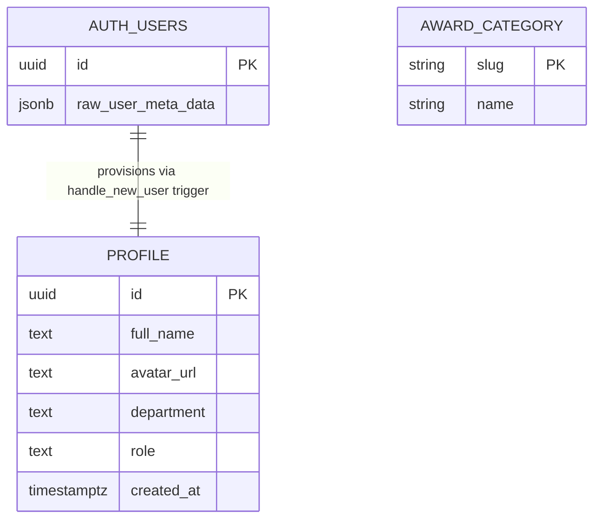

# Entities

**Project**: SAA 2025 Web
**Generated**: 2026-08-31

> **Scope note (reconciliation with prior `docs/data-model.md`).** The existing `docs/data-model.md`
> is a spec-derived, aspirational read of all 18 MoMorph screens (kudos, hearts, hashtags, badges,
> secret boxes, department directory, etc.) — none of that is implemented in code yet. This Wave 1
> draft covers only what is **actually built**: 2 app-owned entities plus 1 externally-referenced
> Supabase-managed table. It supersedes the prior doc's `profile` and `award_category` sections for
> the currently-shipped behavior; the rest of the prior doc's entities remain undelivered / out of
> scope here, not contradicted.

## Entity Relationship Diagram

`AWARD_CATEGORY` has no relationship edge — it is a standalone static dataset with no FK to
`PROFILE` or `AUTH_USERS` (see its Relationships subsection).

## Entities

### MODEL001_Profile

**Description**: App-level user profile row, one-to-one with a Supabase Auth user. Carries the
`role` used for authorization plus the display fields shown by the site header/FAB. Provisioned
automatically by a `SECURITY DEFINER` trigger (`handle_new_user`) firing on `auth.users` insert —
never written by application code — so provisioning is atomic with account creation and never
depends on app code running after sign-in.
Source: `supabase/migrations/20260828000000_create_profile_table_and_trigger.sql:1-15`

| Attribute | Type | Constraints | Description |
|-----------|------|-------------|-------------|
| id | uuid | PK, NOT NULL, FK → auth.users.id ON DELETE CASCADE | Supabase Auth user id (migration:9) |
| full_name | text | nullable | set once from `raw_user_meta_data->>'full_name'` at insert (migration:40-44); read in `get-current-profile.ts:34,44` |
| avatar_url | text | nullable | set once from `raw_user_meta_data->>'avatar_url'` at insert (migration:40-44); read in `get-current-profile.ts:34,45` |
| department | text | nullable | column exists in schema (migration:12); no read or write path found in the reviewed app code |
| role | text | NOT NULL, DEFAULT 'member', CHECK role IN ('admin','member') | migration:13; read in `get-current-profile.ts:34,46` |
| created_at | timestamptz | NOT NULL, DEFAULT now() | migration:14 |

**Relationships**:
- One-to-One with `auth.users` via `id` (also the PK) — the row is provisioned by the
  `handle_new_user()` trigger on `auth.users` insert and cascade-deletes when the auth user is
  deleted (migration:9, 34-52).

**Discriminator Fields**:

| Field | DISC-### | Values | Description |
|-------|----------|--------|--------------|
| role | DISC-001 | admin, member | Admin vs. member profile role. Already annotated with this discriminator code at the consuming source (`get-current-profile.ts:10`), which projects it onto `CurrentProfile.role` for the header/FAB. The behavioral branching itself (what admin vs. member changes on screen) lives in that F002 consumer, out of this Wave 1 (data-model-only) scope. |

**Row-level security** (governs what a `select` can return; not a column, documented here because
it is a hard constraint on this entity's data access):
- Policy `profile_select_own`: `for select to authenticated using (auth.uid() = id)` — a
  signed-in user may read only their own row (migration:22-26).
- No insert/update/delete policy exists; every insert happens exclusively via the definer
  trigger's elevated rights (migration:19-21 comment, 30-33).
- `grant select on public.profile to authenticated` (migration:28).

---

### MODEL002_AwardCategory

**Description**: Fixed, in-code list of the 6 SAA 2025 award categories (`name` + `slug` only).
Not a database table — a static TypeScript array (`AWARD_CATEGORIES`) hardcoded from the Figma
award-page nav items C.1–C.6. Per-locale display copy (title/description/quantity/prize) is a
separate config record looked up by `slug` from the i18n message catalog, not stored in this
array. Source: `src/lib/awards/award-categories.ts:1-21`.

| Attribute | Type | Constraints | Description |
|-----------|------|-------------|-------------|
| slug | string | effectively unique (lookup key / URL anchor) | `award-categories.ts:15-20`; shared with homepage award cards and the "Hệ thống giải" section ids (source comment `award-categories.ts:4`) |
| name | string | required | `award-categories.ts:15-20` |

**Associated config data** (not a field of this TS array — a separate JSON content record keyed
by the same `slug`, loaded per active locale; documented here because it is the actual source of
the rendered award-card copy, not `AWARD_CATEGORIES` itself):

| Field (`messages/{locale}/awards.json` → `cardContent[slug]`) | Type | Description |
|---|---|---|
| title | string | localized award title (`messages/en/awards.json:21`) |
| description | string | localized award description (`messages/en/awards.json:22`) |
| quantityValue | string | e.g. `"10"`, `"02"` — kept as string, not numeric (`messages/en/awards.json:23`) |
| quantityUnit | string | e.g. `"Individual"`, `"Team"` (`messages/en/awards.json:24`) |
| prizes | array of `{ amount: string, qualifier: string \| null }` | 1–2 prize tiers per category (`messages/en/awards.json:25-30,73-82`) |

**Relationships**:
- None to `MODEL001_Profile` — `AwardCategory` is standalone static content, not linked to any
  profile row anywhere in this codebase.
- Soft key match (not a DB/FK relationship): `AWARD_CATEGORIES[].slug` ↔
  `messages/{en,vi}/awards.json` → `cardContent[slug]`, matched only by identical string value —
  not enforced by the type system or by any migration. **Cardinality: 1:1 per slug, by convention
  only** — each `slug` is expected to match exactly one `cardContent` key; unenforced, so this is
  a documented risk, not a guarantee. A slug present in one file and absent in
  the other fails silently at render time (a maintenance risk, not a discriminator).

**Discriminator Fields**: None. `slug` is this entity's own identifying key — one row per fixed
value — not a field that branches behavior on some other entity (code-formats.md discriminator
scope: "Does NOT qualify: fields used only for display labels with no behavioral branching").

---

### External reference: auth.users (Supabase-managed, not app-owned)

Not a `MODEL###` entity — this is Supabase Auth's own schema, outside this repo's migrations.
Documented only because `MODEL001_Profile.id` FKs to it and the provisioning trigger reads from
it.

| Field referenced | Type | Used by |
|---|---|---|
| id | uuid | PK target of `profile.id` FK (migration:9) |
| raw_user_meta_data | jsonb | read via `->> 'full_name'` / `->> 'avatar_url'` inside `handle_new_user()` (migration:40-44) |

No `email` column of `auth.users` is read anywhere in the reviewed application code path —
`get-current-profile.ts` selects only `full_name, avatar_url, role` from `public.profile`
(`get-current-profile.ts:34`), and `public.profile` itself carries no `email` column at all. This
is narrower than the prior `docs/data-model.md`'s "email withheld from every payload" framing,
which assumed `email` lived on `profile`; the current schema doesn't put it there in the first
place.

---

## Validation Rules

### Profile (entity 001) validation

| Rule | Field | Constraint | Error Message |
|------|-------|------------|---------------|
| profile_role_check | role | `CHECK role IN ('admin','member')` | Postgres constraint violation; no custom app-level message found (migration:13) |
| profile_id_fk | id | `FK → auth.users(id) ON DELETE CASCADE` | Postgres FK violation on insert; cascade delete on parent removal (migration:9) |
| profile_role_default | role | `DEFAULT 'member'` when omitted | n/a — default, not an error path (migration:13) |
| profile_created_at_default | created_at | `DEFAULT now()` | n/a — default, not an error path (migration:14) |
| profile_select_rls | (row-level) | RLS: only `auth.uid() = id` may `SELECT` | Postgres RLS denial — non-owner query returns no row, not an explicit error (migration:22-26) |

### AwardCategory (entity 002) validation

| Rule | Field | Constraint | Error Message |
|------|-------|------------|---------------|
| award_category_static_shape | name, slug | TypeScript type `AwardCategory { name: string; slug: string }`, compile-time only | TS compile error on shape mismatch (`award-categories.ts:9-12`) |
| award_category_slug_uniqueness | slug | Convention only — no runtime or compile-time uniqueness check across the 6 hardcoded rows | none enforced; a duplicate or mismatched slug silently fails the i18n content lookup |

---

## Summary

- **Total Entities**: 2 app-owned (`MODEL001_Profile`, `MODEL002_AwardCategory`) + 1 external
  reference (`auth.users`, Supabase-managed, not `MODEL###`-numbered per this project's
  convention of only numbering app-owned schema)
- **Total Relationships**: 1 (`auth.users` 1:1 `MODEL001_Profile` via `id`/FK, established by the
  `handle_new_user` trigger)
- **Discriminators assigned**: 1 (the role discriminator on `MODEL001_Profile.role`)
