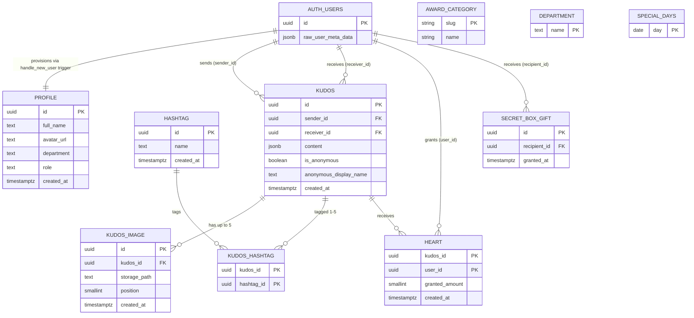

# Data Model

**Project**: SAA 2025 Web
**Generated**: 2026-09-02

> **Scope note (round 2 / Wave 1).** Round 1 (`docs/generated/entities.md`, 2026-08-31) covered
> 2 app-owned entities (`profile`, `award_category`) + 1 external reference (`auth.users`) — the
> only schema shipped at that point. This draft extends it with the full Kudos cluster that
> shipped this round: 8 new Postgres tables, 1 aggregate view, 1 transactional RPC, and RLS on the
> `images` Storage bucket — all sourced verbatim from `supabase/migrations/*.sql` (6 files) and
> the `src/lib/kudos/types.ts` / `content-schema.ts` view-model contracts. It also supersedes the
> pre-existing spec-derived `docs/data-model.md` (18-screen aspirational read, no `databaseTable`
> beyond one bare mention of `kudos`) for every entity actually implemented below; sections of
> that doc with no shipped counterpart (badges, secret-box redemption flow, etc.) remain
> aspirational, not contradicted. Nothing here is invented — MCP/design/data authority per
> `development-rules.md`; every field, constraint and policy is read off the migrations, not
> guessed.

## Entity Relationship Diagram

`AWARD_CATEGORY`, `DEPARTMENT` and `SPECIAL_DAYS` carry no relationship edge — all three are
standalone reference tables with no FK to any other entity (see their Relationships subsections
for the soft-key exceptions). `KUDOS_CARD_VIEW` (MODEL001) is a read-only aggregate view with no
independent existence of its own — omitted from the ER diagram per convention (views are
derivations, not base entities) and documented in its own entity block below.

## Entities

### MODEL002_Profile

**Description**: App-level user profile row, one-to-one with a Supabase Auth user. Carries the
`role` used for authorization plus the display fields shown by the site header/FAB. Provisioned
automatically by a `SECURITY DEFINER` trigger (`handle_new_user`) firing on `auth.users` insert —
never written by application code — so provisioning is atomic with account creation.
Source: `supabase/migrations/20260828000000_create_profile_table_and_trigger.sql:8-15`

| Attribute | Type | Constraints | Description |
|-----------|------|-------------|-------------|
| id | uuid | PK, NOT NULL, FK → auth.users.id ON DELETE CASCADE | Supabase Auth user id (migration:9) |
| full_name | text | nullable | set once from `raw_user_meta_data->>'full_name'` at insert (migration:40-44); read in `get-current-profile.ts:34,44` |
| avatar_url | text | nullable | set once from `raw_user_meta_data->>'avatar_url'` at insert (migration:40-44); read in `get-current-profile.ts:34,45` |
| department | text | nullable, **no FK** to `department.name` | column exists in schema (migration:12); unenforced soft key against `MODEL003_Department` — see Relationships |
| role | text | NOT NULL, DEFAULT 'member', CHECK role IN ('admin','member') | migration:13; read in `get-current-profile.ts:34,46` |
| created_at | timestamptz | NOT NULL, DEFAULT now() | migration:14 |

**Relationships**:
- One-to-One with `auth.users` via `id` (also the PK) — row provisioned by the
  `handle_new_user()` trigger on `auth.users` insert, cascade-deletes when the auth user is
  deleted (migration:9, 34-52).
- Soft key (not FK, unenforced): `profile.department` ↔ `MODEL003_Department.name`, matched only
  by identical string value — no constraint ties them; a value here absent from `department` fails
  silently (no lookup uses `profile.department` this round per scout inventory).

**Discriminator Fields**:

| Field | DISC-### | Values | Description |
|-------|----------|--------|-------------|
| role | DISC-001 | admin, member | Admin vs. member profile role. Consuming code already annotates this discriminator at `get-current-profile.ts:10`, projecting it onto `CurrentProfile.role` for the header/FAB. Behavioral branching on the value lives in that F002 consumer (out of this data-model-only scope). |

**Row-level security**:
- `profile_select_own` (migration `20260828000000`, lines 22-26): `for select to authenticated
  using (auth.uid() = id)` — **superseded**, see below.
- `profile_select_all_authenticated` (migration `20260831000100_widen_profile_select.sql:12-16`):
  `for select to authenticated using (true)` — every authenticated Sunner may read every profile
  row (recipient autocomplete, @mention search, sender/receiver display on kudos cards). The
  migration explicitly `drop policy` + `create policy` rather than stacking a second permissive
  policy (`...000100:1-10` comment) — Postgres ORs multiple permissive select policies together,
  so replace-not-add keeps exactly one active select policy.
- No insert/update/delete policy exists; every insert happens exclusively via the definer
  trigger's elevated rights (migration `20260828000000:19-21` comment, 30-33).
- `grant select on public.profile to authenticated` (migration `20260828000000:28`).

---

### MODEL004_AwardCategory

**Description**: Fixed, in-code list of the 6 SAA 2025 award categories (`name` + `slug` only).
Not a database table — a static TypeScript array (`AWARD_CATEGORIES`), unchanged since round 1.
Source: `src/lib/awards/award-categories.ts:1-21`.

| Attribute | Type | Constraints | Description |
|-----------|------|-------------|-------------|
| slug | string | effectively unique (lookup key / URL anchor) | `award-categories.ts:14-21` |
| name | string | required | `award-categories.ts:14-21` |

**Relationships**:
- None to `MODEL002_Profile` or the Kudos cluster — standalone static content.
- Soft key (not enforced): `AWARD_CATEGORIES[].slug` ↔ `messages/{en,vi}/awards.json` →
  `cardContent[slug]`, matched only by identical string value. Unchanged since round 1.

**Discriminator Fields**: None. `slug` is this entity's own identifying key, not a field that
branches behavior on some other entity.

---

### MODEL003_Department

**Description**: Seed-only reference list (50 rows) backing the "Phòng ban" filter dropdown on
the Kudos board. Admin-managed via Studio/SQL — no app-side write path this round.
Source: `supabase/migrations/20260831000000_create_kudos_cluster.sql:12-24`

| Attribute | Type | Constraints | Description |
|-----------|------|-------------|-------------|
| name | text | PK, NOT NULL | migration:13; the sole column — no `id`, no `created_at` |

**Relationships**:
- No FK from any other table. `profile.department` matches it only by soft-key convention (see
  MODEL002 Relationships) — not enforced, not currently read by app code.

**Discriminator Fields**: None. `name` is a free-text reference value with no behavioral branch
per row.

**Row-level security**: `department_select_authenticated` (migration:18-22): `for select to
authenticated using (true)`; `grant select on public.department to authenticated`
(migration:24). No insert/update/delete policy exists — no `authenticated` write path; rows are
seeded, never app-inserted.

**Seed data**: 50 rows, e.g. `CTO`, `SPD`, `FCOV`, `CEVC1`…`CEVC4`, `PAO - PAO`, `CEVEC`, `GEU -
HUST` — inserted verbatim in `supabase/migrations/20260831000300_seed_hashtag_and_department.sql:24-75`,
`on conflict (name) do nothing`.

---

### MODEL005_Hashtag

**Description**: Seed-only reference list (13 rows) backing the hashtag picker in Compose and the
board's hashtag filter. No app-side insert — the "+ Hashtag" control is a picker over this fixed
set, not a tag-creation form (migration comment).
Source: `supabase/migrations/20260831000000_create_kudos_cluster.sql:31-35`

| Attribute | Type | Constraints | Description |
|-----------|------|-------------|-------------|
| id | uuid | PK, NOT NULL, DEFAULT gen_random_uuid() | migration:32 |
| name | text | NOT NULL, UNIQUE | migration:33 |
| created_at | timestamptz | NOT NULL, DEFAULT now() | migration:34 |

**Relationships**:
- One-to-Many with `MODEL006_KudosHashtag` via `id` → `hashtag_id` (FK, `on delete` NO ACTION —
  no cascade specified at `...create_kudos_cluster.sql:118`, so deleting a seeded hashtag while
  any kudos still references it is blocked at the DB level).

**Discriminator Fields**: None. `name` is a fixed seed value, not a field with per-value
behavioral branching.

**Row-level security**: `hashtag_select_authenticated` (migration:39-43): `for select to
authenticated using (true)`; `grant select on public.hashtag to authenticated` (migration:45).
No insert/update/delete policy exists — no `authenticated` write path; rows are seeded, never
app-inserted.

**Seed data**: 13 rows inserted verbatim in
`supabase/migrations/20260831000300_seed_hashtag_and_department.sql:8-22` (`on conflict (name) do
nothing`) — e.g. `Toàn diện`, `Giỏi chuyên môn`, `Aim High`, `Wasshoi`, `Quản lý xuất sắc`.

---

### MODEL007_Kudos

**Description**: One row per submitted "Viet Kudo". Deliberately not denormalized with a
`heart_count` column (YAGNI, migration comment) — heart counts are a live aggregate read through
`MODEL001_KudosCardView`. `content` is a TipTap-shaped `jsonb` document, allow-listed by
`content-schema.ts` (see Discriminator Fields).
Source: `supabase/migrations/20260831000000_create_kudos_cluster.sql:52-60`

| Attribute | Type | Constraints | Description |
|-----------|------|-------------|-------------|
| id | uuid | PK, NOT NULL, DEFAULT gen_random_uuid() | migration:53; also accepted as an RPC input `p_id` so the client can know the id pre-insert (see RPC Contracts) |
| sender_id | uuid | NOT NULL, FK → auth.users.id | migration:54; ON DELETE action unspecified (NO ACTION default) |
| receiver_id | uuid | NOT NULL, FK → auth.users.id | migration:55; ON DELETE action unspecified (NO ACTION default) |
| content | jsonb | NOT NULL | migration:56; shape allow-listed app-side by `content-schema.ts` (the two nested content discriminators below), never DB-validated |
| is_anonymous | boolean | NOT NULL, DEFAULT false | migration:57 |
| anonymous_display_name | text | nullable | migration:58; required only when `is_anonymous = true`, enforced app-side (`validate-draft.ts:77-79`), not by a DB CHECK |
| created_at | timestamptz | NOT NULL, DEFAULT now() | migration:59 |

**Relationships**:
- Many-to-One with `auth.users` via `sender_id` and, separately, via `receiver_id` (two FKs to
  the same parent table, no cascade on either).
- One-to-Many with `MODEL008_KudosImage` via `id` → `kudos_id` (FK, ON DELETE CASCADE,
  `...cluster.sql:84`).
- One-to-Many with `MODEL006_KudosHashtag` via `id` → `kudos_id` (FK, ON DELETE CASCADE,
  `...cluster.sql:117`).
- One-to-Many with `MODEL009_Heart` via `id` → `kudos_id` (FK, ON DELETE CASCADE,
  `...cluster.sql:150`).

**Discriminator Fields**:

| Field | DISC-### | Values | Description |
|-------|----------|--------|--------------|
| is_anonymous | DISC-002 | true, false | Single boolean driving conditional rendering of sender identity: `true` shows `anonymous_display_name` in place of the sender's real name/avatar on the card (per `is_anonymous`/`anonymous_display_name` pairing, `types.ts:27-28`); `false` shows `sender` (`types.ts:24`). Qualifies as a discriminator per code-formats.md's boolean-single-field-drives-conditional-rendering clause, not a plain status flag. |
| content[].type (nested, inside the `content` jsonb column) | DISC-004 | doc, paragraph, text, blockquote, orderedList, listItem, mention | TipTap node kind. Allow-listed at `content-schema.ts:10-18` (`ALLOWED_NODE_TYPES`), enforced on write by the same module, and drives a 6-way `switch` render branch at `kudos-content-renderer.tsx:69-96` (each value renders a structurally different element — `
`, `<blockquote>`, `<ol>`/`<li>`, an `@mention` chip, or a text leaf). Nested inside `MODEL007_Kudos.content`, not a top-level table column — DB has no CHECK on this shape (`content` is opaque `jsonb`). |
| content[].marks[].type (nested, inside `content` jsonb) | DISC-005 | bold, italic, strike, link | TipTap inline mark kind. Allow-listed at `content-schema.ts:23` (`ALLOWED_MARK_TYPES`), drives a 4-way `switch` at `kudos-content-renderer.tsx:21-49` (`<strong>`, `<em>`, `<s>`, or an anchor tag with scheme-checked `href`). Same nesting caveat as the node-kind discriminator above. |

**Row-level security**: `kudos_select_authenticated` (migration:64-68): `for select to
authenticated using (true)` — every authenticated Sunner may read every kudos row.
`kudos_insert_own` (migration:70-74): `for insert to authenticated with check (sender_id =
auth.uid())`. `grant select, insert on public.kudos to authenticated` (migration:76). No
update/delete policy exists — kudos are immutable once submitted.

---

### MODEL008_KudosImage

**Description**: Up to 5 images per kudos. Immutable once submitted — no update/delete policy
(migration comment). `storage_path` points into the `images` Storage bucket (see Storage below).
Source: `supabase/migrations/20260831000000_create_kudos_cluster.sql:82-89`

| Attribute | Type | Constraints | Description |
|-----------|------|-------------|-------------|
| id | uuid | PK, NOT NULL, DEFAULT gen_random_uuid() | migration:83 |
| kudos_id | uuid | NOT NULL, FK → kudos.id ON DELETE CASCADE | migration:84 |
| storage_path | text | NOT NULL | migration:85; convention `kudos/{sender_id}/{kudos_id}/{position}-{filename}` (`storage-path.ts:2-3,24-27`) |
| position | smallint | NOT NULL, CHECK position BETWEEN 0 AND 4 | migration:86,88 (`kudos_image_position_range`); ordinal display index only, not a behavioral branch (see Discriminator Fields exclusion below) |
| created_at | timestamptz | NOT NULL, DEFAULT now() | migration:87 |

**Relationships**:
- Many-to-One with `MODEL007_Kudos` via `kudos_id`.

**Discriminator Fields**: None. `position` is a bounded ordinal (0–4) used only to order the
gallery — it does not select a different render/behavior path per value (fails code-formats.md's
"unbounded/arbitrary" exclusion only partially, but squarely fails the "distinct behavioral
outcome per value" qualifying test — position 2 does not behave differently from position 3,
only sorts after it).

**Row-level security**: `kudos_image_select_authenticated` (migration:93-97): `for select to
authenticated using (true)`. `kudos_image_insert_own` (migration:99-108): insert only when the
caller owns the parent kudos, via an `exists` subquery on `sender_id = auth.uid()`. `grant
select, insert on public.kudos_image to authenticated` (migration:110). No update/delete
policy — images are immutable once submitted.

---

### MODEL006_KudosHashtag

**Description**: Join table, 1–5 rows per kudos (app-enforced, not a DB CHECK — see Validation
Rules). Composite PK doubles as the "no duplicate tag per kudos" rule.
Source: `supabase/migrations/20260831000000_create_kudos_cluster.sql:116-120`

| Attribute | Type | Constraints | Description |
|-----------|------|-------------|-------------|
| kudos_id | uuid | PK (composite), NOT NULL, FK → kudos.id ON DELETE CASCADE | migration:117,119 |
| hashtag_id | uuid | PK (composite), NOT NULL, FK → hashtag.id | migration:118,119; ON DELETE action unspecified (NO ACTION default) |

**Relationships**:
- Many-to-One with `MODEL007_Kudos` via `kudos_id`.
- Many-to-One with `MODEL005_Hashtag` via `hashtag_id`.

**Discriminator Fields**: None. Pure join table, no non-key attributes.

**Row-level security**: `kudos_hashtag_select_authenticated` (migration:124-128): `for select to
authenticated using (true)`. `kudos_hashtag_insert_own` (migration:130-139): insert only when the
caller owns the parent kudos, via an `exists` subquery on `sender_id = auth.uid()`. `grant
select, insert on public.kudos_hashtag to authenticated` (migration:141). No update/delete
policy — rows are immutable once submitted.

---

### MODEL009_Heart

**Description**: One row per (kudos, liker) — the row's existence IS the "liked" state, no
separate boolean. Composite PK doubles as the "one heart per user per kudo" rule.
`granted_amount` is decided server-side before insert (special-day lookup), never client-writable
(`heart-rules.ts:1-9` comment).
Source: `supabase/migrations/20260831000000_create_kudos_cluster.sql:149-155`

| Attribute | Type | Constraints | Description |
|-----------|------|-------------|-------------|
| kudos_id | uuid | PK (composite), NOT NULL, FK → kudos.id ON DELETE CASCADE | migration:150,154 |
| user_id | uuid | PK (composite), NOT NULL, FK → auth.users.id | migration:151,154; ON DELETE action unspecified (NO ACTION default) |
| granted_amount | smallint | NOT NULL, CHECK granted_amount IN (1, 2) | migration:152 |
| created_at | timestamptz | NOT NULL, DEFAULT now() | migration:153 |

**Relationships**:
- Many-to-One with `MODEL007_Kudos` via `kudos_id`.
- Many-to-One with `auth.users` via `user_id` (the granter, not `MODEL002_Profile` directly).

**Discriminator Fields**:

| Field | DISC-### | Values | Description |
|-------|----------|--------|--------------|
| granted_amount | DISC-003 | 1, 2 | Normal heart (1) vs. special-day double heart (2). Decided server-side by `computeGrantAmount()` (`heart-rules.ts:21-24`), which checks the caller's Ho Chi Minh calendar date against `MODEL010_SpecialDays`. Behavioral outcome: the sender's `heartsReceivedCount` (`types.ts:42-43`) sums `granted_amount`, so a value of 2 credits double toward that Sunner's total on special days. |

**Row-level security**: `heart_select_authenticated` (migration:159-163): `for select to
authenticated using (true)`. `heart_insert_not_self` (migration:167-174) — the DB-enforced
business rule "sender cannot heart own kudo": `for insert to authenticated with check (user_id =
auth.uid() and user_id <> (select sender_id from public.kudos where id = kudos_id))`.
`heart_delete_own` (migration:176-180): `for delete to authenticated using (user_id =
auth.uid())`. `grant select, insert, delete on public.heart to authenticated` (migration:182).

---

### MODEL010_SpecialDays

**Description**: Admin-configured dates that double the heart grant (see `MODEL009_Heart`
the granted-amount discriminator). Seeded empty — admin populates via SQL/Studio; no admin UI this round (migration
comment).
Source: `supabase/migrations/20260831000000_create_kudos_cluster.sql:188-190`

| Attribute | Type | Constraints | Description |
|-----------|------|-------------|-------------|
| day | date | PK, NOT NULL | migration:189; sole column |

**Relationships**: None. Read standalone (not joined) by `heart-rules.ts:21-24`'s date-string
membership check — not a DB-level FK relationship to `heart` or `kudos`.

**Discriminator Fields**: None. `day` is an unbounded date value, not an enum.

**Row-level security**: `special_days_select_authenticated` (migration:194-198): `for select to
authenticated using (true)`; `grant select on public.special_days to authenticated`
(migration:200). No insert/update/delete policy exists — admin populates via SQL/Studio, no
`authenticated` write path this round.

---

### MODEL011_SecretBoxGift

**Description**: Minimal admin-managed log of Secret Box redemptions, so the sidebar counters
read a real (if currently empty) DB source instead of a hardcoded 0
(`clarifications.md` Session 2026-08-31, cited in migration comment). No `authenticated` write
path this round — the redemption flow ships in a later round.
Source: `supabase/migrations/20260831000000_create_kudos_cluster.sql:209-213`

| Attribute | Type | Constraints | Description |
|-----------|------|-------------|-------------|
| id | uuid | PK, NOT NULL, DEFAULT gen_random_uuid() | migration:210 |
| recipient_id | uuid | NOT NULL, FK → auth.users.id | migration:211; ON DELETE action unspecified (NO ACTION default) |
| granted_at | timestamptz | NOT NULL, DEFAULT now() | migration:212 |

**Relationships**:
- Many-to-One with `auth.users` via `recipient_id`.

**Discriminator Fields**: None. No enum/constant-type field.

**Row-level security**: `secret_box_gift_select_authenticated` (migration:217-221): `for select
to authenticated using (true)`; `grant select on public.secret_box_gift to authenticated`
(migration:223). No insert/update/delete policy exists — no `authenticated` write path this
round; the redemption flow ships later.

---

### MODEL001_KudosCardView

**Description**: Read-only aggregate view (`security_invoker = true`) — kudos joined with
sender/receiver profile, a lateral `heart_count`, aggregated hashtag ids/names, and aggregated
image paths. One query, no N+1 (migration comment). `security_invoker` is required: without it
the view would run as its owner and silently bypass the RLS on the tables it joins.
Source: `supabase/migrations/20260831000000_create_kudos_cluster.sql:226-272`

| Attribute | Type | Constraints | Description |
|-----------|------|-------------|-------------|
| id | uuid | (from kudos.id) | migration:235 |
| sender_id | uuid | (from kudos.sender_id) | migration:236 |
| sender_full_name | text, nullable | joined `profile.full_name` | migration:237 |
| sender_avatar_url | text, nullable | joined `profile.avatar_url` | migration:238 |
| receiver_id | uuid | (from kudos.receiver_id) | migration:239 |
| receiver_full_name | text, nullable | joined `profile.full_name` | migration:240 |
| receiver_avatar_url | text, nullable | joined `profile.avatar_url` | migration:241 |
| content | jsonb | (from kudos.content) | migration:242 |
| is_anonymous | boolean | (from kudos.is_anonymous) | migration:243 |
| anonymous_display_name | text, nullable | (from kudos.anonymous_display_name) | migration:244 |
| created_at | timestamptz | (from kudos.created_at) | migration:245 |
| heart_count | int | lateral `count(*)` over `MODEL009_Heart` | migration:246,253-257 |
| hashtag_ids | uuid[], `coalesce(...,'{}')` — never null | lateral `array_agg` over `MODEL006_KudosHashtag` ⋈ `MODEL005_Hashtag`, ordered by name | migration:247,258-265 |
| hashtag_names | text[], `coalesce(...,'{}')` — never null | paired with `hashtag_ids` by array index | migration:247,258-265 |
| image_paths | text[], `coalesce(...,'{}')` — never null | lateral `array_agg` over `MODEL008_KudosImage`, ordered by `position` | migration:249,266-270 |

**TypeScript projection** (camelCased at the query boundary, `KudosCardView`,
`src/lib/kudos/types.ts:22-33`, row-shape contract `map-kudos-card-view-row.ts:10-26,28-56`):
`id`, `sender: {id, fullName, avatarUrl}`, `receiver: {id, fullName, avatarUrl}`, `content`,
`isAnonymous`, `anonymousDisplayName`, `createdAt`, `heartCount`, `hashtags: {id, name}[]`,
`imagePaths: string[]`.

**Relationships**:
- Derived from `MODEL007_Kudos` ⋈ `MODEL002_Profile` (×2, sender+receiver) ⋈ `MODEL009_Heart`
  (lateral count) ⋈ `MODEL006_KudosHashtag` ⋈ `MODEL005_Hashtag` (lateral array_agg) ⋈
  `MODEL008_KudosImage` (lateral array_agg). No independent storage — a view, not a table.

**Discriminator Fields**: None new — `is_anonymous` is the same discriminator field carried through
from `MODEL007_Kudos`, not re-numbered.

**Row-level security**: `grant select on public.kudos_card_view to authenticated`
(migration:272). The view itself declares no RLS policy — `security_invoker = true` means a
querying role is subject to the RLS of `kudos`/`profile`/`heart`/`kudos_hashtag`/`hashtag`/
`kudos_image` as if it queried them directly; since every one of those grants `select` to
`authenticated` unconditionally, the view's effective visibility is also "any authenticated
Sunner, every row."

---

### External reference: auth.users (Supabase-managed, not app-owned)

Not a `MODEL###` entity — this is Supabase Auth's own schema, outside this repo's migrations.
Documented because 6 of the 9 app tables FK into it.

| Field referenced | Type | Used by |
|---|---|---|
| id | uuid | PK target of `profile.id`, `kudos.sender_id`, `kudos.receiver_id`, `heart.user_id`, `secret_box_gift.recipient_id` (all FK) |
| raw_user_meta_data | jsonb | read via `->> 'full_name'` / `->> 'avatar_url'` inside `handle_new_user()` (`...profile_table_and_trigger.sql:40-44`) |

No `email` column of `auth.users` is read anywhere in the reviewed application code path —
`get-current-profile.ts` selects only `full_name, avatar_url, role` from `public.profile`, which
itself carries no `email` column. Cascade note: `profile.id` is the only FK to `auth.users` with
`ON DELETE CASCADE` (migration:9); `kudos.sender_id/receiver_id`, `heart.user_id` and
`secret_box_gift.recipient_id` all specify no delete action (Postgres default `NO ACTION`) — a
deleted auth user's profile row cascades away, but their historical kudos/hearts/gifts rows do
not (would block the delete unless the FK constraint is separately violated-tolerant; not
exercised in the reviewed migrations).

---

## RPC Contracts

### create_kudos (transactional write, not a MODEL### entity)

`public.create_kudos(p_id uuid, p_receiver uuid, p_content jsonb, p_is_anonymous boolean,
p_display_name text, p_hashtag_ids uuid[], p_image_paths text[]) returns uuid` —
`security invoker`, plpgsql, `grant execute ... to authenticated`.
Source: `supabase/migrations/20260831000000_create_kudos_cluster.sql:281-325`

One transaction writing three entities: insert `MODEL007_Kudos` (migration:309-310), loop-insert
`MODEL006_KudosHashtag` (migration:312-314), loop-insert `MODEL008_KudosImage` (migration:316-319,
`position` assigned sequentially from 0 by array order, not client-supplied). Guards:
- hashtag count must be 1–5 (migration:301-303, `raise exception` aborts the whole function —
  Postgres plpgsql: an unhandled exception inside a function rolls back every change the function
  made, so a kudos can never land with 0 hashtags).
- image count must be ≤5 (migration:305-307).

`security invoker` means the function runs as the calling role, so the three inserts are each
still subject to `kudos_insert_own` / `kudos_hashtag_insert_own` / `kudos_image_insert_own` RLS
(all three require `sender_id = auth.uid()`, directly or via the `exists` subquery on the parent
kudos row) — the RPC does not bypass row-level security, it only bundles the three writes
atomically.

---

## Storage

### `images` bucket (Supabase Storage — `storage.objects`, not a Postgres table in this schema)

Backs `MODEL008_KudosImage.storage_path`. No policy existed before this round (bucket was unused,
migration comment).

| Policy | Operation | Rule | Source |
|---|---|---|---|
| `images_select_authenticated` | select | `bucket_id = 'images'` — bucket-wide, every signed-in Sunner may view every kudos's images | `supabase/migrations/20260831000200_storage_images_policies.sql:16-20` |
| `images_insert_authenticated` (superseded) | insert | `bucket_id = 'images'` only — no path scoping | `20260831000200_storage_images_policies.sql:10-14`, dropped |
| `images_insert_authenticated` (current) | insert | `bucket_id = 'images' AND (storage.foldername(name))[1] = 'kudos' AND (storage.foldername(name))[2] = auth.uid()::text` | `supabase/migrations/20260902000000_scope_images_insert_policy.sql:22-32` |

**Hardening history**: the original insert policy (`...000200`) let any authenticated Sunner
upload to any path inside the bucket, including another Sunner's
`kudos/{their_id}/{kudos_id}/...` prefix — defeating the app-level path convention
(`...0902000000:1-9` comment). Migration `20260902000000` drops and recreates it scoped to the
caller's own sender segment. No update/delete policy exists — images are immutable once a kudos
is submitted (removing a thumbnail pre-submit happens client-side, before upload).

**Path convention** (app-level, not DB-enforced beyond the `[2] = auth.uid()::text` scoping
above): `kudos/{sender_id}/{kudos_id}/{position}-{filename}`, built by
`buildKudosImageStoragePath()` (`storage-path.ts:24-27`) and independently re-verified against
traversal/prefix spoofing by `verifyKudosImageStoragePath()` (`storage-path.ts:43-57`) before the
action trusts a client-supplied path.

---

## Derived View-Models (non-persisted — no table/view backs these)

Documented because `src/lib/kudos/types.ts` is a named source of truth for this artifact, but
these four interfaces have no `MODEL###` entry: they are pure query/computation projections, not
stored shapes, so assigning them entity codes would fabricate persistence that doesn't exist.

| Interface | Source | Backed by |
|---|---|---|
| `SidebarStats` (`kudosReceivedCount`, `kudosSentCount`, `heartsReceivedCount`, `secretBoxOpenedCount`, `secretBoxUnopenedCount`, `asteriskTier`) | `types.ts:39-49` | Aggregate queries over `MODEL007_Kudos`/`MODEL009_Heart`/`MODEL011_SecretBoxGift`; `asteriskTier` (0\|1\|2\|3) is computed by `deriveAsteriskTier()` (`asterisk-tier.ts:16-23`) from `kudosReceivedCount` against fixed thresholds (10/20/50). Its behavioral thresholds are already named `BR-008_AsteriskBadgeThresholds` in the owning feature spec — not duplicated as a DISC-### here (one field, one owning artifact, DRY). |
| `LeaderboardEntry` (`userId`, `fullName`, `avatarUrl`, `kudosReceivedCount`, `milestoneReachedAt`) | `types.ts:52-58` | Derived from `MODEL007_Kudos` grouped by `receiver_id`, joined `MODEL002_Profile` |
| `SpotlightNode` (`kudosId`, `recipientName`, `receivedAt`) | `types.ts:65-69` | One node per `MODEL007_Kudos` row, labeled by receiver |
| `FeedPage` (`items: KudosCardView[]`, `nextOffset`) | `types.ts:71-74` | Pagination wrapper over `MODEL001_KudosCardView` |

---

## Validation Rules

### Profile validation
| Rule | Field | Constraint | Error Message |
|------|-------|------------|---------------|
| profile_role_check | role | `CHECK role IN ('admin','member')` | Postgres constraint violation; no custom app-level message found (migration:13) |
| profile_id_fk | id | `FK → auth.users(id) ON DELETE CASCADE` | Postgres FK violation on insert; cascade delete on parent removal (migration:9) |
| profile_role_default | role | `DEFAULT 'member'` when omitted | n/a — default, not an error path (migration:13) |
| profile_select_rls | (row-level) | RLS: any `authenticated` role may `SELECT` (widened) | Postgres RLS denial for unauthenticated roles; non-`authenticated` query returns no row (`...000100:12-16`) |

### AwardCategory validation
| Rule | Field | Constraint | Error Message |
|------|-------|------------|---------------|
| award_category_static_shape | name, slug | TypeScript type `AwardCategory { name: string; slug: string }`, compile-time only | TS compile error on shape mismatch (`award-categories.ts:9-12`) |

### Department validation
| Rule | Field | Constraint | Error Message |
|------|-------|------------|---------------|
| department_name_pk | name | `PRIMARY KEY` (implies UNIQUE + NOT NULL) | Postgres PK violation on duplicate insert (migration:13); app never inserts — seed-only, `on conflict (name) do nothing` (`...seed_hashtag_and_department.sql:75`) |

### Hashtag validation
| Rule | Field | Constraint | Error Message |
|------|-------|------------|---------------|
| hashtag_name_unique | name | `NOT NULL, UNIQUE` | Postgres unique violation (migration:33); seed uses `on conflict (name) do nothing` (`...seed...sql:22`) |

### Kudos validation
| Rule | Field | Constraint | Error Message |
|------|-------|------------|---------------|
| kudos_insert_rls | (row-level) | RLS: insert only `with check (sender_id = auth.uid())` | Postgres RLS denial (migration:70-74) |
| kudos_content_not_null | content | `NOT NULL` | Postgres NOT NULL violation (migration:56) |
| kudos_content_allowlist (app-level) | content | Every node `type` ∈ `ALLOWED_NODE_TYPES`, every mark `type` ∈ `ALLOWED_MARK_TYPES`, every link `scheme` ∈ `ALLOWED_LINK_SCHEMES` | `validateContent()` rejects on write (`content-schema.ts:10-30`); no DB-level check — a malformed `content` jsonb is only caught app-side, both at write (`validate-draft.ts:56-58`, reason `invalid-content-shape`) and read (`kudos-content-renderer.tsx:67,113` silently skips unrecognized nodes rather than erroring) |
| kudos_content_non_empty (app-level) | content | Extracted plain text, trimmed, must be non-empty | `validate-draft.ts:61-63`, reason `empty-content` |
| kudos_hashtag_count (app + RPC) | (via kudos_hashtag) | 1–5 rows, no duplicates | App: `validate-draft.ts:65-71`, reasons `invalid-hashtag-count` / `duplicate-hashtag`. RPC: `create_kudos` raises on `v_hashtag_count < 1 or > 5` (migration:301-303) — the RPC does NOT check duplicates itself, relying on the app layer plus the `(kudos_id, hashtag_id)` composite PK to reject a literal duplicate pair |
| kudos_image_count (app + RPC) | (via kudos_image) | ≤5 rows | App: `validate-draft.ts:73-75`, reason `too-many-images`. RPC: `create_kudos` raises on `v_image_count > 5` (migration:305-307) |
| kudos_anonymous_display_name (app-level) | anonymous_display_name | required (non-blank, trimmed) when `is_anonymous = true` | `validate-draft.ts:77-79`, reason `missing-anonymous-display-name`; no DB CHECK ties the two columns together |
| kudos_no_self (app-level) | sender_id vs receiver_id | sender may not equal receiver | `isSelfKudos()` predicate (`validate-draft.ts:37-39`); enforced by the caller before invoking `create_kudos` — not a DB constraint, no CHECK on `kudos` compares the two FK columns |

### KudosImage validation
| Rule | Field | Constraint | Error Message |
|------|-------|------------|---------------|
| kudos_image_position_range | position | `CHECK position BETWEEN 0 AND 4` | Postgres CHECK violation (migration:88) |
| kudos_image_insert_rls | (row-level) | RLS: insert only when caller owns the parent kudos (`exists` subquery on `sender_id = auth.uid()`) | Postgres RLS denial (migration:99-108) |
| kudos_image_mime_size (app-level, pre-upload) | (file) | MIME ∈ {image/jpeg, image/png, image/webp}, size ≤5MB, count ≤5 | `validateImages()` (`validate-image.ts:7-9,31-49`), reasons `unsupported-type` / `too-large` / `too-many-images`; checked client-side before any Storage upload starts |
| kudos_image_path_scope (Storage-level) | storage_path | Insert into `images` bucket requires `foldername[1]='kudos' AND foldername[2]=auth.uid()::text` | `storage.objects` RLS (`20260902000000...sql:24-32`); independently re-verified app-side by `verifyKudosImageStoragePath()` (`storage-path.ts:43-57`) |

### KudosHashtag validation
| Rule | Field | Constraint | Error Message |
|------|-------|------------|---------------|
| kudos_hashtag_no_dup | (kudos_id, hashtag_id) | Composite `PRIMARY KEY` | Postgres PK violation on a literal duplicate pair (migration:119) |
| kudos_hashtag_insert_rls | (row-level) | RLS: insert only when caller owns the parent kudos | Postgres RLS denial (migration:130-139) |

### Heart validation
| Rule | Field | Constraint | Error Message |
|------|-------|------------|---------------|
| heart_no_dup | (kudos_id, user_id) | Composite `PRIMARY KEY` — one heart per user per kudo | Postgres PK violation (migration:154) |
| heart_granted_amount_check | granted_amount | `CHECK granted_amount IN (1, 2)` | Postgres CHECK violation (migration:152) |
| heart_insert_not_self | (row-level) | RLS: `with check (user_id = auth.uid() and user_id <> (select sender_id from kudos where id = kudos_id))` | Postgres RLS denial — a sender cannot heart their own kudos, enforced at the DB (migration:167-174) |
| heart_delete_own | (row-level) | RLS: delete only `using (user_id = auth.uid())` | Postgres RLS denial (migration:176-180) |
| heart_grant_amount_source (app-level) | granted_amount | Server computes `computeGrantAmount()` from `MODEL010_SpecialDays`, never client-writable | `heart-rules.ts:21-24`; no DB default ties this to `special_days` — a direct insert bypassing the app action could set any value in `{1,2}` |

### SpecialDays validation
| Rule | Field | Constraint | Error Message |
|------|-------|------------|---------------|
| special_days_pk | day | `PRIMARY KEY` (implies UNIQUE + NOT NULL) | Postgres PK violation (migration:189) |

### SecretBoxGift validation
| Rule | Field | Constraint | Error Message |
|------|-------|------------|---------------|
| secret_box_gift_recipient_fk | recipient_id | `NOT NULL, FK → auth.users(id)` | Postgres FK/NOT NULL violation (migration:211); no `authenticated` insert policy exists — this table has no app-side write path this round |

### KudosCardView validation
| Rule | Field | Constraint | Error Message |
|------|-------|------------|---------------|
| kudos_card_view_security_invoker | (view-level) | `with (security_invoker = true)` | Not an error path — a configuration guarantee that the view's RLS exposure equals its underlying tables', never wider (migration:233) |

---

## Summary

- **Total Entities**: 11 `MODEL###`-numbered (2 carried from round 1: Profile, AwardCategory; 9
  new this round: Department, Hashtag, KudosHashtag, Kudos, KudosImage, Heart, SpecialDays,
  SecretBoxGift, KudosCardView) + 1 external reference (`auth.users`, Supabase-managed, not
  numbered per this project's convention) + 4 non-persisted derived view-models (documented, not
  `MODEL###`-numbered) + 1 RPC contract (`create_kudos`, documented, not `MODEL###`-numbered) + 1
  Storage bucket (`images`, documented, not `MODEL###`-numbered).
- **Total Relationships**: 9 FK-backed relationships — auth.users 1:1 Profile; auth.users 1:N
  Kudos (sender); auth.users 1:N Kudos (receiver); auth.users 1:N Heart; auth.users 1:N
  SecretBoxGift; Kudos 1:N KudosImage; Kudos 1:N KudosHashtag; Kudos 1:N Heart; Hashtag 1:N
  KudosHashtag — plus 2 unenforced soft keys (profile.department ↔ Department.name,
  AWARD_CATEGORIES[].slug ↔ awards.json content).
- **Discriminators assigned**: 5 (role, kudos.is_anonymous, heart.granted_amount,
  kudos.content[].type, kudos.content[].marks[].type) — ids contiguous, assigned in
  order of entity discovery.
