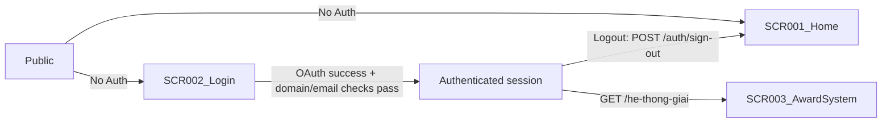

# Screen Flow

**Project**: SAA 2025 Web
**Generated**: 2026-08-31
**Analysis Scope**: Wave 2 — route-view (web), 3 SCR from `screen-list.md`

**Code Format**: All SCR codes follow `SCR###_NameSlug` | `SCR###/REG###` for region-scoped transitions (N/A here — all 3 screens are atomic, no REG### declared).

## Navigation Map

```mermaid
graph TD
    Start((Visitor)) -->|Direct URL /| Home[SCR001_Home]
    Start -->|Direct URL /login| Login[SCR002_Login]
    Start -->|Direct URL /he-thong-giai| Award[SCR003_AwardSystem]

    Home -->|"ABOUT AWARDS" CTA / nav / award card| Award
    Award -->|Logo / nav "About SAA 2025"| Home

    Award -->|"Guard: unauthenticated (proxy.ts)"| Login
    Login -->|"OAuth success, no next"| Home
    Login -->|"OAuth success, next=/he-thong-giai"| Award
    Login -->|"Already authenticated (proxy.ts)"| Home
    Login -->|"OAuth failure"| Login
```

## Feature Entry Points

> Populated from `feature-list.md` (Wave 5, complete — F001–F004) after the W2 placeholder above was intentionally left unresolved. Source: each feature's own Related Screens/APIs section, cross-checked against this file's Navigation Map and Screen Access Paths.

### F001_GoogleOAuthLogin

- **Entry screen**: SCR002_Login — `/login`
- **Return path**: `/auth/callback` (ROUTE001, GET) — Google OAuth redirect target; not a screen, resolves to an exit below
- **Owned screens**:
  - SCR002_Login — `/login` (atomic) — primary sign-in screen
  - Logout trigger only (via the shared account menu) on SCR001_Home — `/` and SCR003_AwardSystem — `/he-thong-giai`; the menu UI itself belongs to F002_NavigationShell
- **Exit screens**: SCR001_Home (OAuth success with no `next`, already-authed redirect off `/login`, or logout); SCR003_AwardSystem (OAuth success with `next=/he-thong-giai`, or logout); SCR002_Login itself (OAuth failure, re-rendered with `?error=`)

### F002_NavigationShell

- **Entry screen**: none of its own — no dedicated route; renders as persistent header/footer/FAB chrome on the screens it owns. SCR002_Login renders its own distinct minimal header instead of this shell (`screen-list.md` SCR002_Login Description).
- **Owned screens**:
  - SCR001_Home — `/` (atomic, chrome only)
  - SCR003_AwardSystem — `/he-thong-giai` (atomic, chrome only)
- **Exit screens**: SCR001_Home ↔ SCR003_AwardSystem via logo/nav-link/footer clicks (see Screen Access Paths below); language switch and FAB expand/collapse do not navigate

### F003_HomepageOverview

- **Entry screen**: SCR001_Home — `/`
- **Owned screens**:
  - SCR001_Home — `/` (atomic)
- **Exit screens**: SCR003_AwardSystem — `/he-thong-giai#{slug}` (award-card click carries the category slug as a hash deep-link; also reachable via hero CTA / header nav / footer nav with no slug)

### F004_AwardSystemBrowse

- **Entry screen**: SCR003_AwardSystem — `/he-thong-giai` (guarded — unauthenticated visitors never reach it; guard is `PERM001_PrivateRouteAuthGuard`, owned under F001), including `#{slug}` deep-links carried in from SCR001_Home award-card clicks (F003)
- **Owned screens**:
  - SCR003_AwardSystem — `/he-thong-giai` (atomic)
- **Exit screens**: SCR001_Home — `/` (logo click, nav "About SAA 2025", footer link)

## Screen Access Paths

| From Screen | To Screen | Action/Trigger | Conditions | Region |
|-------------|-----------|----------------|------------|--------|
| START | SCR001_Home | Direct URL `/` | Public exact-match route | |
| START | SCR002_Login | Direct URL `/login` | Public exact-match route | |
| START | SCR003_AwardSystem | Direct URL `/he-thong-giai` | Redirected to SCR002_Login if unauthenticated | |
| SCR001_Home | SCR003_AwardSystem | Click hero "ABOUT AWARDS" CTA / header nav "Awards Information" / award-card / footer nav | None (public link; guard applies on landing) | |
| SCR003_AwardSystem | SCR001_Home | Click header logo / nav "About SAA 2025" / footer link | None | |
| SCR003_AwardSystem | SCR002_Login | Guard redirect | Unauthenticated session (`proxy.ts` `getClaims()` check) | |
| SCR002_Login | SCR001_Home | Google OAuth success, no `next` param; OR already-authenticated session hits `/login` | `isAllowedEmail` + `emailVerified` both pass (OAuth case) | |
| SCR002_Login | SCR003_AwardSystem | Google OAuth success, `next=/he-thong-giai` | `next` validated by `safeNext()`; domain/email checks pass | |
| SCR002_Login | SCR002_Login | OAuth failure (`oauth_init_failed` / `missing_code` / `exchange_failed` / `domain`) | Re-render with `?error=` banner (`LoginErrorNotice`) | |

> Region column: blank on every row — no REG### exist in `screen-list.md` (all 3 screens classified atomic).

## Screen Transitions

### SCR001_Home (Home)

**Entry Points**:
- Direct URL access (`/`, public)
- From SCR002_Login: OAuth success with no `next` param, or already-authed guard redirect
- From SCR003_AwardSystem: header logo / nav link

**Exit Points**:
- To SCR003_AwardSystem: hero CTA, header/footer nav, award-card click

**Decision Points**:
- None (Home itself has no branching navigation logic; auth branching happens at `proxy.ts`, not on this screen)

---

### SCR002_Login (Login)

**Entry Points**:
- Direct URL access (`/login`, public)
- From SCR003_AwardSystem: unauthenticated guard redirect (`?next=/he-thong-giai`)
- From `proxy.ts`: any other protected path an unauthenticated visitor hit (`?next=<path>`)

**Exit Points**:
- To SCR001_Home: OAuth success (no `next`), or already-authed guard redirect away from `/login`
- To SCR003_AwardSystem: OAuth success with `next=/he-thong-giai`
- To SCR002_Login (self): OAuth failure, re-rendered with `?error=` banner

**Decision Points**:
- OAuth callback outcome (`src/app/auth/callback/route.ts`, BL003): if `isAllowedEmail(email) && emailVerified(user)` → redirect `safeNext(next)`, else → sign out + redirect `/login?error=domain`
- Missing/failed exchange: no `code` → `/login?error=missing_code`; `exchangeCodeForSession` failure → `/login?error=exchange_failed`

---

### SCR003_AwardSystem (AwardSystem)

**Entry Points**:
- Direct URL access (`/he-thong-giai`) — only reaches this screen if authenticated; unauthenticated hits are intercepted before render
- From SCR001_Home: hero CTA, header/footer nav, award-card click
- From SCR002_Login: OAuth success carrying `next=/he-thong-giai`

**Exit Points**:
- To SCR001_Home: header logo, nav "About SAA 2025", footer link

**Decision Points**:
- Auth guard (`src/proxy.ts`, evaluated before this screen renders, not by the screen itself): unauthenticated → redirect `/login?next=/he-thong-giai`

---

## Region Transitions

N/A — no REG### declared in `screen-list.md`; all 3 screens (SCR001_Home, SCR002_Login, SCR003_AwardSystem) are atomic (2-of-3 composite gate not met — see each screen's classification note in `screen-list.md`).

---

## Authentication Flow



| Screen | Authentication Required | Authorization Level |
|--------|------------------------|-------------------|
| SCR001_Home | No | Public |
| SCR002_Login | No (redirects away if already authenticated) | Public |
| SCR003_AwardSystem | Yes | Authenticated (`member` or `admin` — no role-based branching observed on this screen itself; `profile.role` only gates the `AccountMenu` Dashboard entry in the shared header shell) |

---

## Error Handling Flows

| Screen | Error | Handling | Scope |
|--------|-------|----------|-------|
| SCR002_Login | OAuth init failure (`oauth_init_failed`) | `signInWithGoogle` redirects to `/login?error=oauth_init_failed`; `LoginErrorNotice` shows the generic failure banner | screen |
| SCR002_Login | Missing authorization code (`missing_code`) | Callback redirects to `/login?error=missing_code` | screen |
| SCR002_Login | Session exchange failure (`exchange_failed`) | Callback redirects to `/login?error=exchange_failed` | screen |
| SCR002_Login | Disallowed domain / unverified email (`domain`) | Callback signs the session back out, redirects to `/login?error=domain` — one shared banner copy for all 4 codes so a user cannot infer which check failed (clarifications.md) | screen |
| (site-wide, no SCR) | 404 — unmatched path | Next.js auto-renders `src/app/not-found.tsx` (provisional, no route/Figma frame — see `screen-list.md` exclusion note) | screen |
| (site-wide, no SCR) | 403 — forbidden | `src/app/forbidden.tsx` exists but is not currently reachable — no route in this round calls `forbidden()` | screen |

---

## Circular Dependencies Check

- [x] No circular dependencies detected — Home ↔ AwardSystem is standard bidirectional site navigation (not a cycle in the problematic sense); the Login ⇄ AwardSystem ⇄ Login guard loop terminates the moment authentication succeeds, it does not re-enter indefinitely
- [x] All screens have valid entry/exit points
- [x] All navigation paths terminate

---

## Guard Logic

### GUARD-001 — Session revalidation on every non-public path
**trigger:** `middleware` (Next.js 16 `proxy.ts`, the documented functional replacement for `middleware.ts`)
**source:** `src/proxy.ts:40-77`
**logic:**
```pseudo
isAuthed = getClaims() succeeds with a claims payload
if (!isAuthed && !isPublicRoute(pathname)) → redirect /login?next={pathname}
if (isAuthed && pathname === "/login") → redirect /
```
**failure path:** unauthenticated on a protected route (e.g. `/he-thong-giai`) → `/login?next=<path>`; authenticated visitor hitting `/login` → `/`

---

## Deep-Link State Restoration

### SCR002_Login
**URL pattern:** `/login?error={code}&next={path}`
**State restored:**

| Param | Restores | Default if missing |
|-------|----------|--------------------|
| error | `LoginErrorNotice` banner — shown only for known codes (`domain`, `exchange_failed`, `missing_code`; `oauth_init_failed` also reaches this screen but is not in the component's known-code allow-list, see Concern below) | hidden (no banner) |
| next | Post-login redirect target — bound into `signInWithGoogle(next)`, round-tripped through `/auth/callback?next=`, validated by `safeNext()` before use | `/` |

**Failure mode:** unrecognized `error` value → `LoginErrorNotice` renders nothing (silently ignored); malformed/off-site `next` → `safeNext()` rejects it and falls back to `/`

### SCR003_AwardSystem
**URL pattern:** `/he-thong-giai#{slug}`
**State restored:**

| Param | Restores | Default if missing |
|-------|----------|--------------------|
| #{slug} (hash) | `AwardCategoryNav` active-item highlight + initial scroll-into-view of the matching `AwardInfoCard` section | no nav item active, page loads at top |

**Failure mode:** hash not matching any known slug → `resolveActiveSlug` returns `null`, no nav item marked active, no scroll — silently ignored, no error shown

---

## Unsaved-Changes Protection

`N/A — no unsaved-changes guards detected.` No form on any of the 3 screens carries editable, savable state: the Google sign-in form (SCR002_Login) has no fields to lose, and the sign-out form (shared header shell) is a single-action POST.

---

## Extraction Signatures

Framework-agnostic identifier patterns for locating the above constructs.

### Guard Logic
Function/method definitions tied to a route: `beforeEnter|canActivate|middleware|loader|before_action|authenticate|authorize` — check if called from a router config or route registration.

### Deep-Link State Restoration
URL param reads at component mount synced to state: `useSearchParams|useQuery|router\.query|URLSearchParams|params\[|$route\.query` — look for these at top of component with corresponding `setState` or reactive assignment.

### Unsaved-Changes Protection
`beforeunload|onbeforeunload|usePrompt|useBeforeUnload|leaveGuard|isDirty|formState\.isDirty|data-turbo-confirm` — presence confirms protection; absence is a potential gap to flag.
