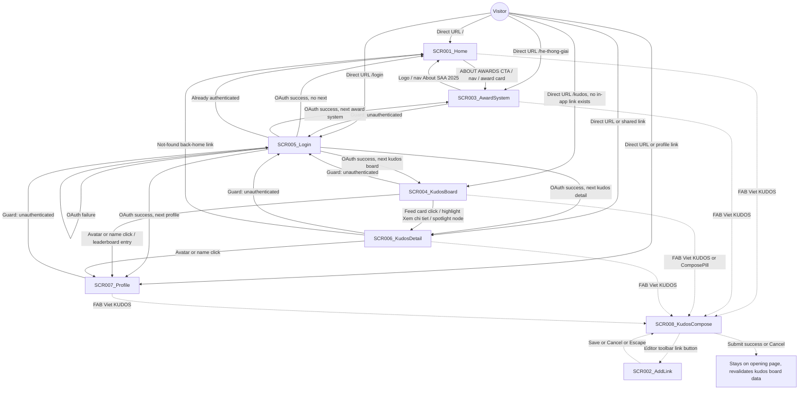
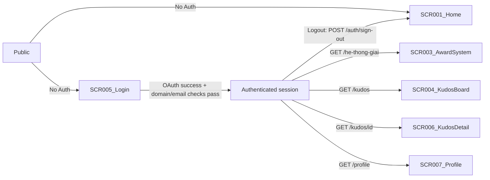

# Screen Flow

**Project**: SAA 2025 Web
**Generated**: 2026-09-02
**Analysis Scope**: Wave 2 — route-view (web) + modal overlays, 8 SCR from `screen-list.md`
(SCR001–SCR002; SCR001–SCR003 identity carried from round-1's 3-screen baseline, re-verified;
SCR004–SCR002 new this round).

**Code Format**: All SCR codes follow `SCR###_NameSlug` | `SCR###/REG###` for region-scoped
transitions (N/A here — all 8 screens are atomic, no REG### declared in `screen-list.md`).

## Navigation Map



> Dotted edges (`-.->`) are modal open/close, not URL navigation — the opening page stays
> mounted underneath. Solid edges are real route changes. The `Start → SCR004_KudosBoard` edge
> label is load-bearing: see § Feature Entry Points, F006, for why it is annotated
> "no in-app link exists."

## Feature Entry Points

> `feature-list.md` (Wave 5) is now complete and canonical. F001–F004 below are unchanged from the
> round-1 reuse; F005/F006 have been reconciled against `feature-list.md`'s actual clustering
> (`F005_KudosCompose`, `F006_KudosLiveBoard` — slugs and screen ownership), superseding the
> provisional informal-doc-comment-tag boundaries this section used earlier this wave before
> `feature-list.md` existed.

### F001_GoogleOAuthLogin

- **Entry screen**: SCR005_Login — `/login`
- **Return path**: `/auth/callback` (ROUTE001, GET) — not a screen, resolves to an exit below
- **Owned screens**:
  - SCR005_Login — `/login` (atomic)
  - Logout trigger only (shared account menu, `account-menu.tsx:96-104`), reachable from every
    `(site)`-group screen: SCR001, SCR003, SCR004, SCR006, SCR007
- **Exit screens**: SCR001_Home (OAuth success with no `next`, already-authed redirect off
  `/login`, or logout); any of SCR003/SCR004/SCR006/SCR007 (OAuth success with the matching
  `?next=`); SCR005_Login itself (OAuth failure, re-rendered with `?error=`)

### F002_NavigationShell

- **Entry screen**: none of its own — persistent header/footer/FAB chrome rendered by
  `(site)/layout.tsx` on every screen it owns. SCR005_Login renders its own distinct minimal
  header instead (`(auth)/layout.tsx`).
- **Owned screens** (chrome only — grown this round from 2 to 5, all under `(site)/layout.tsx`):
  - SCR001_Home — `/`
  - SCR003_AwardSystem — `/he-thong-giai`
  - SCR004_KudosBoard — `/kudos` (new this round)
  - SCR006_KudosDetail — `/kudos/[id]` (new this round)
  - SCR007_Profile — `/profile` (new this round)
- **Cross-feature entry point** (new this round): the FAB rendered by this shell
  (`fab-widget-container.tsx`, `fab-widget.tsx`) is the **site-wide launch point for
  F005_KudosCompose's SCR008_KudosCompose** — every screen F002 owns can open SCR008, not just
  SCR004. This is the shell providing an entry point into a different feature's screen, not a
  navigation between F002's own screens.
- **Exit screens**: SCR001_Home ↔ SCR003_AwardSystem via logo/nav-link/footer clicks; language
  switch, FAB expand/collapse, and opening SCR008 do not navigate (URL unchanged)

### F003_HomepageOverview

- **Entry screen**: SCR001_Home — `/`
- **Owned screens**: SCR001_Home — `/` (atomic)
- **Exit screens**: SCR003_AwardSystem — `/he-thong-giai#{slug}` (award-card click carries the
  category slug as a hash deep-link)

### F004_AwardSystemBrowse

- **Entry screen**: SCR003_AwardSystem — `/he-thong-giai` (guarded, `PERM001_PrivateRouteAuthGuard`),
  including `#{slug}` deep-links from SCR001_Home
- **Owned screens**: SCR003_AwardSystem — `/he-thong-giai` (atomic)
- **Exit screens**: SCR001_Home — `/` (logo click, nav, footer link)

### F005_KudosCompose

- **Entry screen**: none of its own via direct URL — SCR008_KudosCompose is a modal (no route),
  opened from F002's FAB ("Viết KUDOS", any `(site)` screen) or F006's ComposePill on
  SCR004_KudosBoard.
- **Owned screens**:
  - SCR008_KudosCompose — modal, no route (atomic)
  - SCR002_AddLink — modal, no route, nested under SCR008 via the editor toolbar's link button
    (atomic)
- **Exit screens**: N/A — on submit, `createKudos` (`create-kudos-action.ts`) calls
  `revalidatePath("/kudos")` and the dialog closes; the calling screen (whichever screen's FAB or
  SCR004's ComposePill opened the modal) re-renders in place, no navigation to a different screen.

### F006_KudosLiveBoard

- **Entry screen**: SCR004_KudosBoard — `/kudos` (guarded), reachable only by direct URL or the
  auth-guard `?next=/kudos` round trip — see the Navigation Map note and Notes § below for why
  this is flagged, not assumed
- **Owned screens**:
  - SCR004_KudosBoard — `/kudos` (atomic)
  - SCR006_KudosDetail — `/kudos/[id]` (atomic)
  - SCR007_Profile — `/profile` (atomic)
- **Triggered actions (no navigation)**: the heart button on SCR004_KudosBoard/SCR006_KudosDetail
  calls `toggleHeart` (`toggle-heart-action.ts`) — `revalidatePath("/kudos")` server-side plus a
  client `router.refresh()`, no screen change.
- **Exit screens**: SCR001_Home (SCR006's not-found "back home" link only — no other owned
  screen exits to a different feature's screen)

---

## Screen Access Paths

| From Screen | To Screen | Action/Trigger | Conditions | Region |
|-------------|-----------|----------------|------------|--------|
| START | SCR001_Home | Direct URL `/` | Public exact-match route | |
| START | SCR005_Login | Direct URL `/login` | Public exact-match route | |
| START | SCR003_AwardSystem | Direct URL `/he-thong-giai` | Redirected to SCR005_Login if unauthenticated | |
| START | SCR004_KudosBoard | Direct URL `/kudos` | Redirected to SCR005_Login if unauthenticated — **no other screen links here, see Notes** | |
| START | SCR006_KudosDetail | Direct URL or shared link `/kudos/{id}` | Redirected to SCR005_Login if unauthenticated | |
| START | SCR007_Profile | Direct URL or shared link `/profile?id={uuid}` | Redirected to SCR005_Login if unauthenticated | |
| SCR001_Home | SCR003_AwardSystem | Hero CTA / header nav / award-card / footer nav | None (guard applies on landing) | |
| SCR003_AwardSystem | SCR001_Home | Header logo / nav "About SAA 2025" / footer link | None | |
| SCR003_AwardSystem | SCR005_Login | Guard redirect | Unauthenticated (`proxy.ts` `getClaims()`) | |
| SCR004_KudosBoard | SCR005_Login | Guard redirect | Unauthenticated | |
| SCR006_KudosDetail | SCR005_Login | Guard redirect | Unauthenticated | |
| SCR007_Profile | SCR005_Login | Guard redirect | Unauthenticated | |
| SCR005_Login | SCR001_Home | OAuth success, no `next`; or already-authed session hits `/login` | Email allow-list + verified pass | |
| SCR005_Login | SCR003_AwardSystem | OAuth success, `next=/he-thong-giai` | `safeNext()` validated | |
| SCR005_Login | SCR004_KudosBoard | OAuth success, `next=/kudos` | `safeNext()` validated | |
| SCR005_Login | SCR006_KudosDetail | OAuth success, `next=/kudos/{id}` | `safeNext()` validated | |
| SCR005_Login | SCR007_Profile | OAuth success, `next=/profile` | `safeNext()` validated | |
| SCR005_Login | SCR005_Login | OAuth failure (`oauth_init_failed`/`missing_code`/`exchange_failed`/`domain`) | Re-render with `?error=` banner | |
| SCR004_KudosBoard | SCR006_KudosDetail | Feed-card content click (`kudos-card.tsx:81-84`) | `variant="feed"` only | |
| SCR004_KudosBoard | SCR006_KudosDetail | Highlight "Xem chi tiết" (`kudos-card.tsx:181-188`) | `variant="highlight"` only | |
| SCR004_KudosBoard | SCR006_KudosDetail | Spotlight node click (`kudos-feed-container.tsx:137`) | None | |
| SCR004_KudosBoard | SCR007_Profile | Author avatar/name click (`card-author-block.tsx:37-39`) | None | |
| SCR004_KudosBoard | SCR007_Profile | Leaderboard entry click (`leaderboard-list.tsx:52`) | None | |
| SCR006_KudosDetail | SCR007_Profile | Sender/receiver avatar or name click | None | |
| SCR006_KudosDetail | SCR001_Home | Not-found state "back home" link (`kudos-detail-container.tsx:46-51`) | Only when `getKudosById` returns null | |
| SCR001/SCR003/SCR004/SCR006/SCR007 | SCR008_KudosCompose | FAB "Viết KUDOS" (`fab-widget.tsx:68-78`) | Authenticated (FAB hidden for guests) — modal, URL unchanged | |
| SCR004_KudosBoard | SCR008_KudosCompose | ComposePill click (`kudos-feed-container.tsx:113`) | Authenticated — modal, URL unchanged | |
| SCR008_KudosCompose | SCR002_AddLink | Editor toolbar link button (`editor-toolbar.tsx:96-104`) | None — modal-on-modal, URL unchanged | |
| SCR002_AddLink | SCR008_KudosCompose | Save (valid text+URL) or Cancel/Escape | None — closes back to the same open Compose instance | |
| SCR008_KudosCompose | (same page) | Submit success | `revalidatePath("/kudos")` server-side + `router.refresh()` client-side; dialog closes, no navigation | |

> Region column: blank on every row — no REG### exist in `screen-list.md` (all 8 screens
> classified atomic).

## Screen Transitions

### SCR001_Home (Home)

**Entry Points**:
- Direct URL access (`/`, public)
- From SCR005_Login: OAuth success with no `next`, or already-authed guard redirect
- From SCR003_AwardSystem: header logo / nav link
- From SCR006_KudosDetail: not-found state's "back home" link

**Exit Points**:
- To SCR003_AwardSystem: hero CTA, header/footer nav, award-card click
- To SCR008_KudosCompose: FAB "Viết KUDOS" (modal, no URL change)

**Decision Points**: None on this screen itself (auth branching happens at `proxy.ts`).

---

### SCR005_Login (Login)

**Entry Points**:
- Direct URL access (`/login`, public)
- From any guarded screen (SCR003/SCR004/SCR006/SCR007): unauthenticated guard redirect with the matching `?next=`

**Exit Points**:
- To SCR001_Home: OAuth success (no `next`), or already-authed guard redirect
- To SCR003_AwardSystem / SCR004_KudosBoard / SCR006_KudosDetail / SCR007_Profile: OAuth success with the matching `next=`
- To SCR005_Login (self): OAuth failure, re-rendered with `?error=` banner

**Decision Points**:
- OAuth callback outcome (`src/app/auth/callback/route.ts`, BL003): `isAllowedEmail(email) && emailVerified(user)` → redirect `safeNext(next)`, else → sign out + `/login?error=domain`
- No `code` → `/login?error=missing_code`; exchange failure → `/login?error=exchange_failed`

---

### SCR003_AwardSystem (AwardSystem)

**Entry Points**:
- Direct URL access (authenticated only)
- From SCR001_Home: hero CTA, header/footer nav, award-card click
- From SCR005_Login: OAuth success carrying `next=/he-thong-giai`

**Exit Points**:
- To SCR001_Home: header logo, nav "About SAA 2025", footer link
- To SCR008_KudosCompose: FAB "Viết KUDOS" (modal, no URL change)

**Decision Points**:
- Auth guard (`src/proxy.ts`, evaluated before render): unauthenticated → `/login?next=/he-thong-giai`

---

### SCR004_KudosBoard (KudosBoard)

**Entry Points**:
- Direct URL access (`/kudos`, authenticated only) or a bookmarked/typed link
- From SCR005_Login: OAuth success carrying `next=/kudos`
- **No other screen links here** — see Notes § below

**Exit Points**:
- To SCR006_KudosDetail: feed-card content click, highlight "Xem chi tiết", spotlight node click
- To SCR007_Profile: author avatar/name click, leaderboard entry click
- To SCR008_KudosCompose: FAB "Viết KUDOS" or this screen's own ComposePill (modal, no URL change)
- Self (`/kudos?hashtag=&department=`): filter-bar change or per-card hashtag click re-navigates with new query params, remounting the client feed shell

**Decision Points**:
- Auth guard (`src/proxy.ts`): unauthenticated → `/login?next=/kudos`
- Empty feed: 0 rows after filtering → renders `t("allKudos.emptyFeed")` in place of the card list (`kudos-feed.tsx:62-66`), not an error

---

### SCR006_KudosDetail (KudosDetail)

**Entry Points**:
- Direct URL or shared link `/kudos/{id}` (authenticated only)
- From SCR004_KudosBoard: feed-card click, highlight "Xem chi tiết", spotlight node click
- From SCR005_Login: OAuth success carrying `next=/kudos/{id}`

**Exit Points**:
- To SCR007_Profile: sender/receiver avatar or name click
- To SCR001_Home: not-found state's "back home" link only
- To SCR008_KudosCompose: FAB "Viết KUDOS" (modal, no URL change)
- **No exit back to SCR004_KudosBoard exists on this screen** (see `screen-list.md` SCR006 Gap note)

**Decision Points**:
- `getKudosById(id)` miss → inline not-found block (`common.notFound` copy) instead of the card

---

### SCR007_Profile (Profile)

**Entry Points**:
- Direct URL or shared link `/profile?id={uuid}` (authenticated only)
- From SCR004_KudosBoard: author avatar/name click, leaderboard entry click
- From SCR006_KudosDetail: sender/receiver avatar or name click
- From SCR005_Login: OAuth success carrying `next=/profile`

**Exit Points**:
- None — leaf screen, no CTA (still shows the shared header/footer/FAB, so exits via those are
  the same as any other `(site)` screen: header nav, footer, FAB)

**Decision Points**:
- Missing or unresolved `?id=` → same stub renders with `profile: null` (name/avatar both empty), never errors

---

### SCR008_KudosCompose (KudosCompose, modal)

**Entry Points**:
- FAB "Viết KUDOS" from any `(site)`-group screen (SCR001, SCR003, SCR004, SCR006, SCR007)
- SCR004_KudosBoard's own ComposePill

**Exit Points**:
- Submit success: dialog closes, stays on the opening screen, `revalidatePath("/kudos")` + `router.refresh()`
- Cancel or backdrop/Escape (implicit via `onClose`): dialog closes, all input discarded, no confirm
- To SCR002_AddLink: editor toolbar link button (modal-on-modal)

**Decision Points**:
- Client-side self-kudos check (`isSelfKudos`) fires before the network call; server re-checks independently (`createKudos`)
- Submit disabled until recipient + non-empty content + ≥1 hashtag all hold (`kudos-compose-dialog.tsx:72`)
- `is_anonymous=true` requires a non-blank display name (`validate-draft.ts:77-79`)

---

### SCR002_AddLink (AddLink, nested modal)

**Entry Points**:
- SCR008_KudosCompose's editor toolbar link button (only entry)

**Exit Points**:
- Save (valid text + `https?://` URL) → inserts a linked text run into SCR008's editor, closes back to SCR008
- Cancel button or Escape key → closes back to SCR008, discards both fields

**Decision Points**:
- Save disabled until text (1–100 chars) and link (`^https?://`, 5–2048 chars) both validate (`addlink-dialog.tsx:18-26,64-66`)

---

## Region Transitions

N/A — no REG### declared in `screen-list.md`; all 8 screens are atomic (2-of-3 composite gate
not met on any of them — see each screen's classification note in `screen-list.md`, and
SCR004_KudosBoard's note in particular for the one screen where a real independence signal exists
but the gate still doesn't fire).

---

## Authentication Flow



| Screen | Authentication Required | Authorization Level |
|--------|------------------------|-------------------|
| SCR001_Home | No | Public |
| SCR005_Login | No (redirects away if already authenticated) | Public |
| SCR003_AwardSystem | Yes | Authenticated (no role branching on this screen) |
| SCR004_KudosBoard | Yes | Authenticated (no role branching) |
| SCR006_KudosDetail | Yes | Authenticated (no role branching) |
| SCR007_Profile | Yes | Authenticated (no role branching — viewing another Sunner's stub, not gated by `role`) |
| SCR008_KudosCompose | Implicit — never mounted for a guest (`fab-widget-container.tsx:20-23` returns `visible={false}`) | Authenticated |
| SCR002_AddLink | Implicit — nested inside SCR008 | Authenticated |

---

## Error Handling Flows

| Screen | Error | Handling | Scope |
|--------|-------|----------|-------|
| SCR005_Login | OAuth init failure (`oauth_init_failed`) | Redirect `/login?error=oauth_init_failed`, generic failure banner | screen |
| SCR005_Login | Missing authorization code (`missing_code`) | Redirect `/login?error=missing_code` | screen |
| SCR005_Login | Session exchange failure (`exchange_failed`) | Redirect `/login?error=exchange_failed` | screen |
| SCR005_Login | Disallowed domain / unverified email (`domain`) | Session signed back out, redirect `/login?error=domain` — one shared banner copy for all 4 codes | screen |
| SCR004_KudosBoard | Empty feed after filtering | Inline empty-state copy (`allKudos.emptyFeed`), not treated as an error | region:KudosFeed |
| SCR004_KudosBoard | `special_days` query failure (special-day double-heart lookup) | Caught, logged to console, silently falls back to "not a special day" — **no user-visible indication** (`kudos-board-container.tsx:84-92`) | region:KudosFeed/HighlightCarousel (heart amount only) |
| SCR004_KudosBoard, SCR006_KudosDetail | `toggleHeart` server rejection (e.g. RLS denial, self-heart) | Caught, logged to console, optimistic state simply not applied — **no toast or inline error shown to the user** (`use-heart-toggle.ts:38-41`) | region: card-level (per kudos id) |
| SCR006_KudosDetail | Kudos not found (`getKudosById` returns null) | Inline not-found block, `common.notFound` copy, "back home" link | screen |
| SCR008_KudosCompose | Self-kudos rejected (client pre-check or server re-check) | Inline error banner inside the still-open dialog (`compose-dialog-container.tsx:64-67,79-85`) | screen (modal) |
| SCR008_KudosCompose | Image upload failure (`upload-failed`) | Same inline error banner, dialog stays open | screen (modal) |
| (site-wide, no SCR) | 404 — unmatched path | Next.js auto-renders `src/app/not-found.tsx` (unchanged from round-1, provisional) | screen |
| (site-wide, no SCR) | 403 — forbidden | `src/app/forbidden.tsx` exists but still unreachable — no route calls `forbidden()` this round either | screen |

---

## Circular Dependencies Check

- [x] No circular dependencies detected — Home ↔ AwardSystem is standard bidirectional
  navigation; the Login ⇄ {AwardSystem,KudosBoard,KudosDetail,Profile} ⇄ Login guard loop
  terminates the moment authentication succeeds; the Compose ⇄ AddLink modal pair is a strict
  parent/child stack, never mutually recursive
- [x] All screens have valid entry/exit points — except the two flagged, intentional dead-ends:
  SCR004_KudosBoard has no inbound in-app link (entry via direct URL / guard redirect only) and
  SCR007_Profile has no outbound link (leaf screen by design, per its stub status)
- [x] All navigation paths terminate

---

## Guard Logic

### GUARD-001 — Session revalidation on every non-public path

**trigger:** `middleware` (Next.js 16 `proxy.ts`, the functional replacement for `middleware.ts`)
**source:** `src/proxy.ts:40-77` (unchanged this round; re-read and re-verified against current source)
**logic:**
```pseudo
isAuthed = getClaims() succeeds with a claims payload
if (!isAuthed && !isPublicRoute(pathname)) → redirect /login?next={pathname}
if (isAuthed && pathname === "/login") → redirect /
```
**failure path:** unauthenticated on a protected route (`/he-thong-giai`, `/kudos`, `/kudos/{id}`,
`/profile`) → `/login?next=<path>`; authenticated visitor hitting `/login` → `/`

> This is the same guard as round-1's GUARD-001 (`PERM001_PrivateRouteAuthGuard`) — `PUBLIC_ROUTES`
> is still exactly `["/", "/login"]` plus the `/auth/*` prefix carve-out; the 3 new frontend pages
> (`/kudos`, `/kudos/[id]`, `/profile`) fall through to the same "everything else" branch with no
> new guard code added.

---

## Deep-Link State Restoration

### SCR005_Login
**URL pattern:** `/login?error={code}&next={path}`
**State restored:**

| Param | Restores | Default if missing |
|-------|----------|--------------------|
| error | `LoginErrorNotice` banner (known codes: `domain`, `exchange_failed`, `missing_code`; `oauth_init_failed` also reaches this screen but is outside the component's known-code list) | hidden (no banner) |
| next | Post-login redirect target, validated by `safeNext()` | `/` |

**Failure mode:** unrecognized `error` → banner renders nothing; malformed/off-site `next` → `safeNext()` rejects, falls back to `/`

### SCR003_AwardSystem
**URL pattern:** `/he-thong-giai#{slug}`
**State restored:**

| Param | Restores | Default if missing |
|-------|----------|--------------------|
| #{slug} (hash) | `AwardCategoryNav` active-item highlight + scroll-into-view of the matching card | no nav item active, page loads at top |

**Failure mode:** unmatched hash → `resolveActiveSlug` returns `null`, silently ignored

### SCR004_KudosBoard
**URL pattern:** `/kudos?hashtag={id}&department={name}`
**State restored:**

| Param | Restores | Default if missing |
|-------|----------|--------------------|
| hashtag | Hashtag-filter dropdown selection; re-fetches highlight + feed + spotlight scoped to that tag (`kudos-board-container.tsx:24-30`) | no filter applied |
| department | Department-filter dropdown selection; same shared re-fetch | no filter applied |

**Failure mode:** an id/name with no matching rows silently yields an empty feed (`allKudos.emptyFeed`) — no error shown

### SCR007_Profile
**URL pattern:** `/profile?id={uuid}`
**State restored:**

| Param | Restores | Default if missing |
|-------|----------|--------------------|
| id | Which Sunner's stub renders (`getProfileById(id)`) | stub renders with `profile: null` (empty name/avatar, still shows "Đang phát triển") |

**Failure mode:** an `id` that resolves to no row behaves identically to a missing `id` — same null-profile stub, no distinct error

---

## Unsaved-Changes Protection

`N/A — no unsaved-changes guards detected`, but **not uniformly low-risk this round**:

- SCR005_Login's sign-in form and the shared header's sign-out form have nothing to lose (same as round-1).
- **SCR008_KudosCompose is a real gap**: recipient, rich-text content, hashtags, image attachments
  and the anonymous display name are all live, losable input, yet "Hủy" (`compose-footer.tsx:23-31`)
  and the implicit backdrop/Escape close path both discard everything with no confirm dialog and
  no `beforeunload`/route-leave guard. Flagged for a design/product checkpoint, not fixed here
  (Wave 2 is read-only synthesis).
- SCR002_AddLink's 2-field form losing state on Cancel/Escape is comparatively low-stakes (no
  persisted or cross-session data at risk) and is not flagged as a gap.

---

## Extraction Signatures

Framework-agnostic identifier patterns for locating the above constructs.

### Guard Logic
Function/method definitions tied to a route: `beforeEnter|canActivate|middleware|loader|before_action|authenticate|authorize` — check if called from a router config or route registration.

### Deep-Link State Restoration
URL param reads at component mount synced to state: `useSearchParams|useQuery|router\.query|URLSearchParams|params\[|$route\.query` — look for these at top of component with corresponding `setState` or reactive assignment.

### Unsaved-Changes Protection
`beforeunload|onbeforeunload|usePrompt|useBeforeUnload|leaveGuard|isDirty|formState\.isDirty|data-turbo-confirm` — presence confirms protection; absence is a potential gap to flag.

---

## Notes

- **SCR004_KudosBoard reachability gap**: a full-codebase grep for the literal string `/kudos`
  across every `.tsx`/`.ts` file under `src/` (excluding `__tests__`, excluding the dynamic
  `/kudos/${id}` detail links, and excluding the screen's own self-referential filter-URL
  builder in `kudos-feed-container.tsx:53`) found **zero** navigational references to the board
  from any other screen: `site-header.tsx`'s "Sun* Kudos" nav item has no `href` (line 22),
  `kudos-promo.tsx`'s CTA is `aria-disabled`/`tabIndex={-1}` (lines 64-73), and the FAB's "Viết
  KUDOS" button opens SCR008_KudosCompose directly without ever routing through SCR004. The only
  ways a Sunner reaches `/kudos` today are a direct/bookmarked URL, a shared `/kudos/{id}` or
  `/profile?id=` link's implicit sibling awareness of the board's existence, or the auth guard's
  `?next=/kudos` round trip after being redirected from `/kudos` itself while logged out. This is
  a materially different situation from round-1's already-flagged "Sun* Kudos nav has no
  destination" gap — that gap is now live-and-blocking rather than merely dormant, since the
  destination screen exists and ships this round.
