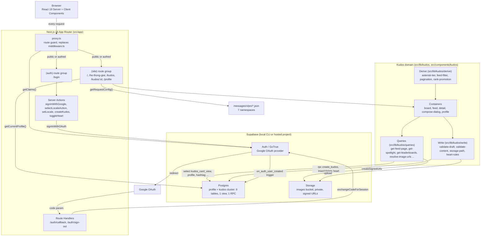
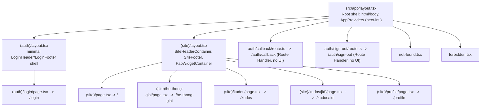
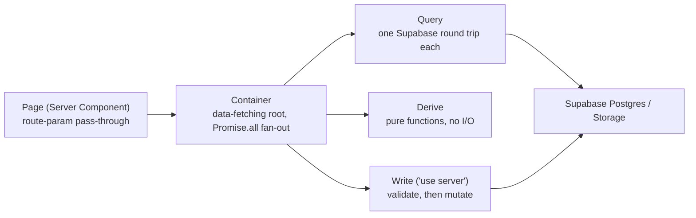
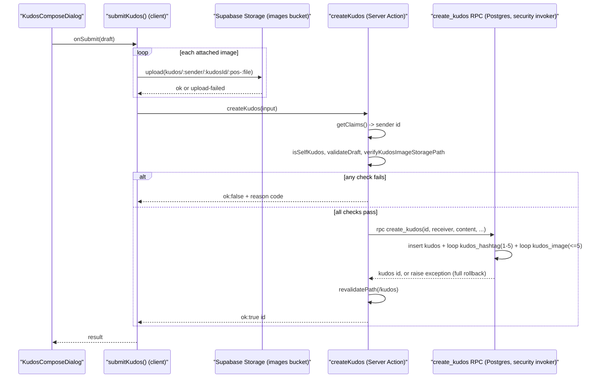
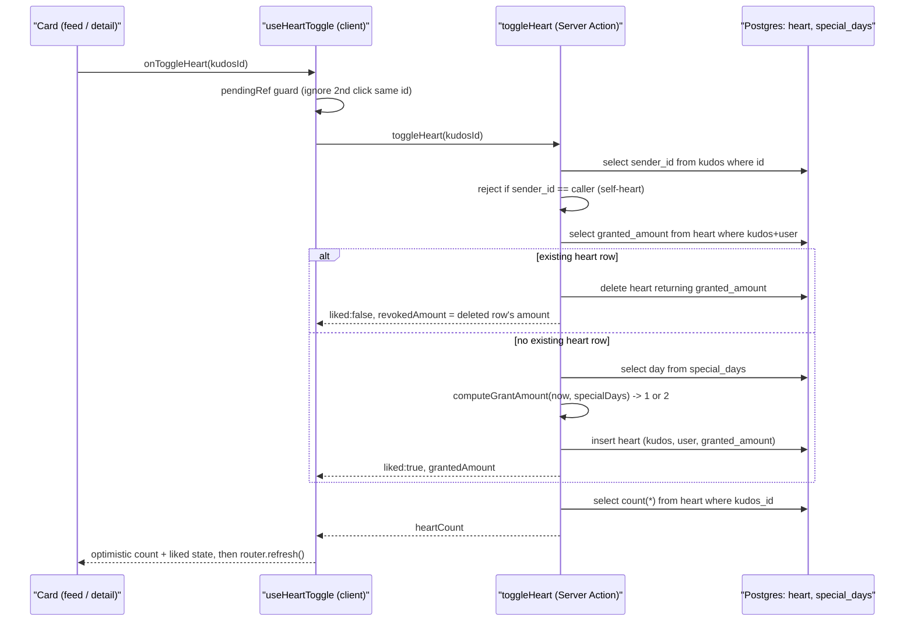
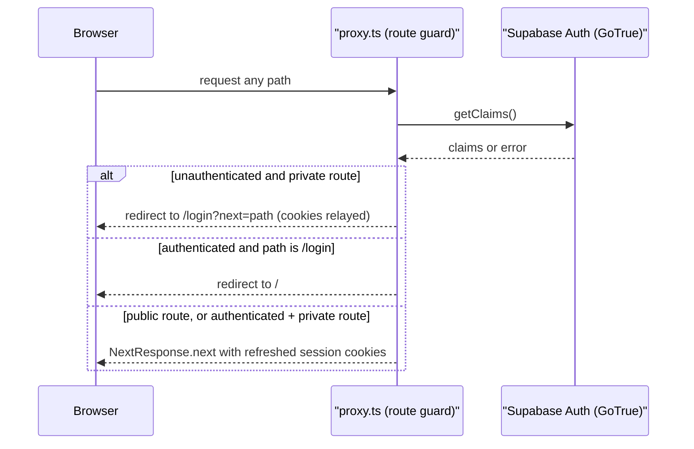
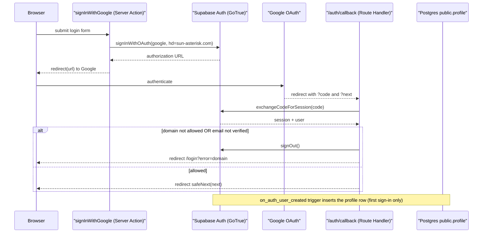
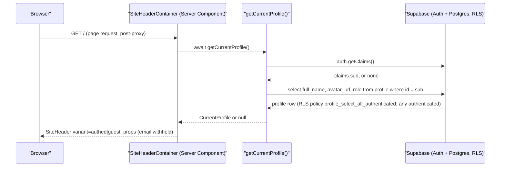

# Architecture

Sources: `src/app/**`, `src/proxy.ts`, `src/lib/supabase/{client,server}.ts`, `src/i18n/request.ts`,
`src/lib/kudos/**`, `src/components/kudos/**`, `next.config.ts`, `playwright.config.ts`,
`vitest.config.mts`, `supabase/config.toml`, `supabase/migrations/*.sql` (5 files), `package.json`.
Cross-checked against and extends the round-1 promoted `docs/system/architecture.md` — every
round-1 claim re-verified against current source; the Kudos domain (round 2, F005/F006) is new.

## System Architecture

Notes:
- No API Gateway / microservices layer. Supabase is consumed directly as BaaS from Server
  Components, Server Actions, Route Handlers, and one inline `"use server"` pagination action
  (`src/components/kudos/containers/kudos-board-container.tsx:104-117`), via two thin client
  factories (`src/lib/supabase/client.ts`, `src/lib/supabase/server.ts`) — no custom REST/GraphQL
  layer in front of it.
- `src/proxy.ts` is unchanged this round: same `PUBLIC_ROUTES = ["/", "/login"]` exact-match list
  plus `/auth/` prefix exception (`src/proxy.ts:12-16`), same `getClaims()`-only re-validation
  (`src/proxy.ts:60`). The new `/kudos`, `/kudos/:id`, `/profile` routes needed no proxy change —
  they fall through to "everything else requires a session".
- The Kudos domain is layered **containers → queries/write → Supabase**, with a **derive** layer of
  pure, side-effect-free functions (asterisk tier, feed filter, pagination cursor, rank-promotion
  milestones, highlight ordering, spotlight nodes) consumed by containers but touching no I/O —
  see `## Kudos Domain Layering` below.

## Route Structure

- Both route groups render at the URL root but mount different shells: `(auth)/layout.tsx` renders
  its own header/footer instead of the full `SiteHeader`/`SiteFooter`/`FabWidget`
  (`src/app/(auth)/layout.tsx:4-9`, `src/app/(site)/layout.tsx:6-9`) — unchanged this round.
- `/kudos` reads its filter (`?hashtag=&department=`) from `searchParams`, not component state, so
  the filtered view is a shareable link (`src/app/(site)/kudos/page.tsx:12-30`).
- `/kudos/:id` and `/profile` are both thin route-param pass-throughs to a container that owns the
  real query and the found/not-found markup (`src/app/(site)/kudos/[id]/page.tsx:15-18`,
  `src/app/(site)/profile/page.tsx:19-28`); neither has any guard code of its own — both are
  guarded purely by absence from `PUBLIC_ROUTES` in `proxy.ts`.
- **Kudos Compose is a modal, not a route** — `KudosComposeDialog` opens from either the FAB
  ("Viết KUDOS", every page) or the `/kudos` board's compose pill, both routed through the single
  `ComposeDialogContainer` (`src/components/kudos/containers/compose-dialog-container.tsx:45-52`)
  so the self-kudos guard, error mapping, and post-submit revalidation exist in exactly one place.
- `/he-thong-giai` has no dynamic segment; category selection is client-side hash-based state
  (`resolve-active-slug.ts`), not a route param — unchanged from round 1.

## Tech Stack

| Layer | Technology | Version | Source |
|-------|------------|---------|--------|
| Frontend framework | Next.js, App Router | 16.3.3 | `package.json:28` |
| UI library | React / React DOM | 19.2.8 | `package.json:30-31` |
| Language | TypeScript | ^5 | `package.json:52` |
| Styling | Tailwind CSS v4 (`@tailwindcss/postcss`) | ^4 | `package.json:35,51` |
| i18n | next-intl (cookie-based locale, no URL prefix) | ^4.14.0 | `package.json:29`, `src/i18n/request.ts` |
| Rich-text editor | TipTap (`@tiptap/core`, `-react`, `-starter-kit`, `-extension-mention`, `-suggestion`, `-pm`) | 3.30.6 | `package.json:19-24`, `src/components/kudos/compose/kudos-editor.tsx` |
| Word-cloud / pan-zoom | `d3-cloud`, `d3-selection`, `d3-zoom` | ^1.2.9 / ^3.0.0 / ^3.0.0 | `package.json:25-27`, `src/components/kudos/board/spotlight-cloud-canvas.tsx` |
| Positioning utility | `@floating-ui/dom` | ^1.8.0 | `package.json:16` |
| Backend / BaaS | Supabase (`@supabase/ssr`, `@supabase/supabase-js`) | 0.12.5 / 2.112.4 | `package.json:17-18`, `src/lib/supabase/*` |
| Database | Postgres, via Supabase local CLI | major_version 17 | `supabase/config.toml:34` |
| File storage | Supabase Storage — `images` bucket, private | `file_size_limit "50MiB"` | `supabase/config.toml:109-112` |
| Auth provider | Supabase Auth (GoTrue) + Google OAuth | `[auth.external.google]` | `supabase/config.toml:298-311` |
| Route guard | `src/proxy.ts` (Next 16 replacement for `middleware.ts`) | n/a | `src/proxy.ts` |
| Unit / component tests | Vitest + Testing Library, jsdom | vitest ^4.1.11 | `package.json:36-38,45-46,54`, `vitest.config.mts` |
| E2E tests | Playwright (chromium project, auto-starts dev server) | ^1.62.1 | `package.json:34`, `playwright.config.ts` |
| Lint | ESLint (`eslint-config-next`) | ^9 / 16.3.3 | `package.json:48-49` |
| Cache | None — no cache layer in this codebase | n/a | not found |
| Queue | None — no queue/worker in this codebase | n/a | not found |
| CI/CD | None — no `.github/workflows/` present | n/a | not found (verified: `ls .github/workflows` → no such directory) |

## Kudos Domain Layering

- **Containers** (`src/components/kudos/containers/*.tsx`) are the data-fetching roots. Each page's
  container resolves every query it needs in parallel via `Promise.all` — e.g.
  `KudosBoardContainer` fans out 8 independent queries/checks (filter options, highlight top-5,
  feed page, spotlight, sidebar stats, leaderboards, recipients, special-day check) plus the
  viewer's own claims in one `Promise.all` before rendering
  (`src/components/kudos/containers/kudos-board-container.tsx:136-158`).
- **Queries** (`src/lib/kudos/queries/*.ts`, 12 files) are one Supabase round trip each, all reading
  through `kudos_card_view` where possible to avoid N+1 (e.g. `get-feed-page.ts:26-49`). A query
  that needs a field the view doesn't carry (department, for the department filter) pays one extra
  targeted lookup rather than widening the view (`get-feed-page.ts:19-24,41-47`,
  `resolve-department-receivers.ts`). Every query degrades to an empty/zero result with a logged
  error on failure, never throws (`get-feed-page.ts:51-54`, `get-sidebar-stats.ts:59-61`,
  `resolve-image-urls.ts:29-32`) — the same "degrade, don't break the page" convention round 1's
  `getCurrentProfile()` established (`src/lib/profile/get-current-profile.ts:38-41`).
- **Derive** (`src/lib/kudos/derive/*.ts`, 6 files) holds business rules with no I/O, safe to unit
  test directly: `deriveAsteriskTier()` (kudos-received thresholds 10/20/50 → tiers 1/2/3,
  `asterisk-tier.ts:10-23`), `deriveRankPromotions()` (a Sunner's 10th/20th/50th received kudos *is*
  the milestone event, top 10 by most-recent, tie-broken by `userId` for determinism,
  `rank-promotion.ts:22-58`), plus `feed-filter`, `pagination`, `highlight-order`, `spotlight-nodes`.
- **Write** (`src/lib/kudos/write/*.ts`, 7 files) is the only layer allowed to mutate: two
  `"use server"` actions (`create-kudos-action.ts`, `toggle-heart-action.ts`) plus pure
  validators/helpers (`validate-draft.ts`, `validate-content.ts`, `validate-image.ts`,
  `storage-path.ts`, `heart-rules.ts`) the actions call before ever reaching Supabase. See
  `## Kudos Write Flow` and `## Heart Toggle & Special-Day Rule` below.
- **Hero/asterisk-tier duplication (known, documented)**: `kudos-board-container.tsx:30-35` and
  `kudos-detail-container.tsx:15-19` each define their own `HERO_TIER_BY_ASTERISK` map — noted in
  both files' comments as "a handful of lines, two call sites, not worth a cross-container module."
  Flagged here for the reviewer, not treated as a defect.

## Kudos Write Flow

- Images upload on **Submit only**, not on file-pick, so a cancelled draft never orphans a storage
  object (`src/lib/kudos/write/submit-kudos.ts:6-13`).
- `createKudos`'s validation order is fixed: unauthenticated → self-kudos → draft shape → per-image
  storage-path ownership → RPC (`src/lib/kudos/write/create-kudos-action.ts:73-123`) — each gate
  returns its own typed failure code so the dialog can show a specific, translated error
  (`src/components/kudos/containers/compose-dialog-container.tsx:32-35`).
  `self-kudos-not-allowed` is checked twice on purpose: client-side for a fast, friendly rejection
  (`compose-dialog-container.tsx:60-67`) and again server-side in case client state is stale or the
  request is replayed directly (`create-kudos-action.ts:90-92`).
- The RPC is the sole write-atomicity boundary — no app-side "insert kudos, then insert hashtags,
  then insert images, and compensate on failure" logic exists; a partial write is structurally
  impossible because `raise exception` inside plpgsql rolls back everything the function did
  (`supabase/migrations/20260831000000_create_kudos_cluster.sql:279,301-306`).

## Heart Toggle & Special-Day Rule

- `computeGrantAmount()` compares in `Asia/Ho_Chi_Minh` local calendar-date terms, not UTC —
  Supabase's `current_date` is UTC and would be up to 7 hours out of phase around VN midnight
  (`src/lib/kudos/write/heart-rules.ts:1-24`).
- A revoke's amount always comes from the row(s) the delete itself removed, never from an earlier
  read, so a losing request in a double-toggle race cannot report an amount for a delete it did not
  perform (`src/lib/kudos/write/toggle-heart-action.ts:76-99`).
- Self-hearting is blocked twice: app-code check (`toggle-heart-action.ts:56-58`, "belt and
  suspenders") and the DB-level `heart_insert_not_self` RLS policy, which is the actual enforcement
  boundary (`supabase/migrations/20260831000000_create_kudos_cluster.sql:167-174`).
- `useHeartToggle()` is shared by the feed/highlight cards and the `/kudos/:id` detail card — one
  in-flight guard and one optimistic-count implementation, not two drifting copies
  (`src/components/kudos/containers/use-heart-toggle.ts:12-27`).

## Storage & Signed URLs

- Bucket `images` is private (`public = false`, `supabase/config.toml:109-112`); a browser can only
  load an object through a short-lived signed URL, never `getPublicUrl()`.
- Read path: `resolveImageUrls()` calls `createSignedUrls(paths, 3600)` — one batched call for every
  image path a card needs, 1-hour TTL, returns `[]` (not a throw) on failure so an unresolved image
  disappears from the card instead of breaking the render
  (`src/lib/kudos/queries/resolve-image-urls.ts:22-35`).
- Write path: `buildKudosImageStoragePath()` produces `kudos/{senderId}/{kudosId}/{position}-{file}`,
  sanitizing the untrusted filename to strip path segments and unsafe characters
  (`src/lib/kudos/write/storage-path.ts:11-27`).
- RLS on `storage.objects` — insert is scoped to the caller's own `kudos/{auth.uid()}/...` prefix via
  `storage.foldername(name)` (`supabase/migrations/20260902000000_scope_images_insert_policy.sql:24-32`,
  hardened after a review finding — see `system-overview.md` Decision 5); select stays bucket-wide
  (`bucket_id = 'images'` only) so every signed-in Sunner can view every kudos's images in the shared
  feed (`supabase/migrations/20260831000200_storage_images_policies.sql:16-20`).

## Data Model Summary (Kudos cluster)

9 tables + 1 view + 1 RPC, added by `supabase/migrations/20260831000000_create_kudos_cluster.sql`
and `20260831000300_seed_hashtag_and_department.sql` (seed data: 50 departments, 13 hashtags).
Full entity/attribute detail belongs in `data-model.md` (not this artifact) — summarized here only
for architectural context:

| Object | Kind | Purpose |
|---|---|---|
| `department`, `hashtag` | table (seed-only) | Fixed reference lists for the filter/picker UI |
| `kudos` | table | One row per submitted Viet Kudo; no `heart_count` column (deliberately not denormalized) |
| `kudos_image`, `kudos_hashtag` | table | Immutable children of `kudos`, written only by the `create_kudos` RPC |
| `heart` | table | One row per (kudos, liker); row existence IS the "liked" state |
| `special_days` | table | Admin-managed dates that double the heart grant |
| `secret_box_gift` | table | Admin-managed redemption log; read-only this round, no write path yet |
| `kudos_card_view` | view (`security_invoker`) | Kudos + sender/receiver profile + live heart count + aggregated hashtags/images — one query, no N+1 |
| `create_kudos` | RPC (`security invoker`) | Atomic 3-table insert; see `## Kudos Write Flow` |

## Auth & Session Flow (per-request route guard)

Unchanged this round — re-verified against current `src/proxy.ts`.

`PUBLIC_ROUTES` is `["/", "/login"]`, matched by exact equality only, plus a `/auth/` prefix
exception (`src/proxy.ts:12-16`) — a `startsWith` match against the list itself is explicitly
disallowed by a code comment (`src/proxy.ts:4-11`) because it would make every route public.
`redirectWithCookies()` copies cookies from the mutated `response` onto the new redirect response
(`src/proxy.ts:26-30`).

## OAuth Login Flow

Unchanged this round — re-verified against current source, same line ranges as round 1.

- `hd: "sun-asterisk.com"` is a Google prefill hint only; enforcement is `isAllowedEmail()` +
  `emailVerified()` in the callback (`src/app/login/actions.ts:26-32`,
  `src/app/auth/callback/route.ts:39-42`).
- `safeNext()` (`src/lib/auth/safe-next.ts:23-45`) is the single choke point every post-login
  redirect passes through.
- Sign-out (`src/app/auth/sign-out/route.ts`) is a plain `<form method="post">` target, not a
  Server Action, because a Server-Action-triggered redirect raced the `Set-Cookie` header against
  the client-side URL update in testing (verified 0/3 vs 3/3 — `src/app/auth/sign-out/route.ts:5-14`
  docblock).
- `public.profile` provisioning is still DB-side only, but round 2 widens its select policy — see
  `system-overview.md` Decision 2.

## Data Flow (session-aware page render)

Unchanged this round.

- The RLS policy backing this read changed name/scope this round (`profile_select_own` →
  `profile_select_all_authenticated`, Decision 2 in `system-overview.md`) but the query shape and
  degrade-on-failure behavior are unchanged (`src/lib/profile/get-current-profile.ts:23-48`).
- `email` is still never selected into this payload by design
  (`src/lib/profile/get-current-profile.ts:34`).

## Internationalization Resolution

- Locale still travels in the `NEXT_LOCALE` cookie only, default `vi` (`src/i18n/request.ts:8-11`).
- **7 message namespaces now load per request**, up from 4 in round 1 — `common`, `login`, `home`,
  `awards`, plus round-2's `compose`, `kudos`, `profile` (`src/i18n/request.ts:23`), each loaded
  via a dynamic `import()` gated by the same strict `vi`/`en` allow-list (`isLocale()`,
  `src/i18n/request.ts:15-17`).
- Locale switching remains a Server Action reference passed as a prop into the client header, never
  an inline closure (`src/lib/i18n/set-locale.ts`, `src/lib/i18n/select-locale-action.ts`) —
  unchanged from round 1.

## Testing Architecture

| Test type | Tool | Config | Scope |
|-----------|------|--------|-------|
| Unit / component | Vitest + Testing Library, jsdom environment | `vitest.config.mts` | `src/**/*.test.{ts,tsx}`, colocated `__tests__/` dirs — now includes `src/lib/kudos/**/__tests__` and `src/components/kudos/**/__tests__` |
| E2E | Playwright, chromium project | `playwright.config.ts` | `e2e/` — **19 spec files this round** (up from round 1's un-enumerated set), including `kudos-board.spec.ts`, `kudos-compose.spec.ts`, `kudos-detail.spec.ts`, `kudos-integration.spec.ts`, `kudos-integration-heart-filters.spec.ts`, `kudos-schema-fixture.spec.ts` |
| E2E fixtures | `e2e/support/seed-session.ts` (real local-Supabase session), `e2e/support/seed-kudos.ts` (new — seeds kudos rows for board/detail specs) | consumed via `authenticatedPage`/`adminPage` fixtures | per scout-report.md File Inventory |

`playwright.config.ts` is unchanged: auto-starts `npm run dev` as its `webServer`
(`reuseExistingServer` outside CI), loads `.env.local` itself via `dotenv`
(`playwright.config.ts:1-14`).

## Deployment / Runtime Notes

Unchanged this round — re-verified.

- No `.github/workflows/` directory exists — no CI/CD pipeline is defined in-repo.
- No `Dockerfile` or `docker-compose.yml` at the repo root; `supabase start` runs the local stack
  via the Supabase CLI's own Docker orchestration (`supabase/config.toml`).
- Environment variables are read from `.env.local` (gitignored); `.env.example` documents the
  required shape.

---

**Status:** DONE
**Sections:** System Architecture · Route Structure · Tech Stack · Kudos Domain Layering · Kudos
Write Flow · Heart Toggle & Special-Day Rule · Storage & Signed URLs · Data Model Summary (Kudos
cluster) · Auth & Session Flow · OAuth Login Flow · Data Flow (session-aware page render) ·
Internationalization Resolution · Testing Architecture · Deployment / Runtime Notes
