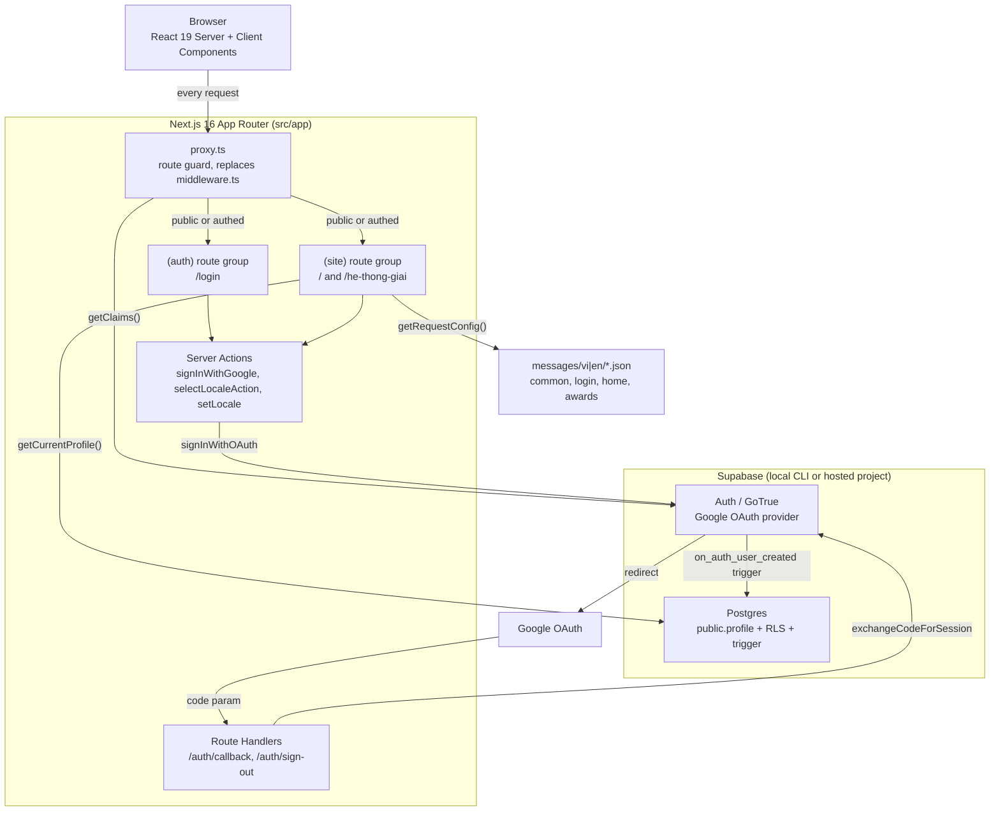
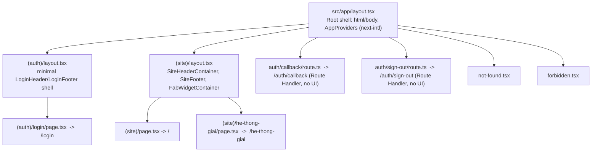
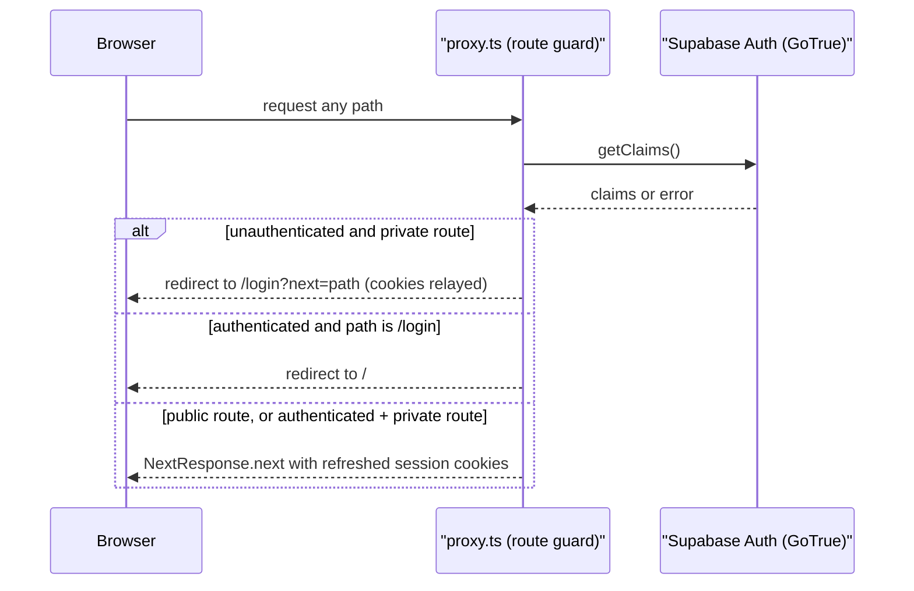
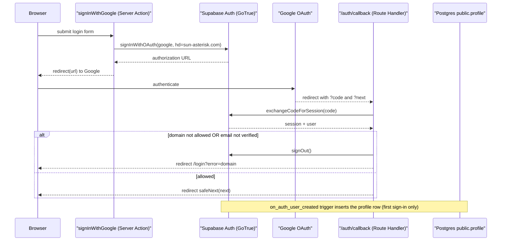
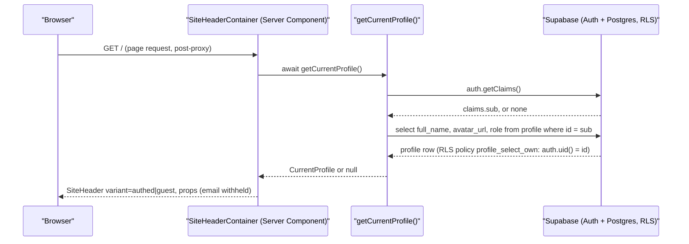

# Architecture

Sources: `src/app/**` (route groups/layouts), `src/proxy.ts`, `src/lib/supabase/{client,server}.ts`,
`src/i18n/request.ts`, `next.config.ts`, `playwright.config.ts`, `vitest.config.mts`,
`supabase/config.toml`, `supabase/migrations/20260828000000_create_profile_table_and_trigger.sql`,
`package.json`. Cross-checked against the existing `docs/system-architecture.md` (prior artifact,
not overwritten here).

## System Architecture

Notes:
- No API Gateway / microservices layer exists. Supabase is consumed directly as BaaS from
  Server Components, Server Actions, and Route Handlers via two thin client factories
  (`src/lib/supabase/client.ts` browser client, `src/lib/supabase/server.ts` cookie-bound
  server client) — there is no custom REST/GraphQL layer in front of it.
- `src/proxy.ts` is Next.js 16's route-guard file (the `middleware.ts` replacement), matched
  against every request except `_next/static`, `_next/image`, `favicon.ico`, and static image
  extensions (`config.matcher`, `src/proxy.ts:82-84`). It re-validates via `supabase.auth.getClaims()`
  on every request — never `getSession()`/`getUser()` server-side (`src/proxy.ts:33-37` docblock).

## Route Structure

- Both route groups render at the URL root (`(auth)`/`(site)` do not affect the path) but mount
  different shells: `(auth)/layout.tsx` renders its own header/footer per the login spec instead
  of inheriting the full `SiteHeader`/`SiteFooter`/`FabWidget` (`src/app/(auth)/layout.tsx:4-9`,
  `src/app/(site)/layout.tsx:6-9`).
  Route classification: scout-report.md `## File Inventory` — both layouts are `route`, not screens.
- `/he-thong-giai` (Award System) has no dynamic segment; category selection inside the page is
  client-side hash-based state (`resolve-active-slug.ts`), not a route param
  (`src/app/(site)/he-thong-giai/page.tsx:26-34`).
- `/auth/callback` and `/auth/sign-out` are plain Route Handlers (`route.ts`, `GET`/`POST`), no
  page component — classified `route` in scout-report.md, not `screen`.

## Tech Stack

| Layer | Technology | Version | Source |
|-------|------------|---------|--------|
| Frontend framework | Next.js, App Router | 16.3.3 | `package.json` |
| UI library | React / React DOM | 19.2.8 | `package.json` |
| Language | TypeScript | ^5 | `package.json` |
| Styling | Tailwind CSS v4 (`@tailwindcss/postcss`) | ^4 | `package.json`, `postcss.config.mjs` |
| i18n | next-intl (cookie-based locale, no URL prefix) | ^4.14.0 | `package.json`, `src/i18n/request.ts` |
| Backend / BaaS | Supabase (`@supabase/ssr`, `@supabase/supabase-js`) | 0.12.5 / 2.112.4 | `package.json`, `src/lib/supabase/*` |
| Database | Postgres, via Supabase local CLI | major_version 17 | `supabase/config.toml` |
| Auth provider | Supabase Auth (GoTrue) + Google OAuth | `[auth.external.google]` | `supabase/config.toml` |
| Route guard | `src/proxy.ts` (Next 16 replacement for `middleware.ts`) | n/a | `src/proxy.ts` |
| Unit / component tests | Vitest, Testing Library, jsdom | vitest ^4.1.11 | `package.json`, `vitest.config.mts` |
| E2E tests | Playwright (chromium project, auto-starts dev server) | ^1.62.1 | `package.json`, `playwright.config.ts` |
| Lint | ESLint (`eslint-config-next`) | ^9 / 16.3.3 | `package.json`, `eslint.config.mjs` |
| Cache | None — no cache layer in this codebase | n/a | not found |
| Queue | None — no queue/worker in this codebase | n/a | not found |
| CI/CD | None — no `.github/workflows/` present | n/a | not found (`ls .github/workflows` empty) |

## Auth & Session Flow (per-request route guard)

`PUBLIC_ROUTES` is `["/", "/login"]`, matched by exact equality only, plus a `/auth/` prefix
exception (`src/proxy.ts:12-16`) — a `startsWith` match against the list itself is explicitly
disallowed by a code comment (`src/proxy.ts:4-11`, FR-003/S1) because it would make every route
public. `redirectWithCookies()` copies cookies from the mutated `response` onto the new redirect
response, since `NextResponse.redirect()` builds a fresh object that would otherwise drop a
rotated/cleared session cookie (`src/proxy.ts:18-30`).

## OAuth Login Flow

- `hd: "sun-asterisk.com"` on `signInWithOAuth` is a Google prefill hint only; the real
  enforcement is `isAllowedEmail()` + `emailVerified()` in the callback
  (`src/app/login/actions.ts:26-31`, `src/app/auth/callback/route.ts:39-42`).
- `safeNext()` (`src/lib/auth/safe-next.ts`) is the single choke point every post-login redirect
  passes through — same-origin, single-`/`-leading paths only, rejecting protocol-relative URLs
  and CR/LF/NUL injection (per `docs/system-architecture.md` § Auth request flow).
- Sign-out (`src/app/auth/sign-out/route.ts`) is a plain `<form method="post">` target, not a
  Server Action, because a Server-Action-triggered redirect races the `Set-Cookie` header against
  the client-side URL update (`src/app/auth/sign-out/route.ts:5-14` docblock, verified 0/3 vs 3/3).
- `public.profile` provisioning is DB-side only: a `security definer` trigger
  (`supabase/migrations/20260828000000_create_profile_table_and_trigger.sql:34-52`) fires on
  `auth.users` insert — no application code writes `profile` directly.

## Data Flow (session-aware page render)

- A failed profile lookup degrades to the guest header variant rather than throwing, so a
  transient Supabase read failure never breaks every page
  (`src/lib/profile/get-current-profile.ts:18-21,38-41`).
- `email` is never selected into this payload by design (`src/lib/profile/get-current-profile.ts:14-16`,
  cross-referenced against `docs/data-model.md`).
- The same server/browser client split applies everywhere: Server Components and Route Handlers
  use `src/lib/supabase/server.ts` (cookie-bound); any future Client Component data access would
  use `src/lib/supabase/client.ts` (browser client) — no Client Component currently calls Supabase
  directly in this codebase.

## Internationalization Resolution

- Locale travels in the `NEXT_LOCALE` cookie only — no URL prefix (`src/i18n/request.ts:4-11`,
  default `vi`). `next.config.ts` wires `next-intl`'s plugin to `./src/i18n/request.ts`
  (`next.config.ts:4-10`).
- Four message namespaces load per request — `common`, `login`, `home`, `awards`
  (`src/i18n/request.ts:20-29`) — via a dynamic `import()` gated by a strict `vi`/`en` allow-list
  (`isLocale()`, `src/i18n/request.ts:14-17`) so an arbitrary cookie value can never reach the
  dynamic import.
- Locale switching (`src/lib/i18n/set-locale.ts`, `src/lib/i18n/select-locale-action.ts`) is a
  Server Action reference passed into the client header, never an inline closure — the
  `"use server"` boundary is crossed exactly once, at the action module
  (`src/components/layout/site-header-container.tsx:15-16`).

## Testing Architecture

| Test type | Tool | Config | Scope |
|-----------|------|--------|-------|
| Unit / component | Vitest + Testing Library, jsdom environment | `vitest.config.mts` | `src/**/*.test.{ts,tsx}`, colocated `__tests__/` dirs |
| E2E | Playwright, chromium project | `playwright.config.ts` | `e2e/` (not enumerated in scout-report.md's File Inventory — see scout-report.md `## Notes`) |
| E2E session fixture | `e2e/support/seed-session.ts` — real local-Supabase session via `admin.createUser` -> `generateLink` -> `verifyOtp`, cookies derived via a real `setSession()` call, no faked cookies | consumed via `authenticatedPage`/`adminPage` fixtures | per `docs/system-architecture.md` § E2E session fixture |

`playwright.config.ts` auto-starts `npm run dev` as its `webServer` (`reuseExistingServer` outside
CI) and loads `.env.local` itself via `dotenv`, since the Playwright Node process does not inherit
Next's own env loading (`playwright.config.ts:1-14`).

## Deployment / Runtime Notes

- No `.github/workflows/` directory exists — no CI/CD pipeline is defined in-repo at this wave.
- No containerization files (`Dockerfile`, `docker-compose.yml`) were found at the repo root;
  `supabase start` runs the local Supabase stack via the Supabase CLI's own Docker orchestration
  (`supabase/config.toml`), not a project-level compose file.
- Environment variables are read from `.env.local` (gitignored); `.env.example` documents the
  required shape: `NEXT_PUBLIC_SUPABASE_URL`, `NEXT_PUBLIC_SUPABASE_ANON_KEY`,
  `NEXT_PUBLIC_SITE_URL`, `NEXT_PUBLIC_EVENT_START_AT`, plus Supabase/Google OAuth secrets used
  only server-side or by the E2E fixture.

---

**Status:** DONE
**Sections:** System Architecture · Route Structure · Tech Stack · Auth & Session Flow · OAuth Login Flow · Data Flow (session-aware page render) · Internationalization Resolution · Testing Architecture · Deployment / Runtime Notes
**Line count:** 241
