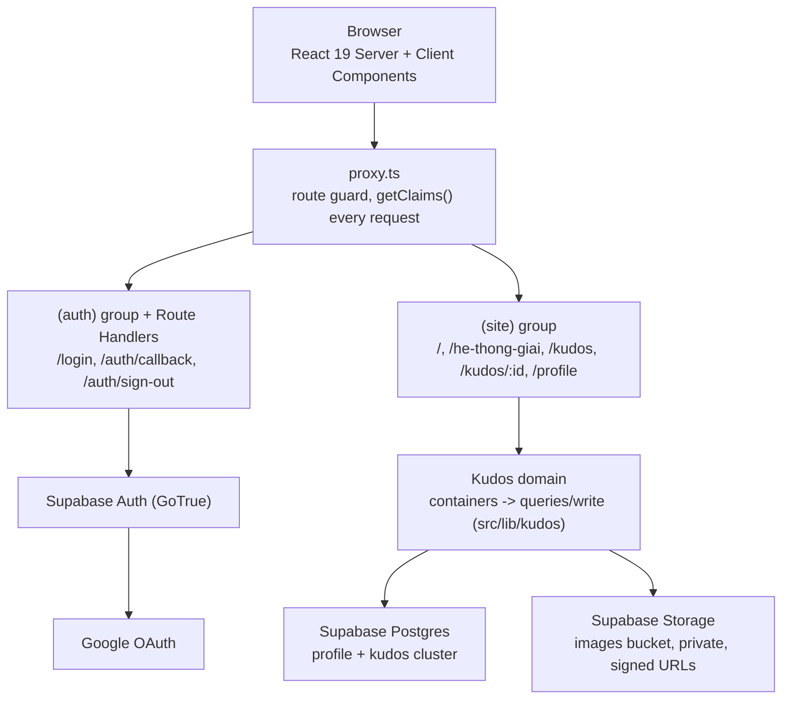
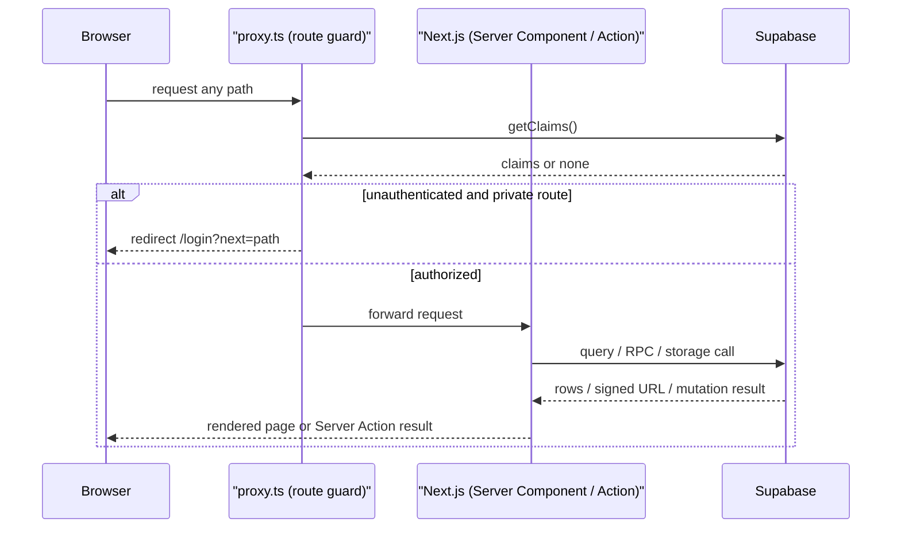

# System Overview

**Project**: SAA 2025 Web (`package.json:2` name `saa-web`)
**Generated**: 2026-09-02
**Architecture Type**: Server-rendered monolith — a single Next.js 16 App Router application (React Server Components, Server Actions, Route Handlers) as the only application tier, backed by Supabase as a managed Backend-as-a-Service for auth, Postgres, and private-file storage (`package.json:15-31`). Round 2 adds one cohesive domain module, Kudos (F005/F006), layered as containers → queries/write → Supabase, alongside the round-1 auth/homepage/awards surface. The codebase remains two stacks under one deploy unit: the JS/TS Next.js app plus SQL/Postgres artifacts that run server-side inside Supabase (`supabase/migrations/*.sql`, 5 files this round vs. 1 in round 1) — `[MULTI_STACK]` (`plans/260831-2303-saa-2025-web-kudos-round-2/artifacts/scout-report.md:499-503`).

## Executive Summary

SAA 2025 Web is the event site for Sun* Awards 2025. Round 1 shipped the public Homepage (event countdown, award teasers), the "Award System" (Hệ thống giải) browse page, and Google-OAuth login gated to `@sun-asterisk.com` accounts. Round 2 adds **Kudos** ("Viết Kudo"): a live social-recognition board where signed-in Sunners send each other short, rich-text notes with optional images and hashtags, react with hearts, and see leaderboards/spotlight/rank-promotion widgets — plus a minimal `/profile` stub. Per the current scout inventory, 9 screens/special-files are implemented: Login, Homepage, Award System, Kudos Live Board (`/kudos`), Kudos Detail (`/kudos/:id`), Profile stub (`/profile`), the Kudos Compose dialog (a shared modal, no route of its own), and the localized Forbidden/Not-Found special files (`plans/260831-2303-saa-2025-web-kudos-round-2/artifacts/scout-report.md:459-469`). Every `(site)` route continues to share one session-aware header/footer/FAB shell that resolves the signed-in profile once per request (`src/components/layout/site-header-container.tsx`, `src/components/layout/fab-widget-container.tsx:19-36`); the FAB is now also the site-wide "Viết KUDOS" entry point, wired with real recipients/hashtags on every page, not only `/kudos` (`src/components/layout/fab-widget-container.tsx:8-17`). Content stays bilingual (Vietnamese default, English fallback) via cookie-based `next-intl` locale switching, no URL prefix — 7 message namespaces now load per request, up from 4 in round 1, adding `compose`, `kudos`, `profile` (`src/i18n/request.ts:19-23`). Feature count is now finalized: 6 features (`feature-list.md`, Wave 5 — `F001_GoogleOAuthLogin`,
`F002_NavigationShell`, `F003_HomepageOverview`, `F004_AwardSystemBrowse`, `F005_KudosCompose`,
`F006_KudosLiveBoard`).

## System Architecture

Compact summary only — the full diagram set (Route Structure, Kudos Domain Layering, Kudos Write
Flow, Heart Toggle & Special-Day Rule, Storage & Signed URLs, per-flow sequence diagrams) and every
version-cited Tech Stack row live in [architecture.md](architecture.md); this section exists so a
reader of this document alone still gets one architecture diagram and one tech-stack table, per the
SystemOverview contract.

### High-Level Architecture

### Technology Stack

| Layer | Technology | Version |
|-------|------------|---------|
| Frontend framework | Next.js, App Router | 16.3.3 |
| UI library | React / React DOM | 19.2.8 |
| Language | TypeScript | ^5 |
| Styling | Tailwind CSS v4 | ^4 |
| i18n | next-intl (cookie-based locale) | ^4.14.0 |
| Rich-text editor | TipTap | 3.30.6 |
| Backend / BaaS | Supabase (`@supabase/ssr`, `@supabase/supabase-js`) | 0.12.5 / 2.112.4 |
| Database | Postgres, via Supabase local CLI | major_version 17 |
| File storage | Supabase Storage — `images` bucket, private | `file_size_limit "50MiB"` |
| Auth provider | Supabase Auth (GoTrue) + Google OAuth | `[auth.external.google]` |
| Route guard | `src/proxy.ts` (Next 16 replacement for `middleware.ts`) | n/a |
| Unit / E2E tests | Vitest + Testing Library / Playwright (chromium) | ^4.1.11 / ^1.62.1 |
| CI/CD | None — no `.github/workflows/` present | n/a |

Full version citations (`package.json`/`supabase/config.toml` line refs) for every row above, plus
the rows this table omits for brevity (word-cloud/pan-zoom, positioning utility, lint), are in
[architecture.md](architecture.md) § Tech Stack.

## Data Flow

Compact cross-cutting flow (session check → app → Supabase); the four Kudos-specific sequence
diagrams (write, heart-toggle, OAuth login, session-aware render) live in
[architecture.md](architecture.md).

## Key Design Decisions

### Decision 1: Domain-restricted Google OAuth with layered server-side verification and continuous session revalidation

**Context**: Only Sun* employees (`@sun-asterisk.com` Google accounts) may hold a session; every visitor must be blocked both at first sign-in and on every later request, since a session must not silently outlive a change in eligibility. Unchanged this round — verified against current source.

**Decision**: `signInWithGoogle()` starts Supabase OAuth with a `hd: "sun-asterisk.com"` query-param hint (`src/app/login/actions.ts:26-32`) — pre-fill only, not enforcement. The real gate is server-side at the OAuth callback: `isAllowedEmail()` requires exactly one `@`, a non-empty local part, and a case-insensitive domain match (`src/lib/auth/allowed-email.ts:24-37`); `emailVerified()` independently requires both `user.email_confirmed_at` and the first identity's `identity_data.email_verified === true` (`src/lib/auth/email-verified.ts:9-20`); either failing signs the session back out (`src/app/auth/callback/route.ts:39-42`). The post-login redirect passes through `safeNext()` — same-origin, single-`/`-leading paths only, rejecting protocol-relative, `://`/backslash-bearing, and raw/percent-encoded CR/LF/NUL values (`src/lib/auth/safe-next.ts:23-45`). Every subsequent request is re-validated by `proxy.ts` via `supabase.auth.getClaims()`, never `getSession()`/`getUser()` (`src/proxy.ts:60`); `PUBLIC_ROUTES` (`["/", "/login"]`) is matched by exact equality plus a `/auth/` prefix exception only (`src/proxy.ts:12-16`) — still true this round, including the new `/kudos`, `/kudos/:id`, `/profile` routes, which fall through to "everything else requires a session" with no code changes needed.

**Rationale**: The `hd` hint alone does not block other domains, so enforcement must happen server-side, twice — once at the callback (blocks a disallowed account from ever getting a session) and again on every request via `getClaims()` (blocks a session from outliving revoked eligibility). Splitting `isAllowedEmail` (domain-only) from `emailVerified` (identity-only) keeps two distinct security predicates from blurring into one under-specified check.

### Decision 2: Profile provisioning stays DB-side; round 2 widens read access instead of adding a second permissive policy

**Context**: `public.profile` is still provisioned exactly once, by a `security definer` trigger, independent of application code (`supabase/migrations/20260828000000_create_profile_table_and_trigger.sql:34-52`, unchanged). Round 2 needs every authenticated Sunner to read *any* profile row — recipient autocomplete, `@mention` search, sender/receiver display on kudos cards, the `/profile?id=` stub — not just their own.

**Decision**: Migration `20260831000100_widen_profile_select.sql` explicitly `drop policy "profile_select_own"` then `create policy "profile_select_all_authenticated" ... using (true)` (`supabase/migrations/20260831000100_widen_profile_select.sql:10-16`), rather than adding a second permissive select policy alongside the old one. `role` (`admin`/`member`) still has no insert/update policy and no route guard reads it — same YAGNI gap round 1 flagged, still open.

**Rationale**: Postgres ORs multiple permissive policies for the same table/action together, so stacking a second `select` policy next to `profile_select_own` would leave the old, narrower policy as dead weight while the new, wider one silently wins — replace, not add. This same drop-then-create discipline is used for round 2's storage insert policy (Decision 5).

### Decision 3: Kudos writes commit through one atomic RPC; the client is never trusted for identity, content shape, or storage-path ownership

**Context**: A "Viết Kudo" write touches 3 tables in one logical operation (`kudos`, 1-5 `kudos_hashtag` rows, up to 5 `kudos_image` rows) and must never land partially — e.g. a kudos with 0 hashtags — while a Server Action is reachable over the network with an arbitrary JSON body, so the TypeScript parameter type alone cannot be trusted (`src/lib/kudos/write/create-kudos-action.ts:52-71`).

**Decision**: `submitKudos()` (client) uploads any images to Storage first, then calls the `createKudos` Server Action (`src/lib/kudos/write/submit-kudos.ts:35-68`). `createKudos` independently: resolves the sender id only from `getClaims()`, never the request body (`src/lib/kudos/write/create-kudos-action.ts:78-84`); re-runs `isSelfKudos` server-side even though the dialog already blocked it client-side (`src/lib/kudos/write/create-kudos-action.ts:90-92`, mirrored client-side in `src/components/kudos/containers/compose-dialog-container.tsx:60-67`); re-validates the whole draft via `validateDraft` (`src/lib/kudos/write/create-kudos-action.ts:94-104`); and verifies every image's storage path sits exactly inside `kudos/{sender}/{kudosId}/` before trusting it (`src/lib/kudos/write/storage-path.ts:43-57`, called at `create-kudos-action.ts:110`). Only then does it call the single-transaction RPC `public.create_kudos`, which inserts `kudos` + loops `kudos_hashtag` (1-5, guarded) + loops `kudos_image` (≤5, guarded) and rolls back the whole function on any `raise exception` (`supabase/migrations/20260831000000_create_kudos_cluster.sql:281-323`). The RPC runs `security invoker`, so it is still RLS-checked as the calling Sunner, not a privilege escalation (`supabase/migrations/20260831000000_create_kudos_cluster.sql:292`).

**Rationale**: A client-supplied JSON tree is untrusted input from two angles: it might carry a shape the render layer cannot safely display (unknown TipTap node/mark types, a `javascript:` link), and it might carry a storage path belonging to another Sunner's kudos. Content-schema and path-ownership checks close both gaps at the one place identity is known server-side, before any row is written — not deferred to RLS, since RLS on `kudos_image`/`kudos_hashtag` only proves the *parent kudos* is owned by the caller, not that a specific `storage_path` string wasn't copy-pasted from someone else's upload. Using one RPC instead of 3 sequential app-side inserts makes the all-or-nothing guarantee a database property (transaction rollback) rather than an app-level compensating-transaction pattern the team would otherwise have to hand-write and keep correct under partial failure.

### Decision 4: Heart-doubling on special days is computed server-side, timezone-aware, and never a client-writable value

**Context**: Sun* wants hearts to count double on admin-designated "special days" (`public.special_days`, admin-managed, unseeded — `supabase/migrations/20260831000000_create_kudos_cluster.sql:184-200`). `granted_amount` has no DB-level derivation and no stored running total (`heart_total`) to keep in sync (`src/lib/kudos/write/heart-rules.ts:1-10`).

**Decision**: `toggleHeart()` reads `special_days` itself, server-side, on every insert (`src/lib/kudos/write/toggle-heart-action.ts:101-111`), and hands the comparison to a pure helper: `computeGrantAmount()` converts the current instant to an `Asia/Ho_Chi_Minh` calendar date string via `Intl.DateTimeFormat` and checks membership in `specialDays` (`src/lib/kudos/write/heart-rules.ts:12-24`). A revoke never assumes an amount — it deletes the row and reads `granted_amount` back from what the delete actually removed (`src/lib/kudos/write/toggle-heart-action.ts:82-98`, `resolveRevokedAmount()` at `heart-rules.ts:26-30`), so a losing request in a double-toggle race can never report an amount it did not itself cause. The DB only enforces the shape invariant: `granted_amount smallint not null check (granted_amount in (1, 2))` (`supabase/migrations/20260831000000_create_kudos_cluster.sql:152`) and `heart_insert_not_self` (`sender cannot heart own kudos`, DB-enforced, not just UI — `supabase/migrations/20260831000000_create_kudos_cluster.sql:167-174`, re-checked in app code too at `toggle-heart-action.ts:56-58` as "belt and suspenders").

**Rationale**: Supabase's `current_date` is UTC; a naive server-side date compare would flip 7 hours out of phase around Vietnamese midnight, granting or denying the doubled amount on the wrong calendar day for part of the day. Computing the VN-local date explicitly, in one small pure function that both the grant path and its unit tests can exercise directly, keeps the timezone rule auditable and testable without needing a live special day to observe it. Keeping `granted_amount` decision logic in the app layer (not a DB trigger) matches this codebase's existing preference for app-side business rules with the DB holding only structural invariants (mirrors Decision 3's split between RPC-enforced atomicity and app-enforced content trust).

### Decision 5: Kudos images live in a private Storage bucket; the client only ever sees short-lived signed URLs, and the insert policy is scoped to the caller's own path segment

**Context**: The `images` bucket is `public = false` (`supabase/config.toml:109-112`), so a plain `getPublicUrl()` would hand `` a URL the Storage API rejects. `storage.objects` had no RLS policy at all before this round (bucket was unused) — the first policy (`20260831000200_storage_images_policies.sql`) checked only `bucket_id = 'images'` on insert, letting any authenticated Sunner write to *any* path in the bucket, including another Sunner's `kudos/{their_id}/...` prefix.

**Decision**: `resolveImageUrls()` calls `supabase.storage.from("images").createSignedUrls(paths, 3600)` for every kudos card rendered, batched in one call per card (not N calls), returning `[]` on failure or empty input rather than throwing (`src/lib/kudos/queries/resolve-image-urls.ts:22-35`). Migration `20260902000000_scope_images_insert_policy.sql` `drop`s the original bucket-only insert policy and recreates it scoped to `(storage.foldername(name))[1] = 'kudos' and (storage.foldername(name))[2] = auth.uid()::text` (`supabase/migrations/20260902000000_scope_images_insert_policy.sql:22-32`), matching the app-level path convention `kudos/{sender_id}/{kudos_id}/{position}-{filename}` built by `buildKudosImageStoragePath()` (`src/lib/kudos/write/storage-path.ts:24-27`). The select policy stays bucket-wide (`bucket_id = 'images'`, no path scoping) — every signed-in Sunner must be able to view every kudos's images in the shared feed, not just their own uploads (`supabase/migrations/20260831000200_storage_images_policies.sql:16-20`, unchanged by the hardening migration).

**Rationale**: This is a genuine security-review finding, not a design preference — the original insert policy let RLS silently rely on an app-level path convention the storage layer itself never checked, so a malicious or buggy client could overwrite/pollute another Sunner's object path. `storage.foldername(name)` returning the path's folder segments as `text[]` (excluding the filename) makes a 2-segment ownership check expressible directly in the policy, without a trigger or a second lookup table. Signed URLs (rather than making the bucket public) keep image access behind the same `authenticated` boundary as every other kudos read, consistent with this project's "no anonymous/public read anywhere" RLS posture.

## Security Overview

- **Authentication**: Google OAuth 2.0 exclusively, via Supabase Auth. Unchanged this round (`src/app/login/actions.ts:21-40`, `src/app/auth/callback/route.ts:31-32`, `src/app/auth/sign-out/route.ts:33-41`). Session validity is re-checked every request via `getClaims()` (`src/proxy.ts:60`).
- **Authorization**: Still two roles only, `member`/`admin` (`profile.role` check constraint), with no admin-only route or RLS policy reading `role` — an open gap carried over from round 1, now also true of the Kudos surface (no admin-only kudos moderation exists). Data-level authorization on the new Kudos tables is uniformly `select: all authenticated` with narrowly-scoped, ownership-checked write policies: `kudos`/`kudos_image`/`kudos_hashtag` insert require `sender_id = auth.uid()` directly or via an `exists` subquery on the parent `kudos` row (`supabase/migrations/20260831000000_create_kudos_cluster.sql:70-74,99-108,130-139`); `heart` insert additionally blocks self-hearting and `heart` delete is own-row-only (`supabase/migrations/20260831000000_create_kudos_cluster.sql:167-180`). `department`, `hashtag`, `special_days`, `secret_box_gift` are admin/seed-managed with no app write policy this round.
- **Input trust boundary (new this round)**: `kudos.content` (TipTap JSON) is validated against one shared allow-list (`src/lib/kudos/content-schema.ts:10-30`) on both the write path (`validate-content.ts`) and the render path, so a stored document can never carry a node/mark type the renderer wasn't built to handle, nor a non-`http(s)` link scheme (blocks `javascript:`/`data:`) — `src/lib/kudos/write/validate-content.ts:56-70`. The same validator bounds recursion depth (20) and total node count (2000) so an attacker-controlled JSON tree fails as a typed error instead of exhausting the stack/CPU (`src/lib/kudos/write/validate-content.ts:18-19,81-89`).
- **Data Encryption**: Not configured in application code — unchanged from round 1. Out of this document's scope (Supabase-platform concern).
- **API Security**: Server Actions get Next.js's same-origin protection for free; the state-changing Route Handler (`POST /auth/sign-out`) adds its own explicit `Origin` check (`src/app/auth/sign-out/route.ts:27-31`). `safeNext()` closes the open-redirect surface (`src/lib/auth/safe-next.ts:23-45`). The `create_kudos` RPC and `toggleHeart`/`createKudos` Server Actions are additional network-reachable surfaces this round; all three re-derive identity from `getClaims()` server-side rather than trusting any client-asserted id (`src/lib/kudos/write/create-kudos-action.ts:78-84`, `src/lib/kudos/write/toggle-heart-action.ts:36-42`).

## Scalability

- **Current Capacity**: Still local-development-only — Supabase in Docker (`supabase/config.toml`), no production deployment manifest or CDN/edge config found. Unchanged from round 1.
- **Scaling Strategy**: The app tier remains stateless (`src/proxy.ts:40-58`). The Kudos feed is deliberately not denormalized: no `heart_count` column on `kudos` (comment at `supabase/migrations/20260831000000_create_kudos_cluster.sql:47-50`) — `heart_count`, hashtag ids/names, and image paths are computed live via `left join lateral` subqueries in `kudos_card_view` (`supabase/migrations/20260831000000_create_kudos_cluster.sql:232-270`), one query per page load, no N+1. Feed pagination is offset/limit, page size 10, no cursor/keyset strategy (`src/lib/kudos/queries/get-feed-page.ts:8,26-35`) — acceptable at current expected volume but a candidate for revisit if the feed grows large enough that deep-offset scans become costly. Image URL resolution batches every path on a card into one `createSignedUrls()` call rather than one call per image (`src/lib/kudos/queries/resolve-image-urls.ts:27`).
- **Performance Targets**: None defined in the scanned source or docs, same as round 1 — flagged as an open gap, not asserted.
